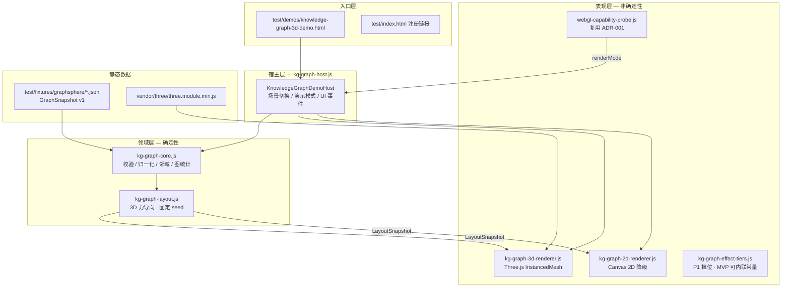
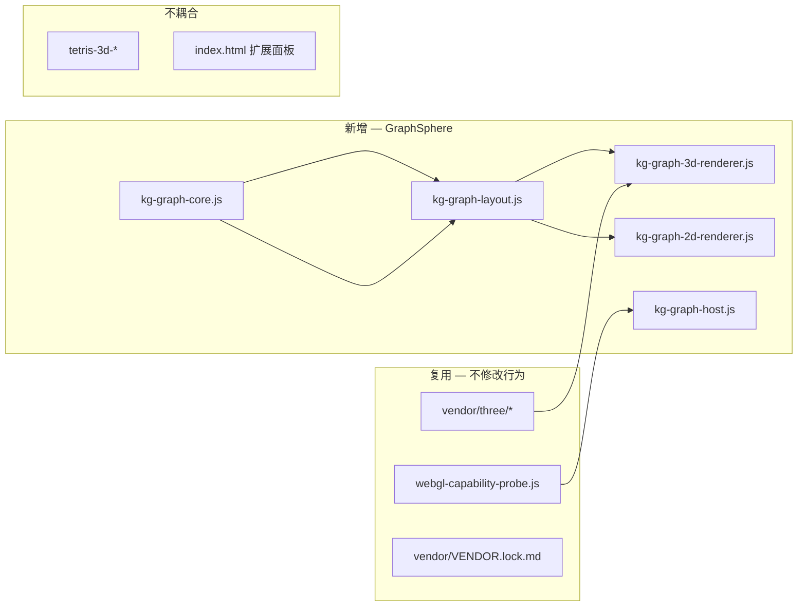
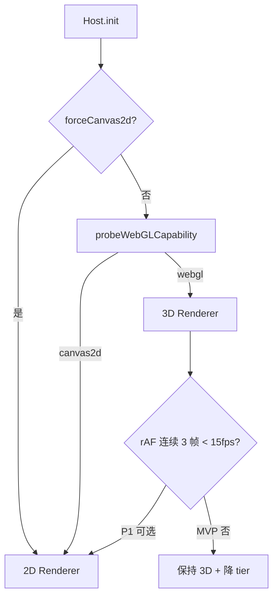

# ADR-002：GraphSphere 技术选型与架构设计 v1

| 元数据 | 值 |
|--------|-----|
| **ADR 编号** | ADR-002 |
| **状态** | **Proposed**（D1 M0 待 Tech Lead Accept） |
| **日期** | 2026-05-25 |
| **决策者** | Tech Lead（架构师起草） |
| **前置 ADR** | [ADR-001 Tetris 3D](adr-tetris-3d-tech-stack-architecture-v1.md)（Vendor / Probe / 分层模式继承） |
| **数据 SSOT** | [GraphSnapshot Schema v1](../technical/arch-graphsnapshot-schema-v1.md) |
| **范围** | GraphSphere v0.1 Demo：Web 静态 3D 知识图谱浏览器；不含后端、编辑、NLP 建图 |

---

## 1. 背景与问题陈述

Round 1 已裁定 **有条件 Go**：2 周 Demo Sprint，定位为「可演示的 3D 知识图谱浏览器」，非知识管理平台。工程路径为 **复用现有仓库**（`js/kg-graph-*` + `test/demos`），而非 Round 1 架构师异议中的 Vite+React 新仓。

本 ADR 在 D1 冻结以下四类架构决策，作为 PR-1～PR-4、QA AC-04、DevOps 包体门禁的 **单一技术依据**：

1. **GraphSnapshot Schema v1**（已独立冻结，本文引用）
2. **Vendor 与加载模型**（Three.js 本地 bundle，禁止 CDN）
3. **WebGL Probe 与 2D 降级策略**（复用 vs 扩展）
4. **模块边界与接口契约**（Domain / Layout / Render / Host）

---

## 2. 决策摘要

| 主题 | 决策 | 理由摘要 |
|------|------|----------|
| 数据 SSOT | **GraphSnapshot JSON v1.0.0** | 零后端；与 BA R-KG、QA 可复现对齐；布局坐标运行时计算 |
| 工程形态 | **Vanilla JS + CommonJS/IIFE**；MVP 在 `test/demos/` + `js/kg-graph-*` | 与 ADR-001、现有单测基建一致；避免 React 脚手架拉长 D10 |
| 3D 渲染 | **Three.js `InstancedMesh`** + 复用 `vendor/three/three.module.min.js` | 已有供应链锁定与 CI SHA 门禁 |
| 布局 | **自研 3D 力导向**（`kg-graph-layout.js` 纯函数）；禁止 MVP 引入 `3d-force-graph` | 可单测、可固定 seed；黑盒库定制成本高 |
| Probe | **复用** `js/webgl-capability-probe.js` | 同浏览器 WebGL 能力一致；Demo 独立页无与 Tetris 缓存冲突 |
| 降级 | WebGL 失败 → **`kg-graph-2d-renderer.js`**（Canvas 2D 力导向简图） | 非 Tetris `drawTetrisFrame`；保留 P0 点选/邻域/侧栏 |
| 节点规模 | P0 预置 ≤150；运行时硬限 **200**；P1 ≤500 + LOD | Tech Lead 统一性能红线 |
| 合规 | MV3 / 静态 Demo **禁止 CDN**；包体 gzip 门禁 ≤800KB（Demo 子集） | 与 ADR-001、运维 L0/L2 一致 |
| Phase 1 偿还 | Vite+React+TS 抽离 `apps/knowledge-graph-3d/`；评估 `3d-force-graph` | 触发：Demo KPI 通过且需深度渲染定制 |

---

## 3. 目标架构

### 3.1 逻辑分层



**原则**（继承 ADR-001 第 4 节）：

1. **Domain 层零 WebGL/DOM 引用**；`validateGraphSnapshot` / `computeLayout` 100% 可单测。
2. **Layout 无时钟**；迭代次数为函数参数，保证同输入同输出。
3. **输入/相机动画止于 Host**；Renderer 仅消费 `LayoutSnapshot` + 交互高亮状态。
4. **GraphSnapshot 为渲染唯一数据输入**；禁止运行时改拓扑（P0 无编辑）。

### 3.2 与仓库现有模块关系



- **共享**：Probe、Three vendor、CI `scan-package.sh` 对 `vendor/three` 的校验。
- **隔离**：无 Dock 注册（MVP）；无 `chrome.runtime` 硬依赖（Demo 可 HTTP 静态托管）；埋点命名空间 `graphsphere.*`。

---

## 4. 模块划分与职责

| 模块 | 文件 | 职责 | 确定性 |
|------|------|------|--------|
| **Graph Core** | `js/kg-graph-core.js` | GraphSnapshot 解析、L0–L2 校验、归一化、`getNeighborhood1Hop`、度/连通分量统计 | **是** |
| **Graph Layout** | `js/kg-graph-layout.js` | 力导向迭代（3D）、`layoutSeed`、hub `pinned` 锚点、边长度/斥力参数 | **是**（固定迭代次数） |
| **3D Renderer** | `js/kg-graph-3d-renderer.js` | 场景/相机/灯光、节点 InstancedMesh、边 LineSegments、标签 Sprite/Canvas（P0 简化为近距标签） | 否 |
| **2D Renderer** | `js/kg-graph-2d-renderer.js` | Canvas 2D 圆点+直线；同 `LayoutSnapshot`；无 orbit 时用平移缩放 | 否 |
| **Effect Tiers** | `js/kg-graph-effect-tiers.js`（P1；MVP 常量表可置于 Host） | 节点数档位 → 迭代次数、标签数、边抽样 | 否 |
| **Demo Host** | `js/kg-graph-host.js` | fetch 场景、Probe 分支、rAF、演示巡航、侧栏、场景切换、选中态 | 调度否 |
| **Capability Probe** | `js/webgl-capability-probe.js` | **复用**；`probeWebGLCapability({ forceCanvas2d })` | 否 |
| **Demo 入口** | `test/demos/knowledge-graph-3d-demo.html` | 静态 HTML、脚本顺序、无 CDN | — |
| **Fixtures** | `test/fixtures/graphsphere/*.json` | 场景 A/B 与 draft | — |

### 4.1 PR 映射（与 Tech Lead WBS 对齐）

| PR | 交付物 | 门禁 |
|----|--------|------|
| PR-1 | `kg-graph-core.js` + `test/kg-graph-core.test.js` | L0/L1/L2-P0 单测绿灯 |
| PR-2 | `kg-graph-layout.js` + `test/kg-graph-layout.test.js` | 同 seed 坐标快照 ±ε |
| PR-3 | `kg-graph-3d-renderer.js` + `kg-graph-2d-renderer.js` + Probe 集成 | 200 节点 ≥30fps@1080p |
| PR-4 | `kg-graph-host.js` + `knowledge-graph-3d-demo.html` + `test/index.html` | 三条 Demo 路径 ×3 无 P0/P1 |

---

## 5. Vendor 与加载模型

### 5.1 选型

| 依赖 | 决策 | 版本 / 路径 |
|------|------|-------------|
| **Three.js** | **复用现有本地 ESM** | `vendor/three/three.module.min.js`（与 [VENDOR.lock.md](../../vendor/VENDOR.lock.md) 一致，当前 r170 系） |
| **3d-force-graph** | **MVP 禁止** | Phase 1 评估；引入需新 ADR 修订与包体重算 |
| **d3-force-3d** | **不引入 npm 包** | 算法思路借鉴；MVP 自研 ≤200 行核心迭代，避免额外 vendor |
| **React / Vite** | **Phase 1 偿还** | Demo KPI 通过后抽离 `apps/knowledge-graph-3d/` |

### 5.2 加载方式

**Demo 页（MVP）**——与 `test/demos/tetris-3d-minimal.html` 一致：

```html
<script src="../../js/webgl-capability-probe.js"></script>
<script src="../../js/kg-graph-core.js"></script>
<!-- ... -->
<script type="module">
  const probe = TetrisWebGLCapabilityProbe.probeWebGLCapability(
    new URLSearchParams(location.search).has('force2d') ? { forceCanvas2d: true } : {}
  );
  const three = await import('../../vendor/three/three.module.min.js');
  // 注入 KgGraph3DRenderer
</script>
```

| 规则 | 说明 |
|------|------|
| **禁止 CDN** | HTML/JS 不得引用 `cdn.*` / `unpkg` / `jsdelivr` |
| **HTTP 服务** | `file://` 下 ESM 可能失败；QA/DevOps 使用本地静态服（与 Tetris demo 相同） |
| **OrbitControls** | MVP **不引入** `examples/jsm`；Host 内实现简化 orbit（yaw/pitch + 距离），控制包体 |
| **包体预算** | Demo 分发 zip：`three.module.min.js` + kg 模块 gzip **合计 ≤800KB**；仅 `three.module.min.js` 时沿用 ADR-001 ~170KB gzip |

### 5.3 供应链

- **不新增** vendor 文件；PR 不得修改 `vendor/three/*` 除非安全升级并更新 `VENDOR.lock.md` + CI SHA。
- GraphSphere CI 路径（P1）：`.github/workflows/kg-graph-ci-gate.yml` 镜像 `tetris-3d-ci-gate.yml`。

---

## 6. WebGL Probe 与降级

### 6.1 Probe 策略：复用而非分叉

| 选项 | 裁定 |
|------|------|
| 复制 Probe 为 `kg-graph-probe.js` | **拒绝** — 重复维护与测试 |
| 扩展 Probe 支持多 cache key | **P1** — 仅当扩展页与 Demo **同页** 共存时 |
| **MVP：直接复用** `TetrisWebGLCapabilityProbe` | **接受** |

**理由**：GraphSphere Demo 为 **独立 HTML**；`sessionStorage` 键 `tetris3d.webglProbe.v1` 缓存的是浏览器级 WebGL 能力，与产品无关，复用可加快冷启动。

```javascript
// 契约：Host 启动时
const probe = TetrisWebGLCapabilityProbe.probeWebGLCapability({
  forceCanvas2d: urlParams.has('force2d') || storageOverride === '2d',
});
// probe.mode === 'webgl' | 'canvas2d'
```

**L0 人工降级入口**（运维预案）：

| 入口 | 行为 |
|------|------|
| URL `?force2d=1` | `forceCanvas2d: true` |
| URL `?force3d=1` | 跳过缓存，强制重探（调用 `clearProbeCache()` 后 probe） |
| 隐藏菜单（L1） | 演示人员切换 2D/3D，写 `sessionStorage` 可选键 `graphsphere.renderMode`（仅影响 Host 分支，不改 Probe 全局语义） |

### 6.2 降级渲染：2D 力导向简图（非 Tetris Canvas）

| 能力 | WebGL 3D | 2D 降级 |
|------|----------|---------|
| 力导向布局 | ✓ 同 `LayoutSnapshot` | ✓ 同快照 |
| Orbit 旋转 | ✓ 3D 相机 | △ 2D 平移+缩放 |
| 点选 + 邻域高亮 | ✓ | ✓ **P0 必须** |
| 侧栏详情 | ✓ | ✓ |
| 演示巡航 | ✓ 相机路径 | △ 2D 逐节点 pan + 高亮（简化） |
| 节点标签 | 3D Sprite / 近距 | 2D 文字（≤80 节点显示全标签） |

**降级决策树**：



MVP **不实现** 运行时 fps 自动切换（避免演示中途跳变）；仅 Probe 级降级。fps 档位通过 `kg-graph-effect-tiers` 在初始化时选择。

### 6.3 性能档位（Effect Tiers）

| tierId | 节点上限 | 布局迭代 | 3D 标签策略 | 边渲染 |
|--------|----------|----------|-------------|--------|
| `low` | ≤80 | 50 | 仅 hub + 选中 | 全边 |
| `medium` | ≤150 | 80 | hub + 度≥3 | 全边 |
| `high` | ≤200 | 100 | 距离相机 Top-N | 全边 |
| `p1-500` | ≤500 | 120 + Worker 可选 | LOD 聚合 | 边抽样 50% |

Host 根据 `nodes.length` 与 `probe.glVersion` 选择 tier；**禁止** 超 200 节点进入 P0 渲染（`validateGraphSnapshot` L2 拒绝）。

---

## 7. 接口定义（契约级）

> 实现为 CommonJS / 浏览器全局；下列为 **架构契约**，PR 不得偏离语义。

### 7.1 Graph Core

见 [arch-graphsnapshot-schema-v1.md §4.1](../technical/arch-graphsnapshot-schema-v1.md#41-校验-api实现须遵守)。

补充错误码：

| code | 含义 |
|------|------|
| `E_SCHEMA` | L0 结构失败 |
| `E_GRAPH_REF` | 悬空边、重复边、自环 |
| `E_RKG_STATS` | 超限节点、孤立占比、连通分量 |
| `E_DEMO_REF` | `demo.tourNodeIds` 引用缺失 |

### 7.2 Graph Layout

```javascript
/**
 * @typedef {Object} LayoutNode
 * @property {string} id
 * @property {number} x @property {number} y @property {number} z
 */

/**
 * @typedef {Object} LayoutSnapshot
 * @property {string} sceneId
 * @property {number} seed
 * @property {ReadonlyArray<LayoutNode>} nodes
 * @property {ReadonlyArray<{ sourceId: string, targetId: string, type: string }>} edges
 * @property {number} iterationCount
 */

/**
 * @param {NormalizedGraph} graph
 * @param {{ seed: number, iterations: number, bounds?: { radius: number } }} options
 * @returns {LayoutSnapshot}
 */
function computeLayout(graph, options) {}
```

**约束**：

- `seed` **必须**来自 `graph.meta.layoutSeed`。
- 迭代次数由 tier 决定，**不得** 在 rAF 内增迭代（保证录屏稳定）。
- hub 节点 `pinned: true` 在迭代 0 固定初始球面分布锚点。

### 7.3 3D Renderer

```javascript
/**
 * @typedef {'webgl'|'canvas2d'} KgRenderMode
 * @typedef {Object} KgGraph3DRendererOptions
 * @property {HTMLElement} container
 * @property {KgRenderMode} renderMode
 * @property {string} [effectTierId]
 */

class KgGraph3DRenderer {
  constructor(options) {}
  async init() {}  // dynamic import THREE
  /** @param {LayoutSnapshot} layout @param {HighlightState} highlight */
  render(layout, highlight) {}
  setCameraOrbit(yaw, pitch, distance) {}
  projectNodeToScreen(nodeId) {}  // 演示巡航 / 点选命中
  resize(w, h) {}
  dispose() {}
}
```

**InstancedMesh 策略**：

- 节点：单 `InstancedMesh`，容量 `min(nodes.length, tierMax)`。
- 边：`LineSegments` 或 `InstancedMesh` 圆柱（P0 优先 `LineSegments` 降面数）。
- **禁止** 每节点 `new Mesh()`；`dispose()` 在场景切换时调用。

### 7.4 2D Renderer

```javascript
class KgGraph2DRenderer {
  constructor({ container, effectTierId }) {}
  render(layout, highlight) {}
  /** @returns {string|null} nodeId */
  hitTest(clientX, clientY) {}
  resize(w, h) {}
  dispose() {}
}
```

### 7.5 Demo Host

```javascript
class KnowledgeGraphDemoHost {
  constructor({ container, scenarioCatalog, initialScenarioId }) {}
  async init() {}
  loadScenario(metaId) {}       // fetch JSON → validate → layout → render
  setSelectedNode(nodeId) {}   // 邻域 + 侧栏
  startTour() / pauseTour() / resetTour()
  switchRenderMode(mode) {}    // L1：3d | 2d
  destroy() {}
}
```

---

## 8. 安全、可维护性与技术债

| 维度 | MVP 要求 |
|------|----------|
| **安全** | `validateGraphSnapshot` 扫描 `attrs`/label/summary 中 API Key、绝对路径模式（R-KG-N06）；DOMPurify **仅**侧栏 Markdown 若 P1 引入 |
| **CSP** | Demo 页 inline script 最小化；无 eval |
| **可测试性** | Core + Layout 快照测试；Renderer 仅 smoke（可选 headless WebGL） |
| **技术债登记** | TD-GS-01：React 抽离；TD-GS-02：`3d-force-graph` 评估；TD-GS-03：Probe 命名空间；TD-GS-04：Worker 布局 |

---

## 9. 风险与缓解

| 风险 | 概率 | 影响 | 缓解 |
|------|------|------|------|
| 自研布局质量不及成熟库 | 中 | 演示视觉效果 | 固定 seed + hub 锚点；预置场景手工调 seed；P1 再评估库 |
| 200 节点 3D 边过多掉帧 | 中 | AC-01 失败 | tier 降迭代；边 `LineSegments`；P1 边抽样 |
| Three 与 kg 模块超 800KB | 低 | 运维门禁 | 仅打包 min；kg 源码 gzip；Demo 独立 zip |
| Probe 缓存与 Tetris 同页冲突 | 低 | 错误降级 | MVP Demo 独立页；P1 扩展 `cacheKeyNamespace` |
| Schema 与 BA 清单漂移 | 中 | AC-04 失败 | GraphSnapshot SSOT + R-KG L2 自动校验 |

---

## 10. 未决项（D1 拍板）

| ID | 问题 | 建议默认 |
|----|------|----------|
| O-01 | 3D 节点标签：Sprite vs CSS2DRenderer | MVP：**近距节点才显示**（距离阈值常量） |
| O-02 | 场景 JSON 是否打包进 JS | **否**；`fetch('fixtures/...')` 便于 BA 热更新 |
| O-03 | `kg-graph-effect-tiers` 是否独立文件 | D3 前 **Host 内常量**；超 40 行再抽文件 |

---

## 11. 结论

- **GraphSnapshot Schema v1.0.0** 已冻结，见 `docs/technical/arch-graphsnapshot-schema-v1.md` 与 JSON Schema。
- **ADR-002** 冻结 GraphSphere MVP 技术栈：**Vanilla JS 四层模块 + 复用 Three/Probe + 自研布局 + 2D 降级**。
- 研发 **不得** 在 PR-1 之前引入 React、`3d-force-graph` 或 CDN。
- Tech Lead **Accept** 后，本 ADR 状态改为 `Accepted`，并作为 D3 M1 底座门禁引用。

---

## 附录 A：与 ADR-001 对照

| ADR-001 决策 | ADR-002 继承 / 差异 |
|--------------|---------------------|
| Three 本地 bundle | **继承** |
| Probe + session 缓存 | **继承** |
| Canvas 2D fallback | **差异**：非 `drawTetrisFrame`，专用 `kg-graph-2d-renderer` |
| InstancedMesh | **继承**（节点实例化） |
| Dock 注册 | **差异**：MVP 无 Dock；Phase 1 可选 |
| 内核快照驱动渲染 | **差异**：`GraphSnapshot` → `LayoutSnapshot` → Renderer |

## 附录 B：文档索引

| 文档 | 路径 |
|------|------|
| GraphSnapshot 规范 | `docs/technical/arch-graphsnapshot-schema-v1.md` |
| JSON Schema | `docs/technical/graphsnapshot-schema-v1.json` |
| Demo PRD | `docs/requirements/prd-graphsphere-demo-scope-v0.1.md` |
| BA / R-KG | `docs/requirements/ba-graphsphere-scenario-entities-rkg-v0.1.md` |
