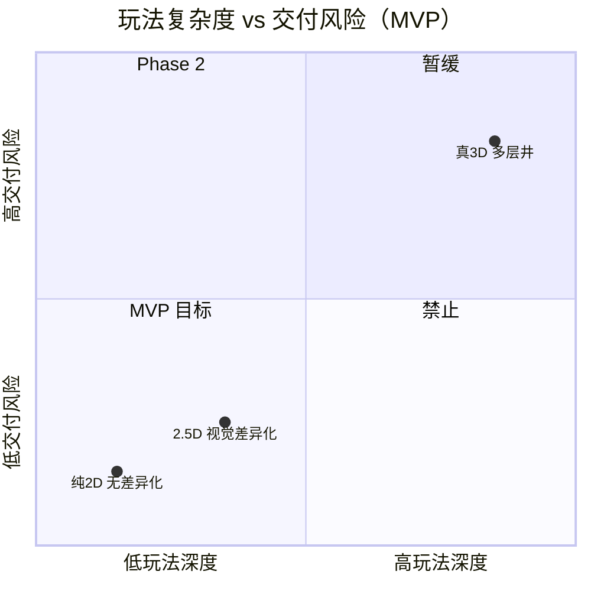
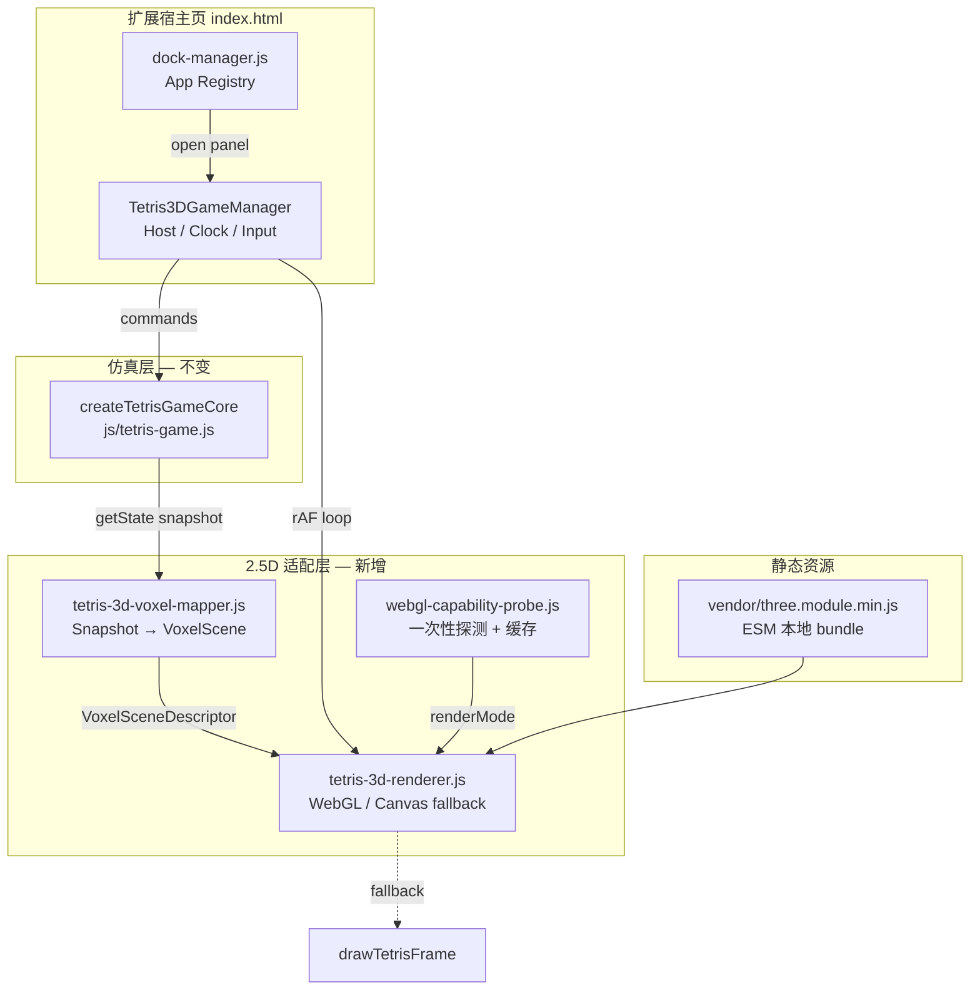
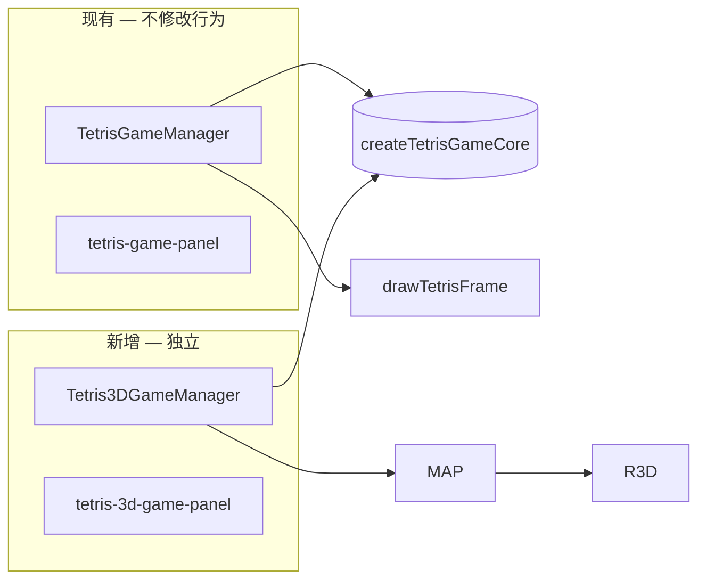

# ADR-001：技术选型与架构设计 v1（2.5D 立体方块 MVP）

| 元数据 | 值 |
|--------|-----|
| **状态** | Accepted |
| **日期** | 2026-05-20 |
| **决策者** | Tech Lead（架构师起草） |
| **关联** | [tetris-mvp-spike-v1.md](../tetris-mvp-spike-v1.md)、[play-spec-deterministic-v1.md](../play-spec-deterministic-v1.md)、[dock-manager-design-v1.md](../dock-manager-design-v1.md)、[tetris-rules-v1-parameter-bundle.json](../tetris-rules-v1-parameter-bundle.json) |
| **范围** | Chrome 扩展新标签页 Dock 内「立体方块」MVP；不含 Phase 2 真 3D 井、排行、联机 |

---

## 1. 背景与问题陈述

团队在「3D 俄罗斯方块」方向达成 **有条件 Go**：定位为扩展 Dock 留存/差异化模块，14 个工作日交付可玩 Alpha/Beta，**零后端**，成功指标绑定 Dock 点击率与扩展留存而非游戏内变现。

核心分歧：**产品 PRD 中的真 3D 多层空间**（4×4×N 柱体、Z 层消除、双轴旋转）与 **工程可交付的 2.5D**（经典 10×20 单层逻辑 + 立体体素视觉 + 固定斜视相机）之间的语义差距。

仓库已具备：

- 确定性仿真内核 `createTetrisGameCore`（`js/tetris-game.js`）及单测 `test/tetris-game-core.test.js`
- 快照驱动 Canvas 渲染 `drawTetrisFrame`
- 宿主 `TetrisGameManager`（计时、输入、2D 面板）
- 性能分级 `js/tetris-effect-tiers.js`
- Dock 应用注册表 `js/dock-manager.js`（可扩展独立入口）
- Spike 结论：逻辑/渲染已解耦，WebGL 宜单独分包 + Probe 降级（见 [tetris-mvp-spike-v1.md](../tetris-mvp-spike-v1.md) R3/R5）

本 ADR 冻结 **MVP 架构边界、模块接口契约、Three.js 本地 bundle 方案**，作为 PR-1～PR-4 与 QA/DevOps 门禁的单一技术依据。

---

## 2. 决策摘要

| 主题 | 决策 |
|------|------|
| 玩法深度 | **MVP = 2.5D**；真 3D 井 **Phase 2** 独立立项（+8～12 周预估，90 天 KPI 门禁） |
| 逻辑 SSOT | 复用 **`createTetrisGameCore`**，不新建 `packages/tetris-core`（TS 迁移列入 Phase 2 tech-debt） |
| 渲染 | **Three.js 本地 bundle** + `InstancedMesh`；Probe 失败 → **Canvas 2D** 降级（复用 `drawTetrisFrame`） |
| 入口 | 独立 Dock 应用 **`tetris-3d-game`**；现有 **`tetris-game` 2D 面板零改动** |
| 合规 | MV3 **禁止 CDN**；所有脚本走 `chrome-extension://` + `vendor/` |
| 平台 | 桌面 Chrome/Edge/Safari 优先；触控 v1.1 |

---

## 3. 2.5D 边界定义（架构契约）

### 3.1 术语

| 术语 | 定义 |
|------|------|
| **2.5D** | 仿真在 **二维离散网格**（10 列 × 20 行，单层）上运行；表现层用 **体素/方块网格** 在 WebGL 中绘制 **固定斜视相机** 下的「立体感」，**不**引入第三维玩法状态 |
| **真 3D（Phase 2）** | 玩法状态含 **深度轴 Z**（如 4×4×N 井）、Z 向消除、绕多轴旋转、四向深度移动；需独立碰撞/墙踢/消行语义与全新内核或子系统 |

### 3.2 MVP 内（In Scope）

| 维度 | 规格 |
|------|------|
| 棋盘 | `cols=10`, `rows=20`，`board[y][x]` 与现内核一致 |
| 旋转 | 2D 四态 `rotation ∈ {0,1,2,3}`，**generic 踢墙**（与 `tetris-game.js` 一致） |
| 消行 | **整行满** 消除（水平行），计分 `[0,100,300,500,800]` 按消除行数 |
| 重力 | `tick` / `softDrop` / 硬降语义由现 `TetrisGameManager` 调度模式继承 |
| 胜负 | 新块无法生成即 `gameOver`；MVP **无 Ghost、无 Hold、无断点续玩** |
| 相机 | **固定** 斜视（建议 yaw≈45°、pitch≈35°～55° 可配置常量），**无自由轨道相机** |
| 输入 | 键盘：←→/AD 平移，↑/K/X 旋转，↓/S 软降，C/End 硬降，空格暂停（与 2D 面板一致，作用域收敛到 3D 面板 focus） |
| 表现 | 每格一个体素实例；锁定格 + 当前骨牌；可选 P1 消行动画（**仅渲染层插值**，不改变内核时序） |

### 3.3 MVP 外（Out of Scope → Phase 2+）

- 4×4×N **多层井**、Z 层 / 柱体消除、**双轴/三轴** 旋转玩法
- Ghost piece、Hold、SRS guideline 全量、联机、排行榜、皮肤商城、云存档
- 自由相机、AR/VR、移动端手势（v1.1）
- 后端 API、账号体系

### 3.4 2.5D vs 真 3D 决策矩阵



**裁定理由**：真 3D 使旋转/碰撞/墙踢复杂度约 **3～5×**，与 14 日里程碑及「留存验证」目标不匹配；2.5D 在 Spike 已验证的 **快照渲染解耦** 上增量最小。

---

## 4. 目标架构

### 4.1 逻辑分层（与 play-spec 对齐）



**原则**（继承 [play-spec-deterministic-v1.md](../play-spec-deterministic-v1.md)）：

1. **内核零 WebGL 引用**；`getState()` 为渲染唯一输入。
2. **Mapper 无时钟**；动画状态仅存在于 Renderer。
3. **输入/时钟止于 Host**（`Tetris3DGameManager`），不得把屏幕坐标传入内核。

### 4.2 与现有 2D 模块的关系



- **共享**：`createTetrisGameCore`、`getPieceCells`、`COLORS`、单测与规则 JSON SSOT。
- **隔离**：DOM 面板、脚本加载顺序、Dock `appId`、功能开关、埋点命名空间。

---

## 5. 模块划分与职责

| 模块 | 文件（计划） | 职责 | 确定性 |
|------|----------------|------|--------|
| **Simulation Kernel** | `js/tetris-game.js`（已有） | 碰撞、踢墙、锁定、消行、计分、七袋 | **是** |
| **Voxel Mapper** | `js/tetris-3d-voxel-mapper.js` | `GameStateSnapshot` → 体素列表/实例矩阵/颜色索引 | 纯函数，**是** |
| **WebGL Renderer** | `js/tetris-3d-renderer.js` | Three.js 场景、相机、灯光、`InstancedMesh` 更新、resize | **否** |
| **Capability Probe** | `js/webgl-capability-probe.js`（可内联于 renderer） | WebGL2/WebGL1 上下文探测、黑名单 GPU 启发式 | **否** |
| **3D Host** | `js/tetris-3d-game.js` | 元素绑定、键盘、重力 tick、`rAF`、Probe 结果选择渲染器 | 调度确定性；渲染否 |
| **Effect Tiers** | `js/tetris-effect-tiers.js`（已有） | `maxDrawableInstances`、`canvasResolutionScale` 映射到 3D | 否 |
| **Dock Registry** | `js/dock-manager.js` | 注册 `tetris-3d-game`，Launchpad 可见 | — |

### 5.1 交付 PR 映射

| PR | 交付物 | 门禁 |
|----|--------|------|
| PR-1 | `tetris-3d-voxel-mapper.js` + `test/tetris-3d-voxel-mapper.test.js` | `node --test` 绿灯 |
| PR-2 | `tetris-3d-renderer.js` + Probe + Canvas fallback | 桌面 ≥30fps@1080p（P0） |
| PR-3 | `Tetris3DGameManager` + HTML/CSS + Dock 注册 | 连续 10 局无崩溃 |
| PR-4 | 消行动画、音效、埋点（P1，不阻塞 Alpha） | — |

---

## 6. 接口定义（契约级）

> 实现语言为 **CommonJS / IIFE**（与仓库一致）；下列为 **架构契约**，PR 实现不得偏离语义。

### 6.1 内核（已有，只读依赖）

```javascript
/**
 * @typedef {Object} TetrisCoreState
 * @property {number} cols
 * @property {number} rows
 * @property {number[][]} board  // 0 空，1–7 种类索引
 * @property {{type:string, rotation:number, x:number, y:number}|null} current
 * @property {number} score
 * @property {number} lines
 * @property {number} level
 * @property {boolean} gameOver
 */

/** @returns {TetrisCoreAPI} */
createTetrisGameCore(options?: { cols?: number, rows?: number, randomFn?: () => number })

// TetrisCoreAPI 方法（MVP 使用子集）:
// move(dx), rotateCW(), softDrop(), hardDrop(), tick(), reset()
// getState(): TetrisCoreState
```

### 6.2 Voxel Mapper

```javascript
/**
 * 将内核快照映射为渲染器无关的场景描述（世界坐标单位：1 格 = 1 unit）。
 * @param {TetrisCoreState} state
 * @param {import('./tetris-game.js').COLORS} [palette]
 * @returns {VoxelSceneDescriptor}
 */
function mapSnapshotToVoxelScene(state, palette) { /* ... */ }

/**
 * @typedef {Object} VoxelSceneDescriptor
 * @property {number} cols
 * @property {number} rows
 * @property {ReadonlyArray<VoxelInstance>} voxels
 * @property {ReadonlyArray<VoxelInstance>} [activePieceVoxels]  // 可与 voxels 分池供动画
 * @property {'playing'|'game_over'} phase
 */

/**
 * @typedef {Object} VoxelInstance
 * @property {number} gx  // 网格 x
 * @property {number} gy  // 网格 y（向下为正，与内核一致）
 * @property {number} colorIndex  // 1–7
 * @property {'locked'|'active'} kind
 */
```

**约束**：

- `gy` 与内核 `board[y][x]` 索引 **一一对应**，不在 Mapper 内做「假 Z 轴玩法偏移」。
- 输出体素数量上界：`cols * rows + 4`（当前块），供 `tetris-effect-tiers` 的 `maxDrawableInstances` 校验。

### 6.3 WebGL Capability Probe

```javascript
/**
 * @typedef {'webgl'|'canvas2d'} RenderMode
 */

/**
 * @param {object} [hints]
 * @param {boolean} [hints.forceCanvas2d]  // L0 功能开关注入
 * @returns {{ mode: RenderMode, reason: string, glVersion?: 1|2 }}
 */
function probeWebGLCapability(hints) { /* ... */ }
```

**降级顺序**：

1. `forceCanvas2d` / `chrome.storage` `tetris3d.renderMode='2d'` → Canvas
2. 无法创建 WebGL 上下文 → Canvas
3. 上下文创建成功 → WebGL

探测结果 **会话级缓存**（`sessionStorage` 或模块级 singleton），避免每局重复创建上下文。

### 6.4 Tetris3D Renderer

```javascript
/**
 * @typedef {Object} Tetris3DRendererOptions
 * @property {HTMLElement} container
 * @property {number} logicalWidth
 * @property {number} logicalHeight
 * @property {import('./tetris-effect-tiers.js').TetrisEffectTierId} [effectTierId]
 * @property {RenderMode} renderMode
 */

class Tetris3DRenderer {
  /**
   * @param {Tetris3DRendererOptions} options
   */
  constructor(options) {}

  /** 绑定 WebGL 或 2D canvas，初始化相机/InstancedMesh */
  init() {}

  /**
   * @param {VoxelSceneDescriptor} scene
   * @param {{ lineClearAnim?: { rows: number[], t01: number } }} [fx]  // P1，内核已完成消行
   */
  render(scene, fx) {}

  resize(width, height) {}
  dispose() {}
}
```

**InstancedMesh 策略**：

- 预分配 `cols * rows + 4` 实例槽位；每帧仅更新 `instanceMatrix` + `instanceColor`（或统一材质 + 7 色材质数组）。
- **禁止** 每格 `new Mesh()`；`dispose()` 在面板关闭时释放 GPU 资源。

**Canvas 降级**：内部持有离屏逻辑尺寸 canvas，调用已有 `drawTetrisFrame(ctx, w, h, coreState)`（Mapper 可旁路，直接传 `getState()`）。

### 6.5 Tetris3D Game Manager（Host）

```javascript
class Tetris3DGameManager {
  constructor(options?: {
    effectTierId?: 'low'|'medium'|'high',
    renderModeOverride?: RenderMode,
  })
  init()           // bind DOM, probe, create renderer
  start() / pause() / restart()
  /** 由 rAF 或 setTimeout 驱动 */
  onFrame(nowMs: number)  // tick gravity + renderer.render
  destroy()        // dispose renderer, remove listeners
}
```

**输入作用域**：仅在 `#tetris-3d-game-panel` 可见且（建议）面板 `tabindex` focus 时 `preventDefault`；避免重复 2D 面板的全局快捷键风险（Spike R4）。

### 6.6 平台与运营预留（MVP 不实现）

```typescript
// Phase 2 — 仅接口占位，禁止 MVP 耦合业务
interface IGamePlatform {
  getHighScore(): Promise<number>;
  setHighScore(score: number): Promise<void>;
  track(event: string, payload?: Record<string, unknown>): void;
}
```

本地最高分（P1）可直接 `chrome.storage.local`，无需抽象层直至排行需求立项。

### 6.7 Dock 应用注册扩展

在 `dock-manager.js` 应用表新增（示意）：

```javascript
{
  id: 'tetris-3d-game',
  name: '立体方块',           // 对外规避 Tetris 商标
  icon: 'fas fa-cube',
  category: 'games',
  dockBtnId: 'tetris-3d-dock-btn',
  panelId: 'tetris-3d-game-panel',
  defaultInDock: true,        // Canary 期可由 storage 覆盖
  defaultOrder: 8.5,
  isSystem: false,
}
```

---

## 7. Three.js 本地 Bundle 方案

### 7.1 约束

| 约束 | 说明 |
|------|------|
| MV3 CSP | 扩展页 **不得** 依赖 `https://cdn.*`；`manifest.json` 当前无 host 脚本白名单，保持 **纯本地** |
| 包体 | Chrome Web Store 单包建议监控；Three **tree-shake 不可用**（无构建链）→ 使用 **官方 pre-minified ESM** 子集 |
| 加载模型 | 与 `vendor/mermaid.tiny.min.js` 一致：**静态 `<script type="module">` 或 dynamic `import()` 指向 `chrome.runtime.getURL`** |
| 隔离 | Three **仅** 被 `tetris-3d-renderer.js` 静态 import；**禁止** 污染全局 `window.THREE` 供其他模块误用 |

### 7.2 推荐目录与版本

```
vendor/
  three/
    three.module.min.js    # r16x ~ r170，锁定 minor 版本并记录在 package-lock 式 VENDOR.lock.md
  VENDOR.lock.md           # 记录版本、构建命令、许可证 MIT
```

**版本选型**：`three@0.170.x`（或团队已验证的 r16x LTS）；**仅引入** `three.module.js` 压缩版，**不引入** examples/jsm 除非 PR-2 明确需要（MVP 避免 OrbitControls）。

### 7.3 构建与入库流程（DevOps）

```bash
# 在仓库根执行（一次性 / 升级时）
npm pack three@0.170.0
tar -xf three-*.tgz/package/build/three.module.js
# 使用 esbuild 或 terser 压缩后写入 vendor/three/three.module.min.js
# 记录 SHA256 至 docs/adr/VENDOR.lock.md
```

**CI 门禁**（与 action item 对齐）：

```bash
node --test test/tetris-game-core.test.js test/tetris-3d-voxel-mapper.test.js
./scripts/package.sh
# 新增：zip 内不得含 cdn.jsdelivr / unpkg 字符串；vendor/three 必须存在
```

### 7.4 运行时加载

**方案 A（推荐）**：`index.html` 中 3D 面板脚本使用 **native ESM**：

```html
<script type="module" src="js/tetris-3d-game.js"></script>
```

`tetris-3d-renderer.js` 顶部：

```javascript
import * as THREE from '../vendor/three/three.module.min.js';
```

Chrome 扩展 MV3 对 extension page 的 ES module 支持已满足（`chrome-extension://` 同源）。

**方案 B（回退）**：esbuild 将 three + renderer **预打包** 为 `vendor/tetris-3d.bundle.js`（IIFE），供禁止 `type=module` 的环境；**MVP 优先方案 A**，减少双份 Three。

### 7.5 包体预算

| 资产 | 预估 |
|------|------|
| `three.module.min.js` | ~600–700 KB（min+gzip ~170 KB） |
| 3D 模块新增 JS | <80 KB |
| **合计增量** | <800 KB raw；接受，与现有 `mermaid.tiny` 量级相当但 **懒加载** |

**懒加载**：仅在用户首次打开 `tetris-3d-game-panel` 时 `import()` Three 与 renderer，避免拖慢新标签页冷启动。

### 7.6 相机与场景常量（架构缺省）

| 参数 | 建议初值 | 说明 |
|------|----------|------|
| `CAMERA_FOV` | 45° | 透视 |
| `CAMERA_POSITION` | (12, 18, 12) | 看向棋盘中心 |
| `LOOK_AT` | (4.5, 10, 0) | cols/2, rows/2 |
| `VOXEL_SIZE` | 1 | 与网格对齐 |
| `BOARD_ORIGIN` | (0, 0, 0) | 左下角为原点，Y 向上抬升以符合「立体」观感（Mapper 做 `displayY = rows - 1 - gy`） |

---

## 8. 技术选型理由

| 选项 | 结论 | 理由 |
|------|------|------|
| **Three.js** vs Babylon / raw WebGL | **Three.js** | 生态成熟、InstancedMesh 一阶支持、团队 spike 与运维 Probe 方案一致；Babylon 包体更大，raw WebGL 14 日风险高 |
| **InstancedMesh** vs 合并 BufferGeometry | **InstancedMesh** | 盘面 + 当前块 <250 实例，每帧矩阵更新即可；便于按 `effectTier` 限流 |
| **2.5D 复用 Core** vs 新 TS 包 | **复用 Core** | 已有单测与确定性链路；避免双份逻辑与 webpack 引入 |
| **独立 Dock 入口** vs 替换 2D | **独立入口** | 零侵入、A/B、L1 回滚关闭入口 <15min |
| **Canvas 降级** vs 纯 WebGL | **双路径** | 扩展环境 WebGL 黑名单与低端集显常见；复用 `drawTetrisFrame` 降本 |
| **generic 踢墙** vs SRS | **generic（MVP）** | 与现内核一致；SRS 开 tech-debt issue |

---

## 9. 非功能需求

### 9.1 性能

| 指标 | 目标 |
|------|------|
| 帧率 | 桌面 1080p **≥30fps**（P0）；目标 60fps |
| 实例数 | ≤ `maxDrawableInstances`（沿用 `tetris-effect-tiers`） |
| 冷启动 | Three **懒加载**；首屏 LCP 不因 3D 模块回归 >3%（运维门禁） |
| 内存 | 面板 `dispose()` 释放 WebGL 上下文；避免多面板同时挂载 |

### 9.2 安全

- **CSP**：不添加 `unsafe-eval`；Three r16x 默认不需要 eval。
- **输入**：面板内键盘监听，避免全局劫持。
- **供应链**：Three 仅来自 npm 锁定版本 + SHA256 记录；CI 扫描 CDN 字符串。
- **品牌**：UI 文案「立体方块 / 3D 方块消除」，代码命名可用 `tetris-3d` 前缀（内部），对外素材避免 Tetris 商标。

### 9.3 可维护性与技术债

| 项 | 处理 |
|----|------|
| guideline SRS + lock delay | MVP 不阻塞；[tech-debt TD-001](../tech-debt/issue-001-srs-guideline-and-phase2-3d-presearch.md) |
| `packages/tetris-core` TypeScript | Phase 2 |
| 真 3D 井玩法 | Phase 2 epic，依赖 KPI；预研见 `js/tetris-3d-phase2-prototype.js` |
| Core 与 JSON profile 漂移 | 以 `tetris-rules-v1-parameter-bundle.json` 为 SSOT，W2 覆盖率 ≥80% |

### 9.4 发布与回滚（架构支持）

| 层级 | 机制 | 恢复时间 |
|------|------|----------|
| **L0** | `chrome.storage` `tetris3d.renderMode='2d'` 或 Probe 强制 Canvas | <5 min |
| **L1** | Dock 配置移除 `tetris-3d-game` 入口 | <15 min |
| **L2** | 扩展版本回退 + 归档 zip | <2 h |

---

## 10. 风险与缓解

| ID | 风险 | 影响 | 缓解 |
|----|------|------|------|
| A1 | PRD/QA 用例仍按真 3D 编写 | 验收失败 | PM 修订 PRD v1.1；本 ADR §3 为测试冻结依据 |
| A2 | Three 包体导致商店审核/下载抱怨 | 安装转化 | 懒加载 + 可选「仅 2D」运营开关 |
| A3 | WebGL 上下文丢失（睡眠/驱动） | 黑屏 | 监听 `webglcontextlost` → 自动切 Canvas + 提示 |
| A4 | 双游戏全局快捷键冲突 | 主站功能受损 | 面板 focus 捕获；2D/3D 互斥打开（建议） |
| A5 | Mapper 引入隐藏 Z 逻辑 | Phase 2 返工 | Code review 禁止 Mapper 内深度玩法；单测只断言 2D 映射 |
| A6 | InstancedMesh 更新 bug | 视觉与逻辑不一致 | 单测覆盖 mapper；E2E 对拍 `getState().board` 与体素列表 |

---

## 11. 质量门禁（架构视角）

- **P0 阻塞**：`createTetrisGameCore` 单测绿灯；mapper 单测绿灯；桌面 ≥30fps；Blocker/Critical=0；连续 10 局无崩溃。
- **CI**：`node --test test/tetris-game-core.test.js test/tetris-3d-voxel-mapper.test.js` + `package.sh` + CSP/包体扫描。
- **W1 交付物**：固定视角 + 单方块 **最小 Three demo**（`test/demos/tetris-3d-minimal.html` 或 `demos/`）作为渲染层模板，**不计入生产包**时可放 `test/`（package.sh 已排除 test）。

---

## 12. Phase 2 门禁（真 3D）

仅当 90 天观察满足：**Dock 游戏入口点击率 +15～25%**、**7 日留存 +2～4pp**、主功能使用下降 **≤3%**，方可立项真 3D 井。立项时需 **新 ADR**，禁止在 Mapper 上叠床架屋。

---

## 13. 后果

### 正面

- 14 日内可交付可玩 MVP，复用已验证内核与单测。
- 渲染可替换、可降级，扩展合规路径清晰。
- 产品「3D 差异化」由视觉满足，UX 风险可控。

### 负面

- 与 PRD 真 3D 语义差距需对外沟通；竞品若强调「真立体玩法」可能舆论压力。
- Three 增加包体与维护面；需严格懒加载与 dispose 纪律。
- 竞技玩家可能批评踢墙非 SRS（已记录 tech-deject）。

---

## 14. 行动项追踪

| 项 | 负责人 | 状态 |
|----|--------|------|
| 本 ADR 评审签字 | Architect / Tech Lead | ✅ 起草完成 |
| PRD v1.1 对齐 2.5D | PM | ✅ [prd-tetris-3d-v1.1.md](../requirements/prd-tetris-3d-v1.1.md) |
| PR-1～PR-3 | FE / Senior | 待办 |
| W1 Three 最小 demo | Architect | ✅ `test/demos/tetris-3d-minimal.html` |
| `VENDOR.lock.md` + CI CSP 扫描 | DevOps | 待办 |

---

## 15. 修订记录

| 版本 | 日期 | 作者 | 说明 |
|------|------|------|------|
| v1.0 | 2026-05-20 | Architect | 初版：2.5D 边界、模块接口、Three 本地 bundle |
