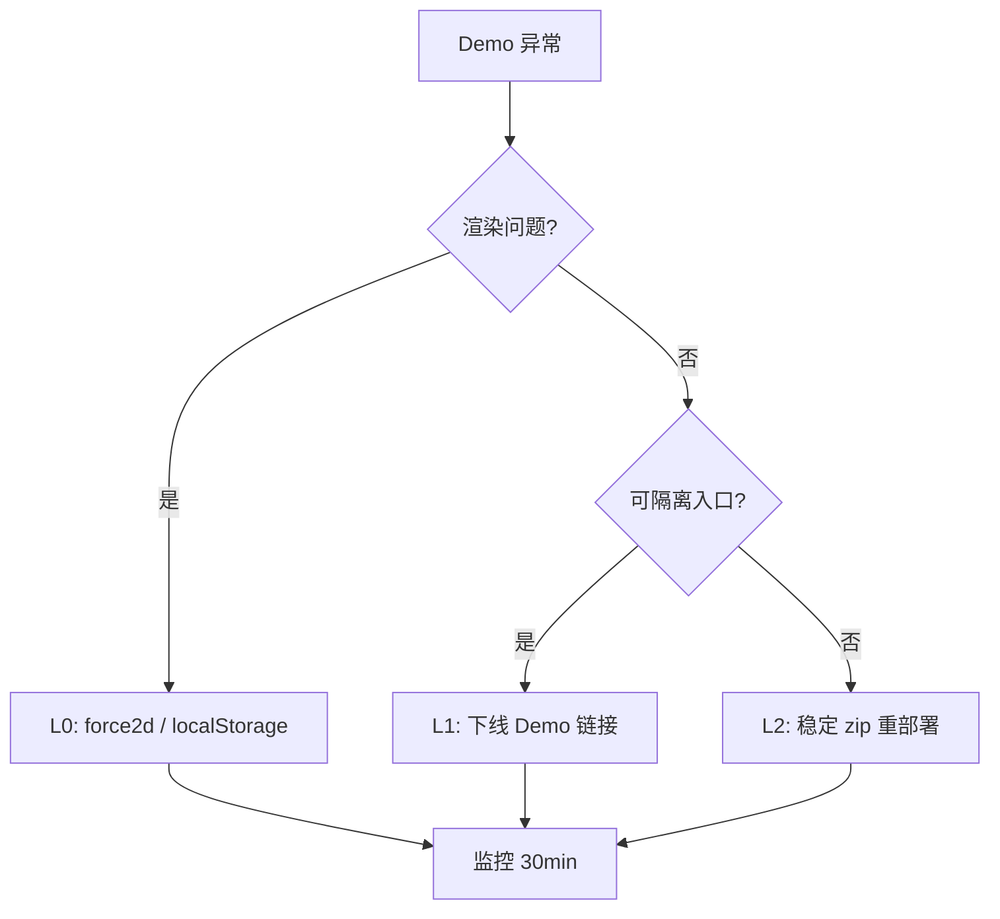

# GraphSphere Demo — 部署与回滚报告

| 项目 | 值 |
|------|-----|
| 模块 | GraphSphere v0.1 静态 3D 知识图谱 Demo |
| 交付形态 | 纯静态 SPA（零后端） |
| Demo 版本 | v0.1.0（`KG3D_DEMO_VERSION`） |
| 入口 | 打包后 `index.html`；开发态 `test/demos/knowledge-graph-3d-demo.html` |
| 发布策略 | CI 绿 → 归档 demo-graph → 可选 GitHub Pages / rsync |
| 文档版本 | v1.0 |

---

## 1. 部署步骤

### 1.1 前置条件

| 检查项 | 命令 / 标准 |
|--------|-------------|
| CI 门禁 | `./scripts/ci-gate-kg3d-demo.sh` 全绿 |
| GraphSnapshot 校验 | `./scripts/validate-demo-graph-json.sh` |
| demo-graph 归档 | `./scripts/archive-demo-graph-json.sh --version 0.1.0` |
| L2 基线（发版前） | `./scripts/rollback-archive-kg3d-demo.sh --tag stable/kg3d-demo-v0.1.0` |
| 回滚演练 | `./scripts/rollback-drill-kg3d-l0-l2.sh --report docs/deploy/drill-reports/kg3d-latest.md` |

### 1.2 本地 / VPS 静态部署

```bash
# 完整门禁 + 打包 + 扫描
./scripts/ci-gate-kg3d-demo.sh

# 部署到本地目录
./scripts/deploy-kg3d-demo.sh --target /var/www/graphsphere-demo

# 远程 rsync
./scripts/deploy-kg3d-demo.sh --target user@host:/var/www/graphsphere --rsync
```

产出：

- `dist/graphsphere-demo-v0.1.0-<sha>.zip` — 可归档 artifact
- `dist/kg3d-demo-staging/` — 可直接 `npx serve -p 8765 dist/kg3d-demo-staging`

### 1.3 CI/CD 流水线

| Workflow | 触发 | 作用 |
|----------|------|------|
| `kg3d-demo-ci-gate.yml` | PR / push（kg-graph 路径） | 单测 + JSON + 打包 + gzip/CSP 扫描 |
| `kg3d-demo-deploy.yml` | `workflow_dispatch` / tag `demo-graph/v*` | 门禁通过后上传 artifact；可选 GitHub Pages |

手动发布：

1. GitHub Actions → **GraphSphere Demo Deploy** → Run workflow  
2. 填写 `demo_version`；需要 Pages 时勾选 `deploy_pages`  
3. 下载 artifact `graphsphere-demo-static` 或访问 Pages URL  

### 1.4 发版后冒烟

| 步骤 | 预期 |
|------|------|
| 打开 `index.html` | 冷启动 ≤3s，场景 A 默认加载 |
| 切换场景 B | JSON fetch 成功，节点 ≤150 |
| `?force2d=1` | 徽章 `Canvas 2D`，点选/邻域可用 |
| 演示巡航 | ≥3 节点路径连续 1 次无 P0 缺陷 |
| fps | 200 节点档位 ≥30fps（中配 MacBook） |

---

## 2. 环境配置

| 配置项 | 说明 |
|--------|------|
| **运行时** | Chrome 120+；静态 HTTP(S)；禁止 `file://`（ES module） |
| **CSP** | 禁止 CDN；Three.js 仅 `vendor/three/three.module.min.js` |
| **包体门禁** | gzip 合计 ≤ **800KB**（`CI_KG3D_MAX_GZIP_BYTES=819200`） |
| **节点规模** | 预置场景 ≤150；运行时硬限 200（`validateGraphSnapshot`） |
| **L0 存储键** | `localStorage` → `graphsphere.renderMode` = `'2d'` |
| **Probe 缓存** | `sessionStorage` → `tetris3d.webglProbe.v1`（L0 后清除） |
| **归档目录** | `releases/kg3d-demo/`（manifest 入库，zip 忽略） |

### 2.1 环境变量（CI / 本地）

| 变量 | 默认 | 用途 |
|------|------|------|
| `KG3D_DEMO_VERSION` | `0.1.0` | 打包与 manifest 版本 |
| `CI_KG3D_MAX_GZIP_BYTES` | `819200` | gzip 硬限 |
| `CI_KG3D_MAX_ZIP_BYTES` | `2097152` | zip 硬限 |
| `CI_KG3D_SCAN_PROFILE` | `release` / `stable` | 扫描配置 |

---

## 3. 监控指标

| 指标 | 阈值 / 动作 |
|------|-------------|
| Demo 完播率 | ≥60%（6 个月 KPI） |
| 冷启动时间 | ≤3s；超 5s → 查 gzip/缓存 |
| fps（200 节点） | ≥30；<20 持续 5min → **L0** |
| `?force2d=1` 占比 | 异常升高 → WebGL 回归排查 |
| JS 运行时错误率 | 控制台 uncaught >1% 会话 → **L1** 隐藏入口 |
| CI gzip 体积 | >800KB → **阻塞合并** |
| 静态 5xx/404 | 可用性 <99.9% → **L2** 回滚 zip |

> MVP 无后端埋点；生产监控依赖静态托管日志 + 人工 Demo 彩排。P1 可接 `graphsphere.*` 前端 track。

---

## 4. 回滚方案

| 层级 | 场景 | 操作 | RTO |
|------|------|------|-----|
| **L0** | WebGL 黑屏、fps 崩溃 | `?force2d=1` 或 `localStorage graphsphere.renderMode=2d` | **<5 min** |
| **L1** | Demo 逻辑缺陷、影响扩展主站 | 从 `test/index.html` 移除 Demo 卡片 / 下线静态路由 | **<15 min** |
| **L2** | L0/L1 不足 | 部署 `releases/kg3d-demo/archives/*-stable-*.zip` 解压目录 | **<2 h** |

### 4.1 L0 操作

```javascript
// URL: /index.html?force2d=1

// 或控制台
localStorage.setItem('graphsphere.renderMode', '2d');
sessionStorage.removeItem('tetris3d.webglProbe.v1');
location.reload();
```

### 4.2 L2 操作

1. 读取 `releases/kg3d-demo/ROLLBACK_MANIFEST.json` → `latestStable`  
2. 校验 SHA256：  
   `shasum -a 256 releases/kg3d-demo/archives/<zipFile>`  
3. 解压并部署：  
   `./scripts/deploy-kg3d-demo.sh --skip-gate --target /var/www/graphsphere --rsync`  
   （或手动 unzip + rsync 稳定 zip 内容）  
4. 冒烟：场景 A/B、`?force2d=1`、BUILD_INFO.json 版本  

### 4.3 自动化脚本

```bash
# 发版前归档稳定包
./scripts/rollback-archive-kg3d-demo.sh \
  --ref HEAD \
  --version 0.1.0 \
  --tag stable/kg3d-demo-v0.1.0

# L0/L2 演练
./scripts/rollback-drill-kg3d-l0-l2.sh \
  --report docs/deploy/drill-reports/kg3d-latest.md
```

---

## 5. 演练记录

| 演练项 | 自动化 | 人工 |
|--------|--------|------|
| L0 forceCanvas2d 单测 | `rollback-drill-kg3d-l0-l2.sh` | 浏览器 `?force2d=1` |
| L2 zip + SHA256 | drill L2 + `scan-kg3d-demo stable` | 静态托管回退一次/季度 |
| demo-graph manifest | `archive-demo-graph-json.sh` | BA 抽检节点清单 |

最新报告：`docs/deploy/drill-reports/kg3d-latest.md`

---

## 6. 决策树



---

*运维维护：每次对外 Demo 发版前必须更新 demo-graph 归档与 L2 stable zip；保留 L0 开关至少 90 天。*
