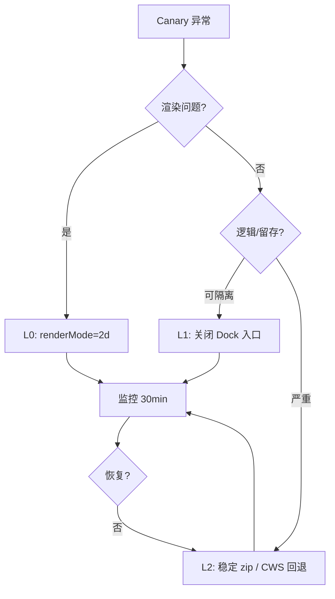

# Tetris 3D MVP — 部署与回滚报告

| 项目 | 值 |
|------|-----|
| 模块 | 立体方块（2.5D MVP） |
| 扩展 | 中国风景时钟 `chrome-time-background` |
| 当前 manifest | v3.16.0 |
| 发布策略 | Canary 5–10% → 全量 |
| 文档版本 | v1.0 |
| 最后演练 | 见 `releases/ROLLBACK_MANIFEST.json` → `latestStable.archivedAt` |

---

## 1. 部署步骤

### 1.1 前置条件

| 检查项 | 命令 / 标准 |
|--------|-------------|
| CI 门禁 | `./scripts/ci-gate.sh` 全绿 |
| 稳定基线已归档 | `./scripts/rollback-archive-stable.sh --tag stable/v3.16.0-pre-tetris3d-mvp` |
| 演练通过 | `./scripts/rollback-drill-l0-l2.sh --report docs/deploy/drill-reports/latest.md` |

### 1.2 Canary 发布（5–10%）

1. **打 MVP 包**（工作区含 Tetris 3D 代码时）  
   `./scripts/package.sh`  
   产出：`dist/chrome-time-background-v3.16.0.zip`

2. **CWS 上传**  
   - [Chrome 开发者后台](https://chrome.google.com/webstore/devconsole) → 软件包 → 上传新 zip  
   - 发布类型：**百分比推出** 5–10%

3. **冒烟**（Canary 用户）  
   - 新标签页 Dock 可见「立体方块」与「俄罗斯方块」  
   - 开局 → 消行 → Game Over → 重开  
   - WebGL 不可用机器：自动 Canvas 2D，徽章显示 `canvas2d`

### 1.3 全量发布

- Canary 24–48h 无 Blocker/Critical 且监控指标正常 → 推出比例 100%  
- 同步更新 `releases/ROLLBACK_MANIFEST.json` 中 `latestMvp`（可选，发版后执行归档脚本记录 MVP commit）

---

## 2. 环境配置

| 配置项 | 说明 |
|--------|------|
| **运行时** | Chrome / Edge / Safari 桌面端；MV3；无后端 |
| **CSP** | 禁止 CDN；Three.js 仅 `vendor/three/three.module.min.js` 本地 bundle |
| **存储键（L0）** | `chrome.storage.local` → `tetris3d.renderMode` = `'2d'` 强制 Canvas |
| **Probe 缓存** | `sessionStorage` → `tetris3d.webglProbe.v1`（L0 后需清除以重新探测） |
| **Dock（L1）** | `dockManagerConfig` / 启动台移除 `tetris-3d-game` |
| **CI** | GitHub Actions `tetris-3d-ci-gate.yml`；Node 20 |
| **归档目录** | `releases/archives/*.zip`（git 忽略二进制，manifest 入库） |

### 2.1 L0 运维开关（控制台）

```javascript
// 启用 L0：强制 2D 渲染（<5min，无需发版）
chrome.storage.local.set({ 'tetris3d.renderMode': '2d' });
sessionStorage.removeItem('tetris3d.webglProbe.v1');

// 解除 L0
chrome.storage.local.remove('tetris3d.renderMode');
sessionStorage.removeItem('tetris3d.webglProbe.v1');
```

### 2.2 L1 关闭 Dock 入口（<15min）

启动台 → 从 Dock 移除「立体方块」；或运维下发配置隐藏 `tetris-3d-game`（`dock-manager` 用户配置）。

---

## 3. 监控指标

| 指标 | 阈值 / 动作 |
|------|-------------|
| Dock「立体方块」点击率 | 目标 +15~25%（90 天） |
| 扩展 7 日留存 | +2~4pp |
| 主功能使用 | 下降 >3% → 触发 L0/L1 |
| `probe_result` 中 `renderMode=canvas2d` 占比 | 异常升高 → 查 WebGL 回归 |
| `panel_abort` / 崩溃率 | Blocker → 暂停 Canary |
| 包体大小 | CI 硬限 12MB；警告 8MB |
| 帧率（桌面 1080p） | ≥30fps P0 |

埋点经 `Tetris3DPlatform.track`（P1 PR-4）：`game_start` / `game_finish` / `probe_result` / `panel_abort`。

---

## 4. 回滚方案

| 层级 | 场景 | 操作 | RTO |
|------|------|------|-----|
| **L0** | WebGL 黑屏、帧率崩溃 | `tetris3d.renderMode='2d'` + 清 Probe 缓存 | **<5 min** |
| **L1** | 3D 逻辑缺陷、留存受损 | 关闭 Dock「立体方块」入口 | **<15 min** |
| **L2** | L0/L1 不足、需完全移除 MVP | CWS 回退或侧载稳定 zip | **<2 h** |

### 4.1 L2 详细步骤

1. 读取 `releases/ROLLBACK_MANIFEST.json` → `latestStable`  
2. 校验 SHA256：  
   `shasum -a 256 releases/archives/<zipFile>`  
3. **Chrome Web Store**：开发者后台 → 回退到上一已发布版本  
4. **或侧载验证**：解压 zip → `chrome://extensions` → 加载已解压  
5. 确认：无 `tetris-3d` 资源、Dock 无立体方块、2D 俄罗斯方块正常  

### 4.2 自动化脚本

```bash
# 归档上一稳定版（自 git HEAD 干净树，不含工作区 WIP）
./scripts/rollback-archive-stable.sh \
  --ref HEAD \
  --tag stable/v3.16.0-pre-tetris3d-mvp

# L0/L2 演练
./scripts/rollback-drill-l0-l2.sh \
  --report docs/deploy/drill-reports/latest.md
```

---

## 5. 演练记录

| 演练项 | 自动化覆盖 | 人工确认 |
|--------|------------|----------|
| L0 forceCanvas2d 单测 | `rollback-drill-l0-l2.sh` L0 | 控制台 storage 开关 |
| L2 zip 完整性 | SHA256 + `CI_SCAN_PROFILE=stable` 扫描 | CWS 回退一次（季度） |
| L1 Dock 关闭 | — | EX-08 UAT |

最新机器可读结果：`docs/deploy/drill-reports/latest.md`

---

## 6. 附录：三层回滚决策树



---

*运维维护：发版前必须更新稳定归档；MVP 全量后保留 L0/L1 开关至少 90 天。*
