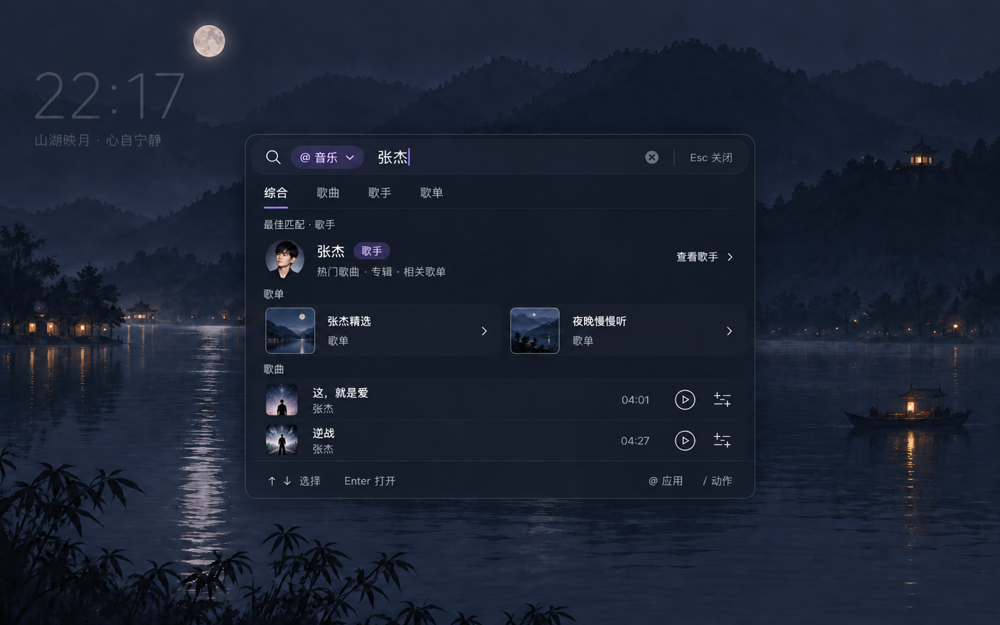

# 快捷助手 v2：轻量输入与音乐对象搜索

状态：设计方向已进入实现；实现范围和验收记录见 assistant-v2-implementation.md。

人物示例规范：后续示例图使用张杰的形象与音乐内容。

## 用户需求

1. 参考 chrome-bookmarks-search 的拼音匹配，支持拼音输入找中文对象。
2. 逐个应用优化，先处理音乐；结果支持歌曲、歌手、歌单。
3. 继承统一视觉风格，明显减轻独立弹窗的重量感。

## 设计图

### 拼音唤出应用

### 音乐综合结果

两张图均为生图概念稿，中文细节、歌单名、头像、封面与时长属于示意。图示像素密度不作为最终 CSS 尺寸合同。

## 视觉与外壳

- 继承 product-ui-v5 的夜色山水、深蓝黑表面、紫色 #8b6cff 强调，不继续使用 MVP 的整片墨绿色。
- 移除大标题、MVP 标签、常驻多行输入框、大执行按钮和设置工具栏。
- 默认一行输入；多行内容按需增长。建议输入行约56–64px，唤出态含一条建议约120–150px；综合结果按内容展开，桌面目标最大高度约420–480px，超出则在结果区滚动。
- 背景保持可辨认，降低阴影与描边；只在最外层使用适度模糊，结果不层层嵌套毛玻璃。
- 首选普通网页内的轻浮层。现在的 Chrome 独立窗口标题栏来自系统窗口，不能只靠页面 CSS 消除；受限页面仍以紧凑小窗承接。页内模式的权限、隔离和焦点恢复属于后续实现内容。
- 实际调用媒体工具仍通过扩展后台；页面层不得拿到模型令牌，也不直接访问任意业务接口。

## 拼音搜索

参考项目的实际入口是 js/search-parser.js 与 js/smart-sort.js，使用本地 js/lib/pinyin-match.js。

- 原文优先匹配，未命中时尝试拼音；利用返回的中文字符位置高亮。
- 应用例：@yy → 音乐。动作例：/jxk → 继续看。
- 已知音乐候选例：zhangjie / zj → 张杰。支持全拼、首字母以及库实际支持的混合输入。
- 模糊匹配只影响候选和排序，不直接触发播放。多结果由用户选择，不把拼音唯一映射成某个人名。
- 第一阶段覆盖应用、动作、已加载结果和本地常用/历史索引。远端全站搜索仍依赖网易云接口；如需从拼音检索全站，可先选择已确认的中文实体再发起搜索，不能声称本地匹配库已解决全站召回。
- 中文输入法合成过程中不抢焦点、不提交，不把未确认的拼音自动替换为汉字。

## 音乐结果与动作

| 类型 | 综合页展示 | 默认 Enter | 次级动作 |
| --- | --- | --- | --- |
| 歌手 | 圆头像、名称、歌手标识、简短资料 | 展开歌手 | 热门歌曲、专辑、相关歌单 |
| 歌单 | 方封面与名称、真实曲目数/创建者 | 展开歌单 | 播放全部、加入队列 |
| 歌曲 | 紧凑行、封面、歌名、歌手、时长 | 播放歌曲 | 加入队列、查看歌手 |

综合页显示最佳匹配歌手、少量歌单与歌曲；类型标签可切换为完整单类结果。不要把所有对象都降格成同一种歌曲行。

进入歌手或歌单后，在同一轻浮层里呈现内容，并保留返回上一级的路径、搜索词和选择位置。对歌单和歌手，浏览与播放是两个不同动作；用户查看对象不会自动清空或替换当前队列。明确说“播放这个歌单”时才走播放动作，并依据真实曲目和播放回执反馈结果。

后端对象需保留类型和真实引用：song / artist / playlist。候选选择通过对象类型调用不同适配器，避免再用统一的 music.play 处理全部对象。使用已有歌手、歌单接口与播放器能力；不编造资源 ID。

## 顺序

1. 先实现输入条的拼音匹配与轻量入口，验证键盘、焦点和收起行为。
2. 音乐搜索返回歌曲、歌手、歌单三类真实对象；先做到可以浏览、返回和选择。
3. 接通歌单播放与队列动作，验证登录、不可播放曲目、手动接管和执行回执。
4. 音乐这一轮稳定后，再逐个处理 B 站和 YouTube。

## 生图方式

使用内置 image_gen；内置接口未暴露模型型号选择，无法指定或核验 image2.5。最终提示词及密度调整记录见 [当前张杰版本的生图记录](../../output/imagegen/assistant-light-v3/prompts.md)。
