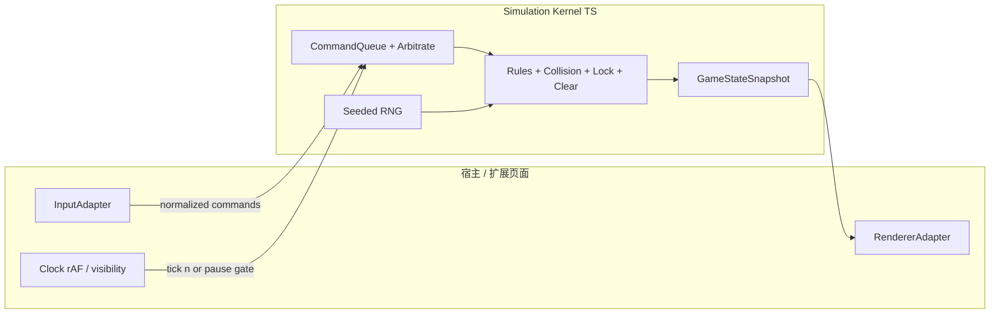

# 玩法规格书（确定性仿真）v1.0

**文档性质**：架构牵头、产品拍板的技术规格；与规则参数包 `tetris-rules-v1-parameter-bundle.{json,md}` 配对——参数包约束**棋盘/旋转/锁定/速度**等数值与表；本文约束**视角与操作、输入仲裁、胜负与暂停/后台**等行为语义，且全部条款可导出为自动化/手工测试用例。  
**非目标**：本文不写渲染与业务实现代码；不承诺对外竞技合规。

---

## 1. 技术方案总览

### 1.1 架构视图（逻辑与渲染分离）

确定性由 **Simulation Kernel（纯离散、无渲染引用）** 保证：`tick` 与 **命令（Command）** 在固定序下推进状态机；宿主负责输入采样、映射、可能在帧间合并，但 **不得** 把「画面坐标」传入内核判定合法性。



### 1.2 模块划分与职责

| 模块 | 职责 | 确定性要求 |
|------|------|------------|
| **Simulation Kernel** | 场地占用、SRS/Profile 踢墙、重力步、锁定延迟、消行、计分、顶出/无合法放置失败 | 同 `seed` + 同命令序列 ⇒ 同终态序列 |
| **InputAdapter** | 键鼠/触摸/手柄 → **规范化命令**；连击合并、方向并发仲裁 | 产出带 **单调时间戳 `t`**（见 §3）与 **帧序号 `frameId`**（可选）的事件流 |
| **RendererAdapter** | 只读 `GameStateSnapshot` / `GamePatch`；相机与特效不影响逻辑 | 不允许向 Kernel 回写逻辑状态 |
| **Rule Bundle** | `ruleSetId` + JSON Profile（与参数包对齐） | 变更须升 `schemaVersion` |

### 1.3 内核对外接口（规范级，非实现）

以下类型名为 **契约建议**，实现语言为 TS 时可逐字落地；测试与回放可只吃命令序列 + seed。

```typescript
// --- 时间轴：宿主单调时钟，单位 ms；暂停时冻结或切段见 §5 ---
type MonoTimeMs = number;

// --- 规范化命令：内核唯一接受的「玩家意图」 ---
type GameCommand =
  | { kind: "move"; dx: -1 | 1; issuedAt: MonoTimeMs }
  | { kind: "rotate"; direction: "cw" | "ccw"; issuedAt: MonoTimeMs }
  | { kind: "softDrop"; issuedAt: MonoTimeMs }        // 语义与 Profile 对齐：倍率重力或逐步，须在参数包声明
  | { kind: "hardDrop"; issuedAt: MonoTimeMs }
  | { kind: "hold"; issuedAt: MonoTimeMs }            // MVP 可标注为 Non-Goal，需与 PRD 一致
  | { kind: "pause"; requested: boolean; issuedAt: MonoTimeMs };

// --- tick：宿主按固定步进或固定帧调用；携带当前物理时间用于锁定延迟 ---
type TickInput = {
  frameId: number;
  now: MonoTimeMs;
  deltaMs: number; // 非负；暂停时为 0 且不推进
};

// --- 输出：便于渲染与测试断言 ---
type GameStateSnapshot = {
  ruleSetId: string;
  schemaVersion: string;
  rngStateDigest: string;        // 如 64-bit 状态摘要，便于回放对拍
  playfield: Readonly<...>;      // 与坐标约定见参数包 Markdown
  activePiece: ... | null;
  phase: "playing" | "line_clear" | "game_over" | "paused";
  score: number;
  level: number;
  lines: number;
  // ... 其它与 UI/结算一致的状态
};
```

**产品拍板项（写入 AC）**：`hold`、连击 UI、是否暴露 `frameId` 给遥测；架构侧要求：**无论是否暴露，内核内部 tick 序必须可重构**。

---

## 2. 视角与操作映射

### 2.1 视角模型（默认：2.5D / 纵深栅格 + 渐进增强）

与已决议一致：**默认不承诺六自由度真 3D 玩法**。规格书冻结以下视角语义，避免「3D」一词扩大解释：

| 概念 | 规格定义 | 渲染允许 | 内核禁止 |
|------|-----------|----------|----------|
| **逻辑棋盘** | 固定列 × 行栅格；重力沿 **−Y（行号减小）** 或按参数包「行向下为正」与占位一致 | 世界空间装饰 | 世界 mesh 碰撞 |
| **幽灵/预览** | 可选 P1；只影响教學/表现 | 可 3D | 不参与占用判定 |
| **相机** | 「主对战视角」+「有限 orbit 角度」→ **仅影响 MVP 输入映射为「屏幕投影后左右」** | 可插值 | 相机改变不得自发产生命令 |

**映射规则（MVP 必须）**：

1. **MoveLeft / MoveRight**：映射到逻辑 `dx = −1 / +1`（与当前 Profile 踢墙与碰撞一致）。若相机绕竖轴旋转，**以「相对主视角的左/右」** 为准；架构要求在 `InputAdapter` 层用**视图矩阵或 yaw 角度**把屏幕意图转正为逻辑 `dx`，Kernel 不识别相机。
2. **Rotate CW / CCW**：永远映射为 `rotate` 命令；O 块为 no-op（参数包已述）。
3. **Soft / Hard Drop**：分别映射 `softDrop` / `hardDrop`；具体一格/倍率与参数包锁定一致。
4. **触屏滑动**（若启用）：短划阈值内视为单点；超过阈值产生单次 `move` 或重复 `move` **必须可走 §3 合并规则**，避免一次滑动插入 undefined 多格（除非产品明确要「拖拽连续移动」并单独立测矩阵）。

### 2.2 可达操作与平台差异

| 平台 | 默认绑定（可配置） | 备注 |
|------|---------------------|------|
| 键盘 | ←/→ 移动；↑ 或 Z/X 旋转；↓ 软降；Space 硬降；P/Esc 暂停 | 浏览器需限定 `preventDefault` 范围，防与扩展快捷键冲突 |
| 触屏 | 虚拟按钮或分区；**连点**走 §3 | 需防误触：可设最小按下间隔（产品定阈） |
| 手柄 | D-Pad / 摇杆死区 | 摇杆持续偏置等价于 **重复 move 命令** 还是 **长按重复** 由 §3.2 决定 |

---

## 3. 输入优先级与仲裁（连点 / 多方向）

### 3.1 事件流与单调时间

- 每条宿主输入经 `InputAdapter` 转为 **一条或多条** `GameCommand`，均带 `issuedAt`（单调非递减）。
- 同一 `frameId` 内到达的多条命令进入 **命令队列**；**Kernel 在一个 tick 内按固定优先级消费**，保证确定性。

### 3.2 单 tick 内优先级（默认提案，**产品二选一须钉死**）

**方案 A（推荐，易测）——「旋转优先于横移，横移优先于软降一步」**  
在同一帧合并窗口内排序：

1. `rotate`（多条时：**先发 CW 再 CCW** 若都存在 → 若冲突则按**时间早者优先**，时间戳相同则 **CCW > CW** 或逆序须产品指定；**默认：时间戳早优先，同戳 rotate 丢弃后者**）
2. `move`（`dx` 冲突：**净位移 = 0** 则不生效果；**非零** 时 **+1 与 −1 同戳 → 全部取消**〔默认〕或 **以最后一条为准**〔备选，需单测加倍〕）
3. `softDrop`（至多应用一次步进，或与倍率重力合成规则在参数包定义）
4. `hardDrop`（一旦存在，**忽略同帧其它平移/旋转**〔默认〕）
5. `pause`

**方案 B（街机向）——「输入缓冲 FIFO，严格到达序，上限 N」**  
每 tick 最多应用前 `N` 条（默认 `N=1` 即退化为极简）；适合重「跟手」但需接受「旋转插队」带来的额外测试量。

**架构意见**：MVP 采用 **方案 A**，利于 Golden Test；若产品坚持 B，须在门禁中单列 **输入缓冲溢出** 用例。

### 3.3 连点（连击）与重复速率

- **连点**：在 `repeatWindowMs` 内多次 `move`/`rotate`，若未合并则逐 tick 处理；若合并，**默认**同一方向连点折叠为 **每 tick 至多 1 次 `move`**（防止一秒穿墙）。
- **长按**：键盘 autorepeat 由宿主节流：**首次间隔 `initialDelayMs` + 周期 `repeatPeriodMs`**，转化为离散命令序列（与 OS 解耦，保证跨浏览器一致）。

**产品拍板**：`repeatWindowMs`、`initialDelayMs`、`repeatPeriodMs` 缺省表（建议：首次 200ms，周期 80ms，合并窗口 = 1 tick）。

### 3.4 多方向同时按住

- **横移左+右同时**：默认 **对消为 0**（不产生 move）；与方案 A 一致。
- **旋转 + 移动 + 软降**：按 §3.2 应用；**硬降** 吞噬同帧其它（默认）。

---

## 4. 胜负条件（确定性条款）

下列条款直接映射 Given-When-Then；与参数包中「七袋、踢墙、锁定」等数值正交。

### 4.1 进行中（Playing）

- **合法放置**：active 与场地占用无重叠且在界内。
- **失败前置**：下一帧将产生非法 overlaps 或越界 **且** 无法通过当前 Profile 的踢墙/重置挽救 → 进入 **锁定或游戏结束判定**（依锁定语义）。

### 4.2 失败（Game Over）——**必须同时满足可观测性与单义性**

**失败类型（默认全集，可裁剪为 PRD Non-Goals）**：

| ID | 条件（When） | 可观测输出（Then） |
|----|----------------|-------------------|
| GO-1 **顶出（Lock Out）** | 新 piece 生成时或锁定后，**占用格任一超出可见顶线**（顶线定义与参数包 `spawn`/`visibleRows` 对齐） | `phase = game_over`，`reason = lockout` |
| GO-2 **无合法生成（Block Out）** | 生成位与场地已有块重叠且踢墙/hold（若启用）无可行解 | `reason = blockage` |
| GO-3 **长时间无可行动（可选 P2）** | 若规则引入「死局」检测；**MVP 默认不启** 以避免争议 | — |

**架构约束**：失败判定只在 Kernel **`afterLock` / `onSpawn`** 两个唯一点触发；宿主不得重复判定以防双杀。

### 4.3 胜利（Victain / Sprint）——**仅当 PRD 声明模式时启用**

- **无尽模式**：无胜利，仅高分/生存时长。
- **Sprint 行数目标**：`lines >= targetLines` → `phase = cleared`，`reason = sprint_complete`。
- **时间关**：`now >= timeLimit` → 结算（胜/负由是否达成分数门槛决定，**产品给表**）。

未在 PRD 出现的模式 **一律视为 Non-Goal**，规格书保留枚举位便于扩展。

### 4.4 计分与消层（引用 SSOT）

- **消层判定、连击、b2b、等级加速**：以 **参数包 JSON + 实现对照表** 为 SSOT；本文只规定 **触发顺序**：`lock → line clear detection → 重力沉降（若有）→ score 更新 → 下一 piece`，且须在同一 `tick` 或 **文档化多 tick 动画相位**中可还原（`phase = line_clear` 时 Kernel 冻结输入或按参数包定义）。

---

## 5. 暂停 / 后台 / 恢复策略（选型）

### 5.1 目标

网页与扩展场景下，**背景 tab、最小化、息屏** 会导致 rAF 节流逝真；须在产品层选择 **「时间模型」**，架构才能在锁定延迟、速度曲线上保持一致解释。

### 5.2 策略枚举（产品择一并写入帮助页）

| 策略 ID | 行为 | 优点 | 风险 |
|---------|------|------|------|
| **P-BIZ-1 完全暂停** | `document.visibilityState !== "visible"` 或宿主定义「失焦」→ Kernel `paused=true`，** Simulation 时间不前进**；恢复后仅继续 | 最公平、最易测 | 竞技感弱；长时间暂停与锁定延迟关系需文案说明（暂停不计入 lock delay） |
| **P-BIZ-2 墙钟追赶（不推荐 MVP）** | 后台仍累加 `now`，恢复时一次或多次 `tick` **追赶** | 真实时间一致 | 极易产生「爆炸式下落」与输入丢失争议 |
| **P-BIZ-3 混合：暂停 + 最大追赶步数上限** | 暂停为主，恢复时最多追赶 `K` 个重力步 | 折中 | 须定义溢出丢弃规则，测试复杂 |

**架构建议（与技负决议一致）**：MVP 采用 **P-BIZ-1**；锁定延迟使用 **仿真时间**（仅在 `paused=false` 时累积）。  
**必须验收**：背景 30s 返回后，**棋盘状态与未后台时「同等输入序列」一致**。

### 5.3 暂停操作与 UI

- **显式暂停**：`pause` 命令或系统菜单；`paused` 时 **拒收游戏性命令**（或入队待恢复，**二选一**；默认 **拒收并丢弃** 以减少状态空间）。
- **隐式暂停**：失焦策略与显式暂停 **必须统一时间冻结语义**。

### 5.4 Chrome 扩展注意点（非功能性需求）

- Service Worker / MV3 生命周期可能导致页面卸载：若无法保存，**产品决定**是否提供「单局恢复」；架构要求至少 **本地持久化 seed + 最近 N 条命令** 才允许声称恢复（否则文案写「返回重开」）。

---

## 6. 技术选型理由（摘要）

| 决策 | 理由 |
|------|------|
| 离散 Kernel + 命令日志 | 可重放、可 Golden Test；避免「帧率相关」漂移 |
| Input 与 Core 分离 | 平台差异止于 Adapter；减少 WebGL/扩展特化渗入规则 |
| 方案 A 仲裁 | 降低组合爆炸；边界用例可穷举 |
| P-BIZ-1 暂停 | 与锁定延迟、网页节流畅天然兼容；技术债最小 |

---

## 7. 测试用例导出模板（可直接贴入 QA/CI）

每条用例含：**ID、前置（规则/profile/seed）、输入序列、期望快照断言**。

### 7.1 视角与映射

| ID | Given | When | Then |
|----|-------|------|------|
| TC-V-01 | yaw=0° | 键盘 Left | `move dx=-1` 一次 |
| TC-V-02 | yaw=180°（若实现相机） | 键盘 Left | `move dx=+1`（相对棋盘矫正后） |
| TC-V-03 | 触摸配置为「短划」 | 划动小于阈值 | 不产生 `move` 或产生 1 次（与 §2.2 声明一致） |

### 7.2 输入仲裁

| ID | Given | When | Then |
|----|-------|------|------|
| TC-I-01 | playing | 同戳 Left+Right | 净 `move` 为 0 |
| TC-I-02 | playing | 同戳 rotate CW+CCW（同 timestamp） | 仅先到的生效，后者丢弃 |
| TC-I-03 | playing | 同帧 hardDrop + move | 仅 hardDrop 生效 |
| TC-I-04 | repeat 打开 | 80ms 内 5 次 Left | 每 tick 至多 1 格（或按合并声明） |

### 7.3 胜负

| ID | Given | When | Then |
|----|-------|------|------|
| TC-G-01 | 接近顶线 | 锁定导致占位越顶 | `game_over` + `lockout` |
| TC-G-02 | 场地已满到生成位 | spawn | `game_over` + `blockage` |

### 7.4 暂停/后台

| ID | Given | When | Then |
|----|-------|------|------|
| TC-P-01 | playing | visibility 隐藏 10s | 棋盘不变；时间冻结 |
| TC-P-02 | paused=true | 发送 move | 状态不变或命令丢弃（与 §5.3 一致） |
| TC-P-03 | 锁定延迟剩余 100ms | 立即 pause 5s 再恢复 | 剩余延迟仍为 100ms（仿真时间不跑） |

---

## 8. 评审与变更控制

- **本文版本**：`play-spec-deterministic/1.0.0`。破坏性改动（仲裁方案、胜负含义、暂停语义）→ **升 minor/major** 并与参数包 `schemaVersion` 联合发布说明。
- **角色**：架构保证条目无歧义；产品对**方案 A/B、P-BIZ、同戳 rotate 次序、硬降吞噬**等拍板；开发负责单测矩阵与帮助页同步。

---

## 9. 与现有仓库文档的关系

- **数值与表**：继续以 `docs/tetris-rules-v1-parameter-bundle.json` 为 SSOT。
- **本文**：补齐**行为语义与时间模型**，使「同一 JSON Profile」在不同宿主上表现一致。

---

*文档结束。*
