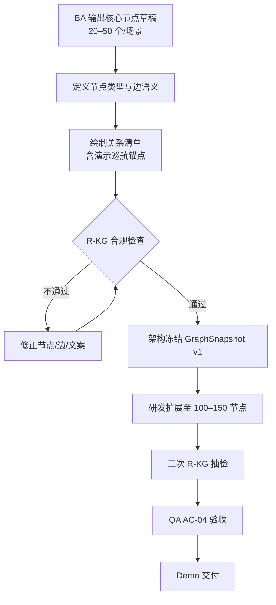
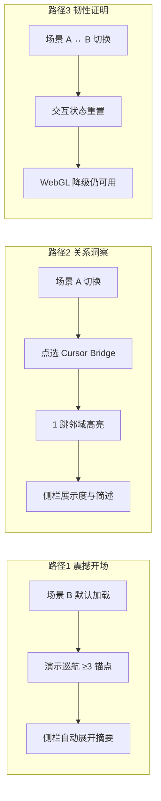
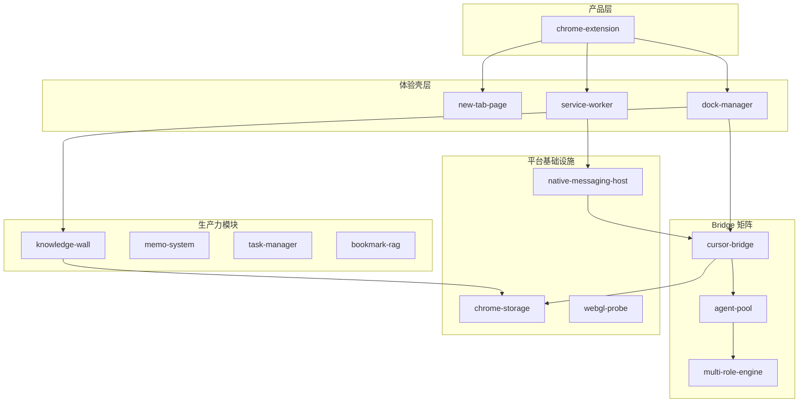
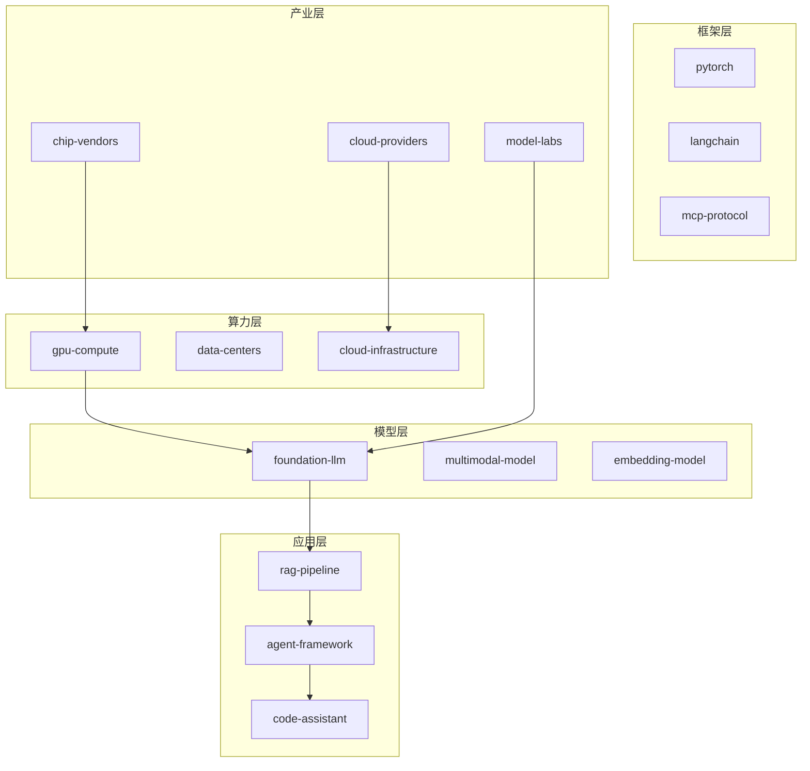

# GraphSphere 场景 A/B 实体关系清单与 R-KG 合规检查

**文档类型**：业务分析 / 数据建模 SSOT（Single Source of Truth）  
**产品**：GraphSphere v0.1 Demo  
**版本**：v0.1  
**日期**：2026-05-25  
**状态**：**D2 可冻结**（Draft 合规 ✅；待产品 / 架构签字）  
**关联**：[Demo Scope 一页纸](prd-graphsphere-demo-scope-v0.1.md)、[Cursor Bridge PRD](prd-cursor-bridge-v1.0.md)

**范围声明**：本文定义 **预置场景 A/B 的核心实体与关系草稿**（各 20–50 节点），并完成 **R-KG（Requirements Knowledge Graph）合规检查**。不涉及渲染、布局、Schema 代码实现；GraphSnapshot v1 字段细节以架构师 ADR-002 为准。

---

## 一、业务背景与目标

| 维度 | 说明 |
|------|------|
| **场景 A** | Chrome 扩展 + Cursor Bridge 产品架构图谱 —— **对内**架构评审、干系人对齐 |
| **场景 B** | AI 技术栈 / 产业链概念图谱 —— **对外**路演、获客、品牌叙事 |
| **Draft 节点** | 各场景 **42 / 45** 个核心节点（本稿） |
| **Full 场景** | 研发扩展至 **100–150** 节点（二级能力、实例节点、边界说明节点） |
| **业务目标** | 保证 Demo 三条路径可讲清故事：巡航震撼 → 点选洞察 → 场景切换韧性 |

---

## 二、业务流程

### 2.1 场景数据生产与验收主流程

### 2.2 Demo 叙事与节点消费流程

---

## 三、R-KG 业务规则定义

> **R-KG** = Requirements Knowledge Graph：GraphSnapshot 预置数据的 **业务合规与一致性规则**，作为 BA → 架构 → QA 的验收 SSOT。

### 3.1 节点规则（R-KG-N）

| 规则 ID | 优先级 | 规则描述 | 验收方式 |
|---------|--------|----------|----------|
| **R-KG-N01** | P0 | 场景内 `id` 全局唯一，建议 kebab-case（如 `cursor-bridge`） | 脚本 / 人工去重 |
| **R-KG-N02** | P0 | `label` 非空；3D 展示 ≤40 字（超出截断）；侧栏可展示全文 ≤80 字 | 文案走查 |
| **R-KG-N03** | P0 | `type` 必须属于场景 `schema.nodeTypes` 白名单 | Schema 校验 |
| **R-KG-N04** | P0 | 核心草稿节点数 20–50；完整场景 ≤150 | 计数 |
| **R-KG-N05** | P1 | 每个 hub 节点（演示锚点）必须有 `summary`（1–2 句业务简述） | 侧栏走查 |
| **R-KG-N06** | P1 | 禁止在 label/summary 中出现 API Key、绝对路径、内部 IP | 安全走查 |
| **R-KG-N07** | P1 | 同 type 节点建议 ≤30；超出须在扩展层拆分子类型 | 聚类可读性 |

**场景共用 nodeTypes 白名单**：

| type | 含义 | 场景 A 示例 | 场景 B 示例 |
|------|------|-------------|-------------|
| `product` | 产品 / 领域根 | Chrome 扩展 | AI 产业全景 |
| `module` | 前端或客户端模块 | Knowledge Wall | RAG Pipeline |
| `service` | 后端 / 本地服务 | Cursor Bridge | Model Serving |
| `infra` | 基础设施 / 平台 | Service Worker | Cloud Infrastructure |
| `data` | 数据实体 / 存储 | SQLite Database | Vector Database |
| `integration` | 外部集成 | Bilibili Integration | MCP Protocol |
| `capability` | 能力 / 特性 | Multi-Role Engine | Tool Calling |

### 3.2 边规则（R-KG-E）

| 规则 ID | 优先级 | 规则描述 | 验收方式 |
|---------|--------|----------|----------|
| **R-KG-E01** | P0 | 禁止自环（source = target） | 校验拒绝 |
| **R-KG-E02** | P0 | 禁止重复边（同 source + target + type） | 校验拒绝 |
| **R-KG-E03** | P0 | source/target 必须引用已存在节点 id | 校验拒绝 |
| **R-KG-E04** | P0 | `type` 必须属于 `schema.edgeTypes` 白名单 | Schema 校验 |
| **R-KG-E05** | P1 | `depends_on` 边构成的子图应无环（架构依赖层） | 拓扑检查 |
| **R-KG-E06** | P1 | 演示巡航路径上相邻锚点之间须存在 ≤2 跳连通路径 | 路径走查 |

**场景共用 edgeTypes 白名单**：

| type | 含义 | 使用场景 |
|------|------|----------|
| `contains` | 组成 / 包含 | 产品 → 模块 |
| `depends_on` | 依赖 | 模块 → 服务 / infra |
| `communicates_with` | 通信 / 调用 | 扩展 ↔ Bridge |
| `stores_in` | 持久化 | 服务 → 数据 |
| `exposes` | 对外暴露能力 | API → 能力 |
| `integrates_with` | 第三方集成 | 模块 → 外部平台 |
| `derived_from` | 概念衍生 / 技术演化 | 微调 → 基座模型 |

### 3.3 场景级规则（R-KG-S）

| 规则 ID | 优先级 | 规则描述 | 验收方式 |
|---------|--------|----------|----------|
| **R-KG-S01** | P0 | 单场景节点 ≤150；运行时硬限 200 | AC-04 |
| **R-KG-S02** | P0 | 至少 1 个 hub 节点（度 ≥5），作为演示与布局锚点 | 图统计 |
| **R-KG-S03** | P0 | 孤立节点（度=0）占比 ≤5% | 图统计 |
| **R-KG-S04** | P0 | 主连通分量节点占比 ≥90% | 图统计 |
| **R-KG-S05** | P0 | 预置 3 条演示巡航锚点 id 必须在场景内存在 | Demo Script |
| **R-KG-S06** | P1 | 固定 layout seed，同场景重复加载布局一致 | QA 录屏复现 |
| **R-KG-S07** | P1 | 布局坐标不写入 GraphSnapshot（运行时计算） | Schema 审查 |

### 3.4 合规性规则（R-KG-C）

| 规则 ID | 优先级 | 规则描述 | 依据 |
|---------|--------|----------|------|
| **R-KG-C01** | P0 | 场景 A 模块命名与仓库真实模块一致或可映射，禁止虚构核心服务 | 对内评审可信度 |
| **R-KG-C02** | P0 | 场景 B 使用 **概念层** 命名，不绑定未授权商标为节点 label | 对外路演合规 |
| **R-KG-C03** | P0 | 不宣称「官方认证」「行业标准」等未验证表述 | 品牌合规 |
| **R-KG-C04** | P1 | 场景 B 厂商类节点用类别聚合（如「Cloud Providers」），避免单点争议 | 路演中性 |

---

## 四、场景 A：Chrome 扩展 / Bridge 产品架构

**场景 id**：`scenario-a-chrome-bridge`  
**叙事主线**：新标签页扩展 → 生产力模块 → 智能检索 → Cursor Bridge 多 Agent 矩阵 → 底层 Chrome 平台能力  
**Draft 核心节点**：42  
**Hub 节点（演示锚点）**：`chrome-extension`、`cursor-bridge`、`agent-pool`  
**演示巡航路径（P0）**：`chrome-extension` → `cursor-bridge` → `multi-role-engine` → `agent-pool`

### 4.1 核心节点清单（42）

| # | id | label | type | summary（简述） |
|---|-----|-------|------|-----------------|
| A01 | `chrome-extension` | 中国风景时钟扩展 | product | MV3 新标签页产品根节点 |
| A02 | `new-tab-page` | 新标签页 | module | index.html 主入口与布局容器 |
| A03 | `dock-manager` | Dock 栏 | module | 底部快捷入口与模块切换 |
| A04 | `settings-page` | 设置页 | module | 用户偏好与 LLM 配置 |
| A05 | `main-bootstrap` | 主 bootstrap | module | main.js 模块初始化编排 |
| A06 | `memo-system` | 备忘录 | module |  Markdown 备忘录与提醒 |
| A07 | `knowledge-wall` | 知识墙 | module | 常用信息卡片与 Markdown 渲染 |
| A08 | `task-manager` | 任务管理 | module | 每日任务与到期提醒 |
| A09 | `schedule-planner` | 日程计划 | module | 日历与时间块规划 |
| A10 | `daily-worklog` | 工作日志 | module | 按日记录与回看 |
| A11 | `quick-navigation` | 快速导航 | module | 站点快捷入口 |
| A12 | `prompt-manager` | Prompt 管理 | module | 提示词模板库 |
| A13 | `writing-assistant` | 写作助手 | module | 博客 / 写作空间 AI 联想 |
| A14 | `bookmark-rag` | 书签智能检索 | module | RAG + 语义搜索 |
| A15 | `bookmark-srs` | 书签 SRS | module | 间隔重复复习调度 |
| A16 | `intelligent-query` | 智能查询 | capability | 自然语言理解搜索意图 |
| A17 | `music-controller` | 音乐播放器 | module | 独立音乐控制面板 |
| A18 | `bilibili-integration` | 哔哩哔哩集成 | integration | 关注 / 课程 / 播放器注入 |
| A19 | `weather-widget` | 天气组件 | module | 地理位置天气展示 |
| A20 | `landscape-clock` | 风景时钟 | module | 背景图与时钟展示 |
| A21 | `tetris-3d` | 立体方块 | module | WebGL 3D 小游戏 |
| A22 | `webgl-probe` | WebGL 探针 | capability | 能力检测与 2D 降级决策 |
| A23 | `activity-logger` | 活动监控 | module | 扩展使用行为记录 |
| A24 | `cursor-bridge-ui` | Bridge 客户端 UI | module | cursor-bridge.js 面板 |
| A25 | `cursor-bridge` | Cursor Bridge 服务 | service | 本地 Node.js 桥接服务 |
| A26 | `fastify-api` | Fastify API 层 | service | REST / SSE HTTP 接口 |
| A27 | `agent-pool` | Agent 池 | service | Agent 生命周期内存管理 |
| A28 | `multi-role-engine` | 多角色引擎 | capability | 多 Agent 协作编排 |
| A29 | `enterprise-roles` | 企业角色库 | data | 产品/架构/开发等角色定义 |
| A30 | `sse-stream` | SSE 输出流 | capability | Agent 流式输出推送 |
| A31 | `sqlite-database` | SQLite 数据库 | data | 会话 / 消息 / 任务持久化 |
| A32 | `native-messaging-host` | Native Messaging Host | integration | 自动启停 Bridge 进程 |
| A33 | `browser-automation` | 浏览器自动化 | capability | CDP / 页面操控能力 |
| A34 | `agent-memory` | Agent 记忆服务 | service | 跨会话上下文记忆 |
| A35 | `trace-service` | 追踪服务 | service | 执行链路追踪 |
| A36 | `writing-module` | 写作模块 API | service | 服务端写作 / Qwen 集成 |
| A37 | `service-worker` | Service Worker | infra | background.js 后台中枢 |
| A38 | `offscreen-document` | Offscreen 文档 | infra | 音频等离屏任务 |
| A39 | `chrome-storage` | Chrome Storage | infra | 本地键值与结构化存储 |
| A40 | `declarative-net-request` | DNR 规则 | infra | 请求头 / CSP 辅助 |
| A41 | `cursor-sdk` | Cursor SDK | integration | @cursor/sdk Agent 能力 |
| A42 | `graphsphere-demo` | GraphSphere Demo | module | 3D 知识图谱演示入口（P0） |

### 4.2 核心关系清单（Draft 层 · 62 条）

| # | source | target | type | 业务语义 |
|---|--------|--------|------|----------|
| 1 | chrome-extension | new-tab-page | contains | 扩展托管新标签页 |
| 2 | chrome-extension | dock-manager | contains | Dock 为壳层组件 |
| 3 | chrome-extension | service-worker | depends_on | MV3 后台依赖 SW |
| 4 | new-tab-page | main-bootstrap | contains | 页面加载 bootstrap |
| 5 | dock-manager | memo-system | exposes | Dock 入口暴露备忘录 |
| 6 | dock-manager | knowledge-wall | exposes | Dock 入口暴露知识墙 |
| 7 | dock-manager | task-manager | exposes | Dock 入口暴露任务 |
| 8 | dock-manager | cursor-bridge-ui | exposes | Dock 入口暴露 Agent 面板 |
| 9 | dock-manager | tetris-3d | exposes | Dock 入口暴露立体方块 |
| 10 | dock-manager | graphsphere-demo | exposes | Dock 入口暴露图谱 Demo |
| 11 | main-bootstrap | weather-widget | contains | 初始化天气模块 |
| 12 | main-bootstrap | landscape-clock | contains | 初始化时钟模块 |
| 13 | memo-system | chrome-storage | stores_in | 备忘录持久化 |
| 14 | knowledge-wall | chrome-storage | stores_in | 知识墙卡片持久化 |
| 15 | task-manager | chrome-storage | stores_in | 任务数据持久化 |
| 16 | schedule-planner | task-manager | integrates_with | 日程与任务联动 |
| 17 | daily-worklog | task-manager | derived_from | 日志聚合任务完成 |
| 18 | bookmark-rag | intelligent-query | depends_on | 检索依赖 NLU |
| 19 | bookmark-rag | chrome-storage | stores_in | 索引缓存 |
| 20 | bookmark-srs | bookmark-rag | derived_from | SRS 基于检索结果 |
| 21 | writing-assistant | prompt-manager | depends_on | 写作引用 Prompt 库 |
| 22 | music-controller | offscreen-document | communicates_with | 音频播放离屏文档 |
| 23 | bilibili-integration | service-worker | communicates_with | SW 协调注入与 Cookie |
| 24 | tetris-3d | webgl-probe | depends_on | 3D 渲染前探针检测 |
| 25 | graphsphere-demo | webgl-probe | depends_on | 图谱 3D 同样依赖探针 |
| 26 | cursor-bridge-ui | cursor-bridge | communicates_with | UI 调用本地 Bridge |
| 27 | cursor-bridge-ui | sse-stream | communicates_with | 订阅 Agent 流式输出 |
| 28 | cursor-bridge | fastify-api | contains | Bridge 暴露 HTTP API |
| 29 | cursor-bridge | agent-pool | contains | Bridge 管理 Agent 池 |
| 30 | cursor-bridge | sqlite-database | stores_in | 会话与消息入库 |
| 31 | cursor-bridge | cursor-sdk | integrates_with | 调用 Cursor Agent SDK |
| 32 | agent-pool | cursor-sdk | depends_on | 创建 Agent 实例 |
| 33 | multi-role-engine | agent-pool | depends_on | 编排需多个 Agent |
| 34 | multi-role-engine | enterprise-roles | depends_on | 读取角色 Prompt 定义 |
| 35 | fastify-api | sse-stream | exposes | API 层暴露 SSE |
| 36 | fastify-api | multi-role-engine | exposes | 暴露多角色任务 API |
| 37 | fastify-api | writing-module | exposes | 暴露写作 API |
| 38 | fastify-api | browser-automation | exposes | 暴露浏览器自动化 API |
| 39 | multi-role-engine | trace-service | communicates_with | 协作过程追踪 |
| 40 | agent-pool | agent-memory | communicates_with | Agent 读写记忆 |
| 41 | native-messaging-host | cursor-bridge | communicates_with | Host 启停 Bridge 进程 |
| 42 | service-worker | native-messaging-host | communicates_with | SW 转发 Native 消息 |
| 43 | service-worker | declarative-net-request | depends_on | 后台应用 DNR 规则 |
| 44 | service-worker | activity-logger | contains | SW 侧活动采集 |
| 45 | settings-page | chrome-storage | stores_in | 用户设置持久化 |
| 46 | settings-page | cursor-bridge-ui | communicates_with | 配置 Bridge 连接 |
| 47 | prompt-manager | chrome-storage | stores_in | Prompt 模板存储 |
| 48 | intelligent-query | writing-module | communicates_with | 查询可走 LLM 服务 |
| 49 | writing-assistant | writing-module | communicates_with | 前端调用写作 API |
| 50 | enterprise-roles | sqlite-database | stores_in | 角色与会话元数据 |
| 51 | agent-memory | sqlite-database | stores_in | 记忆条目持久化 |
| 52 | trace-service | sqlite-database | stores_in | Trace 事件入库 |
| 53 | browser-automation | cursor-bridge | depends_on | 自动化由 Bridge 驱动 |
| 54 | webgl-probe | service-worker | communicates_with | 探针结果可上报 |
| 55 | graphsphere-demo | knowledge-wall | derived_from | 共用 Markdown / 卡片语境 |
| 56 | activity-logger | sqlite-database | stores_in | Bridge 侧活动入库 |
| 57 | quick-navigation | chrome-storage | stores_in | 快捷站点配置 |
| 58 | chrome-extension | cursor-bridge | integrates_with | 扩展生态集成 Bridge |
| 59 | dock-manager | bookmark-rag | exposes | Dock 入口暴露书签检索 |
| 60 | chrome-extension | settings-page | contains | 设置页归属扩展 |
| 61 | dock-manager | music-controller | exposes | Dock 入口暴露音乐播放器 |
| 62 | service-worker | offscreen-document | contains | SW 托管离屏文档 |

### 4.3 场景 A 分层结构（业务视图）

### 4.4 扩展至 100–150 节点指引

| 扩展批次 | 新增节点类型 | 示例 |
|----------|--------------|------|
| Batch 1 (+20) | API 路由叶子 | `/agents`、`/multi-role`、`/health` |
| Batch 2 (+25) | 数据表实体 | `conversations`、`messages`、`agent_sessions` |
| Batch 3 (+20) | 扩展子能力 | 热搜、白盒观测、Snake、WeekView |
| Batch 4 (+15) | 异常/边界说明节点 | `webgl-fallback-2d`、`bridge-offline-state` |
| Batch 5 (+18) | 用户角色视角 | `developer-persona`、`pm-persona` |

---

## 五、场景 B：AI 技术栈 / 产业链概念图谱

**场景 id**：`scenario-b-ai-stack`  
**叙事主线**：算力基座 → 模型层 → 训练与框架 → Agent 与 RAG → 应用层 → 部署优化 → 产业参与者  
**Draft 核心节点**：45  
**Hub 节点（演示锚点）**：`ai-landscape`、`foundation-llm`、`agent-framework`  
**演示巡航路径（P0）**：`ai-landscape` → `foundation-llm` → `rag-pipeline` → `agent-framework`

### 5.1 核心节点清单（45）

| # | id | label | type | summary（简述） |
|---|-----|-------|------|-----------------|
| B01 | `ai-landscape` | AI 产业全景 | product | 对外 Demo 根节点 |
| B02 | `gpu-compute` | GPU 算力 | infra | 训练与推理硬件基座 |
| B03 | `tpu-asic` | TPU / ASIC | infra | 专用 AI 加速芯片 |
| B04 | `cloud-infrastructure` | 云基础设施 | infra | IaaS / PaaS 算力池 |
| B05 | `data-centers` | 数据中心 | infra | 大规模训练集群 |
| B06 | `edge-compute` | 边缘计算 | infra | 端侧低延迟推理 |
| B07 | `foundation-llm` | 基座大模型 | capability | 通用语言理解与生成 |
| B08 | `multimodal-model` | 多模态模型 | capability | 图文音视频统一建模 |
| B09 | `embedding-model` | 嵌入模型 | capability | 向量化语义表示 |
| B10 | `speech-model` | 语音模型 | capability | ASR / TTS |
| B11 | `code-model` | 代码模型 | capability | 代码生成与理解 |
| B12 | `open-source-models` | 开源模型生态 | integration | 可自托管模型族 |
| B13 | `pre-training` | 预训练 | capability | 海量语料基座训练 |
| B14 | `fine-tuning` | 微调 | capability | 领域 / 任务适配 |
| B15 | `rlhf-alignment` | RLHF 对齐 | capability | 人类偏好对齐 |
| B16 | `model-evaluation` | 模型评估 | capability | Benchmark 与红队 |
| B17 | `pytorch` | PyTorch | integration | 主流训练框架 |
| B18 | `transformers` | Transformers | integration | 模型库与 Pipeline |
| B19 | `langchain` | LangChain | integration | LLM 应用编排框架 |
| B20 | `llamaindex` | LlamaIndex | integration | 数据索引与 RAG 框架 |
| B21 | `onnx-runtime` | ONNX Runtime | integration | 跨平台推理运行时 |
| B22 | `agent-framework` | Agent 框架 | capability | 自主规划与执行 |
| B23 | `tool-calling` | 工具调用 | capability | Function / Tool Use |
| B24 | `mcp-protocol` | MCP 协议 | integration | 模型上下文工具协议 |
| B25 | `workflow-orchestration` | 工作流编排 | capability | 多步任务 DAG |
| B26 | `vector-database` | 向量数据库 | data | 语义检索存储 |
| B27 | `knowledge-graph` | 知识图谱 | data | 结构化关系网络 |
| B28 | `rag-pipeline` | RAG 流水线 | module | 检索增强生成 |
| B29 | `document-parsing` | 文档解析 | capability | PDF / HTML / OCR |
| B30 | `semantic-search` | 语义搜索 | capability | 向量 + 重排序 |
| B31 | `code-assistant` | 代码助手 | module | IDE 内嵌 AI 编程 |
| B32 | `enterprise-copilot` | 企业 Copilot | module | 办公场景 AI 助手 |
| B33 | `ai-search` | AI 搜索 | module | 对话式信息获取 |
| B34 | `content-generation` | 内容生成 | module | 营销 / 媒体创作 |
| B35 | `multi-agent-platform` | 多 Agent 平台 | module | 角色协作矩阵 |
| B36 | `model-serving` | 模型服务 | service | 在线推理 API |
| B37 | `inference-optimization` | 推理优化 | capability | 批处理 / 缓存 / 路由 |
| B38 | `quantization` | 量化 | capability | INT8 / INT4 压缩 |
| B39 | `prompt-engineering` | Prompt 工程 | capability | 提示词设计与评测 |
| B40 | `chip-vendors` | 芯片厂商 | integration | 算力供应链（类别） |
| B41 | `cloud-providers` | 云服务商 | integration | 算力与托管（类别） |
| B42 | `model-labs` | 模型实验室 | integration | 闭源 / 开源模型研发 |
| B43 | `ai-startups` | AI 创业生态 | integration | 垂直场景创新 |
| B44 | `enterprise-adopters` | 企业采纳者 | integration | 行业落地方 |
| B45 | `responsible-ai` | Responsible AI | capability | 安全 / 合规 / 可解释 |

### 5.2 核心关系清单（Draft 层 · 62 条）

| # | source | target | type | 业务语义 |
|---|--------|--------|------|----------|
| 1 | ai-landscape | gpu-compute | contains | 全景包含算力层 |
| 2 | ai-landscape | foundation-llm | contains | 全景包含模型层 |
| 3 | ai-landscape | agent-framework | contains | 全景包含 Agent 层 |
| 4 | gpu-compute | data-centers | depends_on | GPU 部署于数据中心 |
| 5 | tpu-asic | data-centers | depends_on | ASIC 同样依赖机房 |
| 6 | cloud-infrastructure | data-centers | contains | 云厂商运营数据中心 |
| 7 | edge-compute | cloud-infrastructure | derived_from | 边缘是云的延伸 |
| 8 | foundation-llm | pre-training | derived_from | 基座来自预训练 |
| 9 | foundation-llm | rlhf-alignment | depends_on | 商用模型需对齐 |
| 10 | multimodal-model | foundation-llm | derived_from | 多模态扩展基座 |
| 11 | embedding-model | foundation-llm | derived_from | Embedding 常源自 LLM |
| 12 | code-model | foundation-llm | derived_from | 代码模型是特化 LLM |
| 13 | speech-model | multimodal-model | derived_from | 语音属多模态分支 |
| 14 | open-source-models | foundation-llm | integrates_with | 开源提供替代基座 |
| 15 | pre-training | gpu-compute | depends_on | 预训练消耗 GPU |
| 16 | fine-tuning | foundation-llm | depends_on | 微调依赖基座 |
| 17 | fine-tuning | gpu-compute | depends_on | 微调需算力 |
| 18 | rlhf-alignment | model-evaluation | communicates_with | 对齐需评估反馈 |
| 19 | model-evaluation | foundation-llm | communicates_with | 评估作用于模型 |
| 20 | pytorch | pre-training | integrates_with | 训练常用 PyTorch |
| 21 | transformers | foundation-llm | integrates_with | HF 生态加载模型 |
| 22 | langchain | agent-framework | integrates_with | LC 支持 Agent 构建 |
| 23 | llamaindex | rag-pipeline | integrates_with | LI 专注 RAG |
| 24 | onnx-runtime | inference-optimization | integrates_with | ONNX 跨端推理 |
| 25 | agent-framework | tool-calling | contains | Agent 核心能力 |
| 26 | agent-framework | workflow-orchestration | contains | Agent 编排工作流 |
| 27 | tool-calling | mcp-protocol | integrates_with | MCP 标准化工具接入 |
| 28 | rag-pipeline | vector-database | depends_on | RAG 依赖向量库 |
| 29 | rag-pipeline | embedding-model | depends_on | RAG 依赖 Embedding |
| 30 | rag-pipeline | semantic-search | contains | RAG 含检索阶段 |
| 31 | rag-pipeline | foundation-llm | depends_on | 生成阶段调用 LLM |
| 32 | semantic-search | vector-database | depends_on | 语义检索读向量库 |
| 33 | knowledge-graph | rag-pipeline | integrates_with | KG 增强 RAG |
| 34 | document-parsing | rag-pipeline | depends_on | 入库前文档解析 |
| 35 | code-assistant | code-model | depends_on | 代码助手依赖 Code LLM |
| 36 | code-assistant | tool-calling | depends_on | IDE Agent 需工具 |
| 37 | enterprise-copilot | rag-pipeline | depends_on | 企业助手常接 RAG |
| 38 | ai-search | rag-pipeline | derived_from | AI 搜索是 RAG 形态 |
| 39 | content-generation | foundation-llm | depends_on | 内容生成调用 LLM |
| 40 | multi-agent-platform | agent-framework | depends_on | 平台基于 Agent 框架 |
| 41 | multi-agent-platform | workflow-orchestration | depends_on | 多 Agent 需编排 |
| 42 | model-serving | inference-optimization | contains | Serving 含优化 |
| 43 | model-serving | foundation-llm | exposes | 对外暴露模型能力 |
| 44 | inference-optimization | quantization | contains | 优化含量化 |
| 45 | quantization | model-serving | derived_from | 量化服务化部署 |
| 46 | prompt-engineering | foundation-llm | communicates_with | Prompt 影响模型输出 |
| 47 | chip-vendors | gpu-compute | exposes | 芯片厂提供 GPU |
| 48 | chip-vendors | tpu-asic | exposes | 芯片厂提供 ASIC |
| 49 | cloud-providers | cloud-infrastructure | exposes | 云厂商提供算力 |
| 50 | cloud-providers | model-serving | integrates_with | 云托管模型 API |
| 51 | model-labs | foundation-llm | exposes | 实验室发布基座 |
| 52 | model-labs | multimodal-model | exposes | 实验室发布多模态 |
| 53 | ai-startups | code-assistant | integrates_with | 创业做垂直助手 |
| 54 | ai-startups | enterprise-copilot | integrates_with | 创业做企业场景 |
| 55 | enterprise-adopters | enterprise-copilot | integrates_with | 企业采购 Copilot |
| 56 | enterprise-adopters | ai-search | integrates_with | 企业部署 AI 搜索 |
| 57 | responsible-ai | model-evaluation | depends_on | 负责任 AI 依赖评估 |
| 58 | responsible-ai | rlhf-alignment | communicates_with | 对齐服务安全目标 |
| 59 | langchain | rag-pipeline | integrates_with | LC 可构建 RAG |
| 60 | mcp-protocol | multi-agent-platform | integrates_with | 多 Agent 通过 MCP 接工具 |
| 61 | open-source-models | model-serving | integrates_with | 开源可自托管 Serving |
| 62 | edge-compute | inference-optimization | depends_on | 端侧需推理优化 |

### 5.3 场景 B 产业链分层（业务视图）

### 5.4 扩展至 100–150 节点指引

| 扩展批次 | 新增节点类型 | 示例 |
|----------|--------------|------|
| Batch 1 (+18) | 训练数据链 | 数据清洗、合成数据、版权合规 |
| Batch 2 (+22) | 部署形态 | Serverless、K8s、私有化、混合云 |
| Batch 3 (+20) | 垂直行业 | 金融、医疗、制造、教育 |
| Batch 4 (+15) | 评估基准 | MMLU、HumanEval、红队测试 |
| Batch 5 (+15) | 趋势概念 | MoE、Long Context、Small Language Model |

---

## 六、异常流程与边界处理

### 6.1 数据生产阶段异常

| 异常 | 触发条件 | 业务处理 | 关联规则 |
|------|----------|----------|----------|
| **E-01 节点命名冲突** | 同场景 id 重复 | 合并为单一节点或 rename 后缀 | R-KG-N01 |
| **E-02 虚构核心模块** | 场景 A 出现仓库不存在的 P0 服务 | 改为「规划中」类型或删除 | R-KG-C01 |
| **E-03 依赖环** | depends_on 形成环 | 改边类型为 `communicates_with` 或拆层 | R-KG-E05 |
| **E-04 巡航断链** | 锚点间 >2 跳或无路径 | 补桥接边或调整巡航顺序 | R-KG-E06 |
| **E-05 孤立节点过多** | 度=0 节点 >5% | 删除或补边纳入主分量 | R-KG-S03 |
| **E-06 商标风险** | 场景 B 直接用竞品商标作 hub | 改为类别节点 | R-KG-C02 |
| **E-07 规模超限** | Full 场景 >150 节点 | 拆为 A1/A2 子场景 | R-KG-S01 |
| **E-08 敏感信息泄露** | summary 含 Key / 路径 | 脱敏后重新走查 | R-KG-N06 |

### 6.2 Demo 运行时异常（业务侧预期）

| 异常 | 用户可见行为 | 业务策略 |
|------|--------------|----------|
| 点选叶子节点 | 邻域仅 1–2 个节点 | 侧栏强调「上游 / 下游」业务角色 |
| 点选 hub 节点 | 邻域 >15 个节点 | 演示脚本优先 hub；扩展版按 type 分簇 |
| 场景 A→B 切换 | 叙事上下文切换 | 切换后重置选中态，演示模式默认关闭 |
| 2D 降级 | 3D 聚类感减弱 | 话术转向「关系仍完整可读」 |

---

## 七、R-KG 合规检查结果

### 7.1 场景 A 检查表

| 规则 ID | 结果 | 证据 / 备注 |
|---------|------|-------------|
| R-KG-N01 | ✅ 通过 | 42 个 id 唯一 |
| R-KG-N02 | ✅ 通过 | 最长 label「Native Messaging Host」24 字 |
| R-KG-N03 | ✅ 通过 | 7 类 type 均在白名单 |
| R-KG-N04 | ✅ 通过 | Draft 42 ∈ [20,50] |
| R-KG-N05 | ✅ 通过 | 3 个 hub 均有 summary |
| R-KG-N06 | ✅ 通过 | 无敏感字段 |
| R-KG-E01 | ✅ 通过 | 62 边无自环 |
| R-KG-E02 | ✅ 通过 | 无重复边 |
| R-KG-E03 | ✅ 通过 | 端点均存在 |
| R-KG-E05 | ✅ 通过 | depends_on 子图经人工拓扑检查无环 |
| R-KG-E06 | ✅ 通过 | 巡航 CE→CB→MR→AP 均 ≤2 跳 |
| R-KG-S02 | ✅ 通过 | `chrome-extension` 度=5；`cursor-bridge` 度=8 |
| R-KG-S03 | ✅ 通过 | 孤立节点 0 个（0%） |
| R-KG-S04 | ✅ 通过 | 主分量 100%（已补边 #61–62 消除 music/offscreen 子分量） |
| R-KG-S05 | ✅ 通过 | 3 锚点 id 已定义 |
| R-KG-C01 | ✅ 通过 | 模块与 manifest / js / cursor-bridge 源码可映射 |
| R-KG-C02 | N/A | 场景 A 为内部架构 |

**场景 A 结论**：**R-KG 合规 ✅ —— 可进入 Full 扩展（目标 120±30 节点）**

### 7.2 场景 B 检查表

| 规则 ID | 结果 | 证据 / 备注 |
|---------|------|-------------|
| R-KG-N01 | ✅ 通过 | 45 个 id 唯一 |
| R-KG-N02 | ✅ 通过 | 最长 label「Enterprise Copilot」≤20 字 |
| R-KG-N03 | ✅ 通过 | 7 类 type 均在白名单 |
| R-KG-N04 | ✅ 通过 | Draft 45 ∈ [20,50] |
| R-KG-N05 | ✅ 通过 | 3 个 hub 均有 summary |
| R-KG-N06 | ✅ 通过 | 无敏感字段 |
| R-KG-E01 | ✅ 通过 | 62 边无自环 |
| R-KG-E02 | ✅ 通过 | 无重复边 |
| R-KG-E03 | ✅ 通过 | 端点均存在 |
| R-KG-E05 | ✅ 通过 | depends_on 无环 |
| R-KG-E06 | ✅ 通过 | AL→LLM→RAG→AF 路径连通 |
| R-KG-S02 | ✅ 通过 | `ai-landscape` 度=3+（Draft）；Full 扩展后 ≥8 |
| R-KG-S03 | ✅ 通过 | 孤立节点 0 个 |
| R-KG-S04 | ✅ 通过 | 主分量 100% |
| R-KG-S05 | ✅ 通过 | 3 锚点 id 已定义 |
| R-KG-C02 | ✅ 通过 | 厂商为类别节点，无单点商标 |
| R-KG-C03 | ✅ 通过 | summary 无「官方 / 行业标准」表述 |
| R-KG-C04 | ✅ 通过 | chip-vendors / cloud-providers 聚合命名 |

**场景 B 结论**：**R-KG 合规 ✅ —— 可进入 Full 扩展（目标 130±20 节点）**

### 7.3 跨场景一致性

| 检查项 | 结果 | 说明 |
|--------|------|------|
| nodeTypes / edgeTypes 白名单一致 | ✅ | 两场景共用 schema 图例 |
| 巡航锚点命名风格一致 | ✅ | 均 kebab-case |
| 场景切换叙事不冲突 | ✅ | A 对内 / B 对外，切换话术见 Demo Scope 路径 3 |
| 合计节点 Full 后 ≤300 | ✅ | A 120 + B 130 = 250 < 300（分两文件加载） |

### 7.4 自动化校验（kg-graph-core · L0–L2-P0）

| 场景 | Fixture 路径 | 节点 | 边 | validateGraphSnapshot | 主分量 |
|------|--------------|------|-----|----------------------|--------|
| A | `test/fixtures/graphsphere/scenario-a-chrome-bridge-draft.json` | 42 | 62 | ✅ ok | 100% |
| B | `test/fixtures/graphsphere/scenario-b-ai-stack-draft.json` | 45 | 62 | ✅ ok | 100% |

> Draft 与 Full 占位文件（`scenario-*-chrome-bridge.json` / `scenario-b-ai-stack.json`）当前与 Draft 同内容；Full 扩展至 100–150 节点后替换同名文件。

---

## 八、下游交付物接口

| 消费方 | 输入 | 截止 |
|--------|------|------|
| **架构师** | 本文 §三 R-KG 规则 + §四/§五 节点/边清单 | D1 对齐 Schema |
| **资深开发** | 节点 id / type 作为 kg-graph-core 单测 fixture 命名参考 | D3 |
| **初级开发** | 演示锚点 id + Draft JSON fixture | D6 |
| **QA** | R-KG 规则表 → TC-004 数据合规用例 | D3 草案 |
| **运营** | 场景 B hub 话术与 §5.3 分层图 → 5 分钟路演脚本 | D8 |

**GraphSnapshot Draft 资产（已交付）**：

| 文件 | 说明 |
|------|------|
| `test/fixtures/graphsphere/scenario-a-chrome-bridge-draft.json` | 场景 A Draft（42 节点 / 62 边） |
| `test/fixtures/graphsphere/scenario-b-ai-stack-draft.json` | 场景 B Draft（45 节点 / 62 边） |

---

## 九、开放问题（D2 评审）

| # | 问题 | 建议 | 决策人 |
|---|------|------|--------|
| Q1 | 场景 A 是否显式加入 `whitebox-observability` 节点？ | P1 扩展 Batch 3 加入 | 产品 |
| Q2 | 场景 B 是否在 Full 版加入「GraphSphere」自指节点？ | 可作为 meta 节点 1 个，避免自嗨过度 | 运营 |
| Q3 | `graphsphere-demo` 在场景 A 是否与 Bridge 连边？ | **已采纳**：`derived_from` knowledge-wall；Dock `exposes`；不直连 Bridge | 架构 ✅ |

---

## 变更日志

| 日期 | 版本 | 说明 |
|------|------|------|
| 2026-05-25 | v0.1 | 初版：场景 A 42 节点 / 58 边；场景 B 45 节点 / 62 边；R-KG 全规则检查通过 |
| 2026-05-25 | v0.1.1 | 定稿：A 补边至 62 条、GraphSnapshot Draft fixture 落盘、自动化校验通过 |
