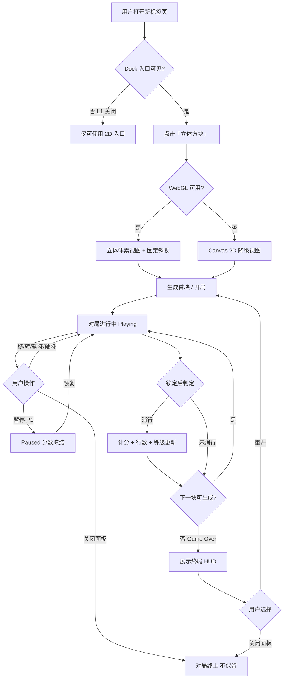
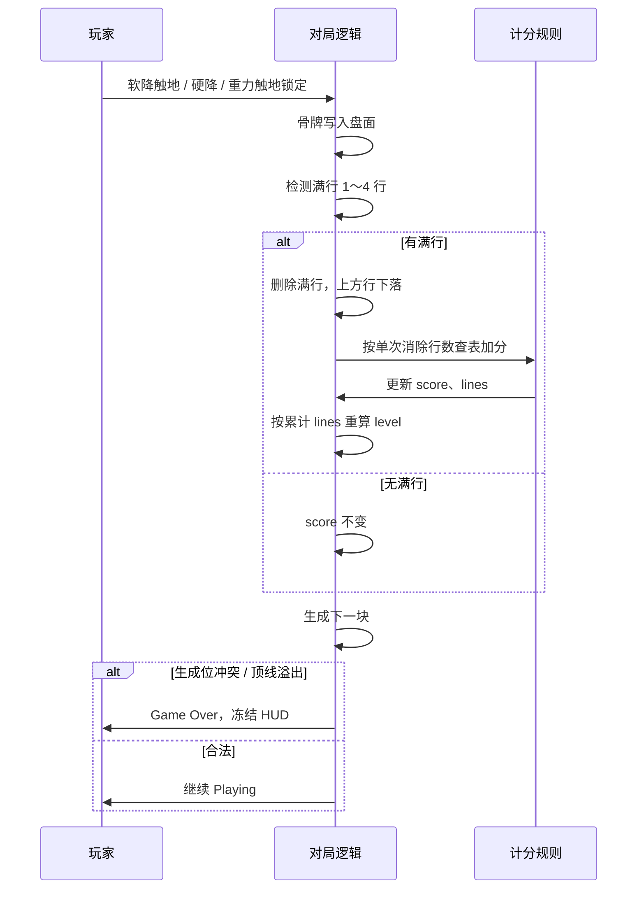
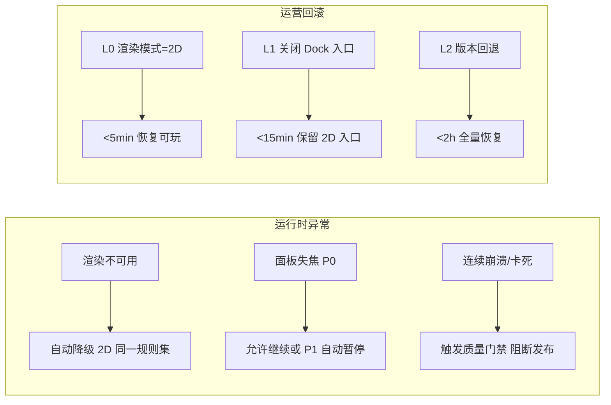

# 业务规则表 v1 — 立体方块（2.5D）MVP

**文档类型**：业务分析 / UAT 验收依据  
**产品**：中国风景时钟 · Dock「立体方块」  
**版本**：v1.0  
**日期**：2026-05-20  
**状态**：待签字（冻结后作为 UAT SSOT）  
**关联**：[PRD v1.1](prd-tetris-3d-v1.1.md)、[玩法规格书](../play-spec-deterministic-v1.md)、[规则参数包](../tetris-rules-v1-parameter-bundle.md)

**范围声明**：本表仅覆盖 **MVP 经典单机无尽模式（2.5D）**。排行、成就、多模式、真 3D 井、联机、云存档等规则 **不在本版签字范围**，列入 Phase 2 业务规则增量包。

---

## 一、业务流程

### 1.1 对局生命周期（主流程）

### 1.2 单次锁定—消行—计分子流程

### 1.3 异常与运营回滚流程（业务视角）

---

## 二、业务规则总表

**优先级说明**：P0 = UAT 阻塞项；P1 = 不阻塞首发，签字后仍须按约定验收。

### 2.1 BR-GAME — 玩法与对局

| 规则编号 | 优先级 | 规则名称 | 业务规则描述 | 验收要点（UAT） |
|----------|--------|----------|--------------|-----------------|
| **BR-GAME-001** | P0 | 产品边界 | MVP 为 Dock 内 **单机、无尽、经典模式**；非独立游戏产品、无内购、无后端、无联机 | 帮助/商店文案无排行/付费承诺 |
| **BR-GAME-002** | P0 | 入口并存 | 「立体方块」与现有 2D「俄罗斯方块」入口 **并存**；用户可任选其一 | Dock 可见两个独立入口；L1 关闭后仅 3D 不可见 |
| **BR-GAME-003** | P0 | 棋盘与模式 | **10 列 × 20 行** 单层栅格；无尽模式，无胜利终局，仅以 Game Over 结束 | 无 Z 轴深度玩法、无多层井 |
| **BR-GAME-004** | P0 | 方块与随机 | 七种标准骨牌（I/O/T/S/Z/J/L）；**七袋随机** 出块；同局内分布符合「一袋 7 块各一」循环 | 长局统计可 spot-check 袋结构 |
| **BR-GAME-005** | P0 | 旋转与踢墙 | **2D 四态旋转**（0→1→2→3 顺时针）；**generic 踢墙**；O 块旋转无占位变化 | 不验收 SRS 全量竞技合规 |
| **BR-GAME-006** | P0 | 消行 | **整行满** 即消除（水平单层）；上方行整体下落；**非** Z 层/柱体消除 | AC-03；无「消层」用语误导 |
| **BR-GAME-007** | P0 | 重力与操作 | 自动 tick 下落；软降逐步下移；硬降一键落底并锁定；触地即锁定（classic 瞬时锁） | 与 2D 内核行为一致 |
| **BR-GAME-008** | P0 | Game Over | **GO-A**：新块生成时与盘面冲突（Block Out）；**GO-B**：锁定后占用超出顶线（Lock Out）。满足任一即 Game Over | AC-04 |
| **BR-GAME-009** | P0 | 重开 | Game Over 后用户可 **一键重开**；新局盘面清空、块袋与计分按 BR-SCORE-31 重置 | 重开后 HUD 初值正确 |
| **BR-GAME-010** | P0 | 视觉与逻辑分离 | **固定斜视** 相机；用户 **不可** 自由旋转场景或改变逻辑重力方向；3D 仅表现 | AC-08 |
| **BR-GAME-011** | P0 | 键位与焦点 | 默认键位见 PRD §4.2；快捷键 **仅对局面板聚焦** 时生效 | 不抢占扩展全局快捷键 |
| **BR-GAME-012** | P0 | 输入仲裁 | 同帧 **左+右** → 净位移 0；同帧 **硬降+其他** → 仅硬降生效；旋转/移动优先级遵循玩法规格 **方案 A** | TC-E-02 快速连按 |
| **BR-GAME-013** | P0 | 渲染降级 | WebGL 不可用时 **自动** 切换 Canvas 2D；**玩法与计分规则不变** | AC-05 |
| **BR-GAME-014** | P0 | 面板关闭 | 用户关闭面板 mid-game → 对局 **终止且不恢复**；不计入「有效对局」完成态（见 BR-VALID-001） | 重开需重新进入入口 |
| **BR-GAME-015** | P1 | 暂停 | 显式暂停（Space/P/Esc）后 **仿真时间停止**；score/lines/level **不变** | AC-P1-03 |
| **BR-GAME-016** | P1 | 失焦 | 面板失焦 → **P-BIZ-1 完全暂停**（与 BR-GAME-015 一致） | 发布说明须标注 P0/P1 差异 |
| **BR-GAME-017** | P1 | 下一块预览 | 预览区展示 **下一生成块**，与随后实际生成块一致 | AC-P1-04 |
| **BR-GAME-018** | Out | Hold / Ghost | MVP **不做** Hold；Ghost **不做**（P1 教学向另议，未签字前按 Out） | 无 Hold 键位承诺 |
| **BR-GAME-019** | Out | 真 3D | **无** 4×4×N 井、无 Z 向移动、无双轴旋转、无深度四向移动 | Phase 2 Epic |
| **BR-GAME-020** | Out | 断点续玩 | 无后台续玩、无云存档 | 关闭即丢局 |

### 2.2 BR-SCORE — 计分与难度

| 规则编号 | 优先级 | 规则名称 | 业务规则描述 | 验收要点（UAT） |
|----------|--------|----------|--------------|-----------------|
| **BR-SCORE-001** | P0 | 计分总则（索引） | 消行得分采用 **单次锁定查表**（§2.2.1）；等级由累计行数推导，**不** 放大消行基础分 | AC-07；与 HUD 一致 |
| **BR-SCORE-01** | P0 | 单次消行查表 | 一次锁定后同时消除行数 → 加分：0 行=0；1=**100**；2=**300**；3=**500**；4=**800** | 四行同消 +800 一次 |
| **BR-SCORE-02** | P0 | 非累加原则 | 同一次锁定多行消除 **只触发一次** 查表，**非** 逐行各 +100 | 双行 +300 非 +200 |
| **BR-SCORE-03** | P0 | 禁止项 | **无** 消层分、Z 向柱体分、深度连击分、T-Spin、Back-to-Back、Combo 加成 | 帮助页不得出现上述术语作 MVP 承诺 |
| **BR-SCORE-10** | P0 | 等级公式 | `level = floor(lines / 10)`；初值 0；累计消满 10 行后 level=1 | 消第 10 行后等级变 1 |
| **BR-SCORE-11** | P0 | 等级与分数解耦 | 等级升高 **仅** 缩短自动下落间隔，**不** 乘以 BR-SCORE-01 基础分 | 同级四分仍 800 |
| **BR-SCORE-12** | P0 | 速度曲线 | 采用 **classic 近似 ms 阶梯**（参数包 `classic_subset_v1.speedCurve`）；用户感知「越玩越快」 | 可对照参数包档位 |
| **BR-SCORE-20** | P0 | 软降计分 | 软降每成功下移一格 **0 分** | 不得软降刷分 |
| **BR-SCORE-21** | P0 | 硬降计分 | 硬降落底 **0 分**；仅通过锁定后消行计分 | — |
| **BR-SCORE-22** | Out | Guideline 硬降分 | 硬降每格 +1 **Phase 2**，MVP 不启用 | — |
| **BR-SCORE-30** | P0 | 终局冻结 | Game Over 时 HUD **冻结** 最终 score / lines / level | 重开前不可变 |
| **BR-SCORE-31** | P0 | 重开清零 | 重开将 score、lines、level **归零** 并重新开局 | — |
| **BR-SCORE-32** | P1 | 本地最高分 | 仅当 `score > bestScore` 更新本地记录；**同分不覆盖**（先达成者优先） | AC-P1-02 |
| **BR-SCORE-40** | P0 | 终局同时消行 | 导致 Game Over 的最后一次锁定 **若同时消行**，仍按 BR-SCORE-01 计分后再 Game Over | 边界用例 |
| **BR-SCORE-41** | P0 | 零消行锁定 | 0 行消除的锁定 → score **不变** | — |
| **BR-SCORE-42** | P0 | 暂停不计分 | 暂停期间无补发分数；恢复后状态与暂停前一致 | — |
| **BR-SCORE-43** | P0 | 降级一致性 | 渲染降级前后 **同一局** score/lines/level **完全一致** | AC-05 + AC-07 |
| **BR-SCORE-44** | P0 | 连按软降 | 快速连按软降：每格锁定链 **独立** 计分；**不得** 对同一行重复计分 | TC-E-02 |

### 2.3 BR-VALID — 有效对局、数据一致性与合规

| 规则编号 | 优先级 | 规则名称 | 业务规则描述 | 验收要点（UAT） |
|----------|--------|----------|--------------|-----------------|
| **BR-VALID-001** | P0 | 有效对局定义 | **有效对局**：从用户点击「立体方块」并成功 **生成首块** 起，至 **Game Over** 或用户 **主动关闭面板** 止；用于 UAT 抽样与（P1）埋点「完局」 | 关闭面板=中止，非完局 |
| **BR-VALID-002** | P0 | 完局定义 | **完局** = 有效对局且以 **Game Over** 正常结束（含顶线/生成失败） | 运营「完局率」分子 |
| **BR-VALID-003** | P0 | 无效对局 | 未生成首块即关闭、崩溃中断、渲染初始化失败且无法降级 → **不计** 入完局 | 质量门禁单独统计崩溃 |
| **BR-VALID-004** | P0 | HUD 一致性 | 任意时刻 HUD 的 score / lines / level 与对局逻辑状态 **一致**；Game Over 后只读 | AC-07 |
| **BR-VALID-005** | P0 | 单局数据一致性 | 同一有效对局内，不因渲染模式切换、暂停/恢复而改变已发生的 score/lines | 降级/暂停用例 |
| **BR-VALID-006** | P0 | 无后端 | MVP **无** 服务端校验；排行榜、账号、云同步 **不提供** | 无网络请求依赖玩法 |
| **BR-VALID-007** | P0 | 品牌合规 | 对外名称 **「立体方块」「3D 方块消除」**；**禁止** 使用 Tetris 商标及易混淆官方美术 | 商店/帮助/ Dock 文案走查 |
| **BR-VALID-008** | P0 | 规则承诺边界 | 对外 **不承诺** 「竞技合规」「官方 Guideline」「SRS 全量」 | 与 BR-GAME-005 一致 |
| **BR-VALID-009** | P0 | 主功能保护 | 游戏模块不得导致扩展 **主功能使用下降 >3%**（90 天观察）；触发则走回滚预案 | 运营 KPI |
| **BR-VALID-010** | P1 | 埋点最小集 | P1 可选埋点：开局、完局、对局时长、WebGL Probe 结果；**不含** PII | PR-4 验收 |
| **BR-VALID-011** | Out | 排行有效局 | 排行榜、反作弊、有效局时长门槛 → **Phase 2** | 本表不签字 |

---

## 三、异常流程处理

| 异常 ID | 触发条件 | 业务期望行为 | 关联规则 | UAT 用例建议 |
|---------|----------|--------------|----------|--------------|
| **EX-01** | WebGL 初始化失败 | 自动降级 2D，提示可选「已切换经典视图」；完成整局且计分一致 | BR-GAME-013, BR-SCORE-43 | AC-05 |
| **EX-02** | 顶线临界同时消行 | 先计分（BR-SCORE-40），再 Game Over | BR-GAME-008, BR-SCORE-40 | TC-B-01 |
| **EX-03** | 同帧左+右 | 净位移 0，块不移 | BR-GAME-012 | 输入仲裁 |
| **EX-04** | 同帧硬降+移动/旋转 | 仅硬降生效 | BR-GAME-012 | — |
| **EX-05** | 快速连按软降 | 每步独立锁定与计分，不重复计行 | BR-SCORE-44 | TC-E-02 |
| **EX-06** | 暂停中（P1） | 盘面与分数冻结；超时 10s 仍不变 | BR-GAME-015, BR-SCORE-42 | AC-P1-03 |
| **EX-07** | 关闭面板 mid-game | 对局丢弃，不恢复；不算完局 | BR-GAME-014, BR-VALID-001 | — |
| **EX-08** | Dock 3D 入口 L1 关闭 | 用户仍可通过 2D 游玩，无功能损失 | BR-GAME-002 | 运维演练 |
| **EX-09** | 连续 10 局崩溃/卡死 | **阻断发布**（质量门禁） | BR-VALID-003 | AC-06 |
| **EX-10** | 同分打破最高分（P1） | 不更新 bestScore | BR-SCORE-32 | — |

---

## 四、合规性与数据一致性

### 4.1 合规清单

| 合规项 | 要求 | 规则编号 |
|--------|------|----------|
| 知识产权 | 不使用 Tetris® 及相关易混淆标识；美术差异化 | BR-VALID-007 |
| 对外宣传 | 不宣称官方规则/电竞合规 | BR-VALID-008 |
| 隐私 | MVP 无账号；本地 storage 仅存最高分（P1）；埋点无 PII | BR-VALID-006, BR-VALID-010 |
| 扩展商店 | 描述与实机玩法一致（2.5D 单层，非真 3D 井） | BR-GAME-003, BR-GAME-019 |
| 儿童/博彩 | 无内购、无抽奖、无现金激励 | BR-GAME-001 |

### 4.2 数据一致性原则

1. **单一逻辑源**：对局胜负与计分以 **经典 10×20 单层逻辑** 为准，渲染模式不参与判定。  
2. **终局不可变**：Game Over 后 score/lines/level 不可因动画未完成而回滚。  
3. **重开隔离**：重开视为新有效对局，与上一局数据无关联（BR-SCORE-31）。  
4. **运营指标口径**：「完局」必须符合 BR-VALID-002，不得将关闭面板计为完局。

---

## 五、UAT 追溯矩阵

| PRD AC | 业务规则编号 |
|--------|----------------|
| AC-01 | BR-GAME-002, BR-GAME-003, BR-GAME-010 |
| AC-02 | BR-GAME-004～007, BR-GAME-011, BR-GAME-012 |
| AC-03 | BR-GAME-006, BR-SCORE-001, BR-SCORE-01～03 |
| AC-04 | BR-GAME-008, BR-GAME-009, BR-SCORE-30 |
| AC-05 | BR-GAME-013, BR-SCORE-43, EX-01 |
| AC-06 | EX-09（质量门禁） |
| AC-07 | BR-SCORE-001, BR-VALID-004, BR-VALID-005 |
| AC-08 | BR-GAME-003, BR-GAME-019 |
| AC-P1-01～04 | BR-GAME-015～017, BR-SCORE-32, BR-GAME-016 |

---

## 六、Phase 2 排除项（本表不签字）

| 类别 | 说明 |
|------|------|
| 真 3D 井 | 4×4×N、Z 层消除、双轴旋转 |
| 计分扩展 | T-Spin、B2B、Combo、硬降每格 +1 |
| 社交与排行 | 联机、排行榜、分享、成就体系 |
| 商业 | 皮肤商城、IAP |
| 模式 | Sprint、对战、多难度 Profile 切换 |

---

## 七、签字页

本规则表 v1 经确认后，作为 **立体方块 MVP UAT** 的唯一业务验收依据；与 PRD v1.1 冲突时，以 **本表 + PRD §五计分** 为准提请变更控制。

| 角色 | 姓名 | 签字 | 日期 | 意见 |
|------|------|------|------|------|
| 业务分析 | | ☐ 同意 ☐ 有保留 | | |
| 产品经理 | | ☐ 同意 ☐ 有保留 | | |
| 项目经理 | | ☐ 同意 ☐ 有保留 | | |
| QA 负责人 | | ☐ 同意 ☐ 有保留 | | |
| 技术负责人 | | ☐ 同意 ☐ 有保留 | | |

**保留项登记**（签字前填写）：

| # | 规则编号 | 保留意见 | 处置 |
|---|----------|----------|------|
| 1 | | | |
| 2 | | | |

---

*文档结束 — 业务规则表 v1.0 · 2026-05-20*
