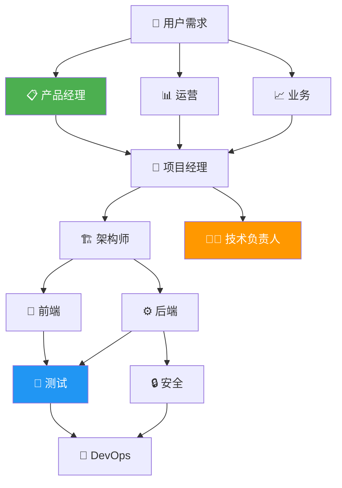

# Agent 能力建设调研报告

## 目录

1. [Agent 记录合并渲染与对话还原](#1-agent-记录合并渲染与对话还原)
2. [浏览器自动化与自循环验证](#2-浏览器自动化与自循环验证)
3. [多角色 Prompt 管理可视化与优化](#3-多角色-prompt-管理可视化与优化)
4. [Cursor SDK 集成参数完整调研](#4-cursor-sdk-集成参数完整调研)
5. [Page Agent 对 CDP 的增强借鉴](#5-page-agent-对-cdp-的增强借鉴)
6. [Cursor Skills 能力集成](#6-cursor-skills-能力集成)
7. [Cursor Dashboard 账号额度展示能力](#7-cursor-dashboard-账号额度展示能力)
8. [Skills/MCP 安装使用与推荐指南](#8-skillsmcp-安装使用与推荐指南)
9. [综合实施路线图](#9-综合实施路线图)

---

## 1. Agent 记录合并渲染与对话还原

### 1.1 问题分析

当前多 Agent 协作时，每个 Agent 各自创建独立的 `conversation` 记录。在 UI 渲染时，一次多 Agent 任务会被拆成多条记录展示，导致：
- 用户无法一眼看到完整的协作过程
- 缺乏"一次任务 → 一条记录"的聚合视图
- 无法点击还原某个 Agent 的具体对话内容

### 1.2 现有数据库结构

当前 `database.ts` 中的表结构：

```
conversations (每个 Agent 一条记录)
  ├── id
  ├── project_id
  ├── agent_name
  ├── model
  ├── status
  └── created_at

messages (每条消息)
  ├── conversation_id → conversations.id
  ├── role (user/assistant)
  ├── content
  ├── event_type
  └── run_id
```

**问题根源**：缺少"任务级别"的聚合层。多 Agent 场景下，`task_analyses` 表虽然存在，但与 `conversations` 没有直接关联。

### 1.3 解决方案：新增 Session 聚合层

**核心思路**：引入 `agent_sessions` 表作为聚合层，一个 session = 一次用户发起的多 Agent 任务。

```sql
-- 新增: Agent Session 聚合表
CREATE TABLE IF NOT EXISTS agent_sessions (
  id TEXT PRIMARY KEY,
  task_analysis_id TEXT,            -- 关联多角色任务 (可选)
  title TEXT NOT NULL,              -- 会话标题 (取自需求摘要)
  summary TEXT,                     -- AI 生成的摘要
  participant_roles TEXT DEFAULT '[]', -- 参与的角色ID列表 JSON
  participant_count INTEGER DEFAULT 1,
  status TEXT DEFAULT 'active',     -- active|completed|failed
  total_messages INTEGER DEFAULT 0,
  total_tokens INTEGER DEFAULT 0,
  created_at INTEGER NOT NULL,
  updated_at INTEGER NOT NULL,
  completed_at INTEGER
);

-- conversations 表新增字段
ALTER TABLE conversations ADD COLUMN session_id TEXT REFERENCES agent_sessions(id);
ALTER TABLE conversations ADD COLUMN role_id TEXT;  -- 对应 enterprise_roles 的 id

-- 索引
CREATE INDEX IF NOT EXISTS idx_sessions_status ON agent_sessions(status);
CREATE INDEX IF NOT EXISTS idx_sessions_created ON agent_sessions(created_at DESC);
CREATE INDEX IF NOT EXISTS idx_conversations_session ON conversations(session_id);
```

### 1.4 渲染逻辑

**聚合视图 API**：

```typescript
// GET /api/sessions — 返回聚合后的 session 列表
interface SessionListItem {
  id: string;
  title: string;
  summary?: string;
  participantRoles: { roleId: string; roleName: string; icon: string }[];
  participantCount: number;
  status: 'active' | 'completed' | 'failed';
  totalMessages: number;
  createdAt: number;
  updatedAt: number;
}

// GET /api/sessions/:id — 返回 session 详情 + 所有 Agent 对话
interface SessionDetail {
  session: SessionListItem;
  conversations: {
    agentId: string;
    agentName: string;
    roleId?: string;
    roleName?: string;
    roleIcon?: string;
    messages: Message[];
    status: string;
  }[];
  taskAnalysis?: TaskAnalysis;
  timeline: TimelineEvent[];  // 按时间排序的所有事件
}
```

**前端渲染逻辑**：

1. 列表页：每个 session 渲染为一张卡片，显示参与角色头像、标题、状态
2. 详情页点击展开：
   - 左侧：时间线视图（所有 Agent 的消息按时间排序交织显示）
   - 右侧：可切换查看单个 Agent 的对话
3. 单 Agent 场景自动降级为单条记录

### 1.5 实现优先级

| 步骤 | 内容 | 复杂度 |
|------|------|--------|
| P0 | 新增 `agent_sessions` 表 + 迁移脚本 | 低 |
| P0 | multi-role-engine 创建任务时自动关联 session | 中 |
| P1 | session 列表 + 详情 API | 中 |
| P1 | 前端 session 聚合卡片渲染 | 中 |
| P2 | 时间线交织视图 | 高 |
| P2 | 对话还原（点击单个 Agent 展开完整对话） | 中 |

---

## 2. 浏览器自动化与自循环验证

### 2.1 需求分析

目标：Agent 完成开发后，能自动在浏览器中模拟用户操作，验证功能是否正确实现，发现问题后自动修复并重新验证，形成闭环。

### 2.2 现有能力盘点

当前 `browser-automation.ts` 已经实现了基于 CDP 的基础能力：

| 能力 | 状态 | 说明 |
|------|------|------|
| 页面导航 | ✅ 已有 | `Page.navigate` |
| CSS 选择器点击 | ✅ 已有 | `Input.dispatchMouseEvent` + 坐标计算 |
| 文本输入 | ✅ 已有 | `Input.dispatchKeyEvent` 逐字符输入 |
| 截图 | ✅ 已有 | `Page.captureScreenshot` |
| JS 执行 | ✅ 已有 | `Runtime.evaluate` |
| 元素等待 | ✅ 已有 | 轮询 querySelector |
| Tab 管理 | ✅ 已有 | `/json` 端点 |

### 2.3 缺失能力与方案

#### 方案 A：增强现有 CDP 实现（推荐）

Cursor 内置浏览器基于 Chromium，天然支持 CDP。增强现有 `browser-automation.ts`：

```typescript
// 新增能力清单
interface EnhancedBrowserActions {
  // 鼠标操作增强
  hover: (selector: string) => Promise<void>;
  doubleClick: (selector: string) => Promise<void>;
  rightClick: (selector: string) => Promise<void>;
  dragAndDrop: (from: string, to: string) => Promise<void>;

  // 表单操作
  select: (selector: string, value: string) => Promise<void>;
  check: (selector: string) => Promise<void>;
  uncheck: (selector: string) => Promise<void>;
  uploadFile: (selector: string, filePath: string) => Promise<void>;

  // 页面状态检查
  isVisible: (selector: string) => Promise<boolean>;
  getText: (selector: string) => Promise<string>;
  getAttribute: (selector: string, attr: string) => Promise<string>;
  getComputedStyle: (selector: string, prop: string) => Promise<string>;

  // 高级交互
  scrollTo: (selector: string) => Promise<void>;
  waitForNavigation: (timeout?: number) => Promise<void>;
  waitForNetworkIdle: (timeout?: number) => Promise<void>;

  // 断言 (用于验证)
  assertVisible: (selector: string) => Promise<AssertResult>;
  assertText: (selector: string, expected: string) => Promise<AssertResult>;
  assertUrl: (pattern: string) => Promise<AssertResult>;
  assertElementCount: (selector: string, count: number) => Promise<AssertResult>;
}
```

#### 方案 B：集成 Cursor 内置 MCP Browser

Cursor IDE 已经内置了 `cursor-ide-browser` MCP 服务器，提供完整的浏览器操作能力：

| MCP 工具 | 功能 |
|----------|------|
| `browser_navigate` | 页面导航 |
| `browser_click` | 点击元素（基于 ref） |
| `browser_type` | 输入文本 |
| `browser_fill` | 填充表单 |
| `browser_select_option` | 选择下拉选项 |
| `browser_press_key` | 键盘操作 |
| `browser_scroll` | 滚动 |
| `browser_drag` | 拖拽 |
| `browser_snapshot` | 获取页面结构（YAML） |
| `browser_take_screenshot` | 截图 |
| `browser_highlight` | 高亮元素 |
| `browser_cdp` | 原始 CDP 命令 |

**优势**：
- 使用 `ref`（不可透明句柄）而非 CSS 选择器，更稳定
- 内置 Accessibility 快照，Agent 能"看懂"页面结构
- 支持 iframe 外的所有元素交互
- 截图直接返回图片，支持视觉验证

### 2.4 自循环验证引擎设计 ✅ MVP 已实现 (`self-loop-verify.ts`)

```
┌─────────────────────────────────────────────────────┐
│                 Self-Loop Verification               │
│                                                      │
│  ┌──────┐    ┌──────────┐    ┌───────────┐          │
│  │ 开发  │───→│ 构建测试  │───→│ 执行测试   │         │
│  │ Agent │    │ 用例      │    │ (浏览器)   │         │
│  └──────┘    └──────────┘    └─────┬─────┘          │
│       ↑                            │                 │
│       │         ┌──────────┐       │                 │
│       │    N    │ 全部通过？ │←──────┘                │
│       │←────────│          │                         │
│       │         └────┬─────┘                         │
│                      │ Y                             │
│                ┌─────▼─────┐                         │
│                │ 生成报告   │                         │
│                └───────────┘                         │
│                                                      │
│  退出条件：                                            │
│  1. 所有测试通过                                       │
│  2. 达到最大重试次数（默认3轮）                           │
│  3. Agent 判断无法自行修复 → 给出结论                     │
└─────────────────────────────────────────────────────┘
```

**核心流程代码框架**：

```typescript
interface VerificationConfig {
  maxRetries: number;        // 最大重试轮次
  screenshotOnFail: boolean; // 失败时截图
  timeout: number;           // 单步超时
  baseUrl: string;           // 被测页面 URL
}

interface TestCase {
  id: string;
  name: string;
  steps: TestStep[];
  expected: string;
}

interface TestStep {
  action: 'navigate' | 'click' | 'type' | 'wait' | 'assert' | 'screenshot';
  target?: string;
  value?: string;
  timeout?: number;
}

interface VerificationResult {
  passed: boolean;
  totalCases: number;
  passedCases: number;
  failedCases: TestCase[];
  screenshots: string[];      // base64 截图
  retryCount: number;
  conclusion: string;         // AI 生成的结论
  canAutoFix: boolean;        // 是否可以自动修复
  fixSuggestions?: string[];  // 修复建议
}

async function selfLoopVerify(
  config: VerificationConfig,
  testCases: TestCase[]
): Promise<VerificationResult> {
  let retryCount = 0;
  let lastResult: VerificationResult;

  while (retryCount < config.maxRetries) {
    // 1. 执行所有测试用例
    lastResult = await executeTests(testCases, config);

    if (lastResult.passed) {
      lastResult.conclusion = '所有测试通过，功能实现正确';
      return lastResult;
    }

    // 2. 分析失败原因
    const analysis = await analyzeFailures(lastResult.failedCases);

    // 3. 判断是否可自动修复
    if (!analysis.canAutoFix) {
      lastResult.conclusion = analysis.reason;
      lastResult.canAutoFix = false;
      lastResult.fixSuggestions = analysis.suggestions;
      return lastResult;
    }

    // 4. 自动修复
    await applyFixes(analysis.fixes);
    retryCount++;
  }

  lastResult!.conclusion = `经过 ${config.maxRetries} 轮尝试仍未通过，需人工介入`;
  return lastResult!;
}
```

### 2.5 推荐方案

**混合方案**：CDP 增强 + Cursor MCP Browser 集成

1. **开发阶段**：增强现有 CDP 实现，补充 hover/drag/form 等能力
2. **验证阶段**：通过 Cursor SDK 的 Agent 调用内置 MCP Browser 进行视觉验证
3. **自循环**：在 multi-role-engine 的 QA 阶段集成 self-loop 验证引擎

---

## 3. 多角色 Prompt 管理可视化与优化

### 3.1 现有 Prompt 架构

当前 `enterprise-roles.ts` 中定义了 11 个企业角色，每个角色的 prompt 结构：

```typescript
interface RoleSkill {
  role: string;        // 角色定位
  goal: string;        // 目标
  backstory: string;   // 背景故事
  behavior: string[];  // 行为准则
  outputFormat: string; // 输出格式
  constraints: string[]; // 约束条件
  focusAreas: string[]; // 关注领域
  canDelegate: boolean; // 能否委派
  canVeto: boolean;     // 能否否决
}
```

`buildRoleSystemPrompt()` 函数将这些字段组装为完整的 system prompt。

> **实现状态**: 已完成基础结构定义，新增 `DynamicContext` 接口和 `PromptBuildContext` 扩展接口。

### 3.2 现有角色清单

| ID | 名称 | 阶段 | 模型层级 | 核心能力 |
|----|------|------|---------|---------|
| operations | 运营 | discussion | balanced | 市场分析、ROI评估 |
| business | 业务 | discussion | balanced | 业务流程、规则定义 |
| product | 产品经理 | discussion | balanced | 需求拆解、PRD |
| project-manager | 项目经理 | discussion+execution | balanced | 执行计划、进度管理 |
| architect | 架构师 | discussion+execution | powerful | 技术选型、架构设计 |
| frontend | 前端开发 | execution | fast | UI实现、交互开发 |
| backend | 后端开发 | execution | fast | API、数据库、业务逻辑 |
| qa | 测试工程师 | qa | balanced | 测试用例、质量保障 |
| devops | DevOps | deployment | fast | CI/CD、部署运维 |
| security | 安全工程师 | qa | balanced | 安全审计、漏洞检测 |
| tech-lead | 技术负责人 | all | powerful | 技术决策、代码审查 |

### 3.3 优化空间分析

#### A. Prompt 质量优化

| 问题 | 现状 | 优化方向 |
|------|------|---------|
| backstory 太简单 | "拥有5年经验..." | 加入行业知识、失败案例、判断框架 |
| behavior 缺少 few-shot | 纯指令列表 | 加入输入→输出示例 |
| 缺少角色间交互规则 | 无 | 定义谁能反驳谁、决策权重 |
| 输出格式不够结构化 | 自然语言描述 | JSON Schema 约束 |
| ~~缺少动态上下文注入~~ | ~~静态 prompt~~ | ✅ 已实现动态上下文注入 |

#### B. Prompt 版本管理 ✅ 已实现

```sql
-- 新增: Prompt 版本管理表
CREATE TABLE IF NOT EXISTS role_prompt_versions (
  id TEXT PRIMARY KEY,
  role_id TEXT NOT NULL,
  version INTEGER NOT NULL,
  prompt_config TEXT NOT NULL,     -- 完整的 RoleSkill JSON
  changelog TEXT,
  performance_score REAL,          -- 效果评分 (0-10)
  usage_count INTEGER DEFAULT 0,
  is_active INTEGER DEFAULT 0,     -- 当前生效版本
  created_at INTEGER NOT NULL,
  created_by TEXT
);

CREATE INDEX IF NOT EXISTS idx_prompt_versions_role ON role_prompt_versions(role_id);
CREATE INDEX IF NOT EXISTS idx_prompt_versions_active ON role_prompt_versions(is_active);
```

#### C. 可视化方案

**Prompt 可视化编辑器设计**：

```
┌──────────────────────────────────────────────────────┐
│  Multi-Role Prompt Manager                           │
├──────────────────────────────────────────────────────┤
│                                                      │
│  [Discussion]  [Execution]  [QA]  [Deployment]       │
│                                                      │
│  ┌─────────┐  ┌─────────┐  ┌─────────┐             │
│  │ 📊 运营  │  │ 📋 产品  │  │ 🏗️ 架构  │             │
│  │ v3      │  │ v5      │  │ v4      │             │
│  │ ⭐ 7.8  │  │ ⭐ 8.2  │  │ ⭐ 8.5  │             │
│  └────┬────┘  └────┬────┘  └────┬────┘             │
│       │            │            │                    │
│  ─────┴────────────┴────────────┴──── Flow ───       │
│                                                      │
│  [编辑 Prompt]  [查看历史]  [AB测试]  [导出]           │
│                                                      │
├──────────────────────────────────────────────────────┤
│  Prompt 编辑区:                                       │
│                                                      │
│  角色: [产品经理        ▼]                             │
│  版本: v5 (active) ← v4 ← v3                        │
│                                                      │
│  ┌─ Role ──────────────────────────────────┐         │
│  │ 资深产品经理                               │         │
│  └─────────────────────────────────────────┘         │
│  ┌─ Goal ──────────────────────────────────┐         │
│  │ 将需求转化为可执行的产品方案                  │         │
│  └─────────────────────────────────────────┘         │
│  ┌─ Backstory ─────────────────────────────┐         │
│  │ ...                                      │         │
│  └─────────────────────────────────────────┘         │
│  ┌─ Behavior Rules ────────────────────────┐         │
│  │ 1. 拆解需求为用户故事                      │         │
│  │ 2. 定义功能优先级（P0/P1/P2）              │         │
│  │ [+ 添加规则]                              │         │
│  └─────────────────────────────────────────┘         │
│  ┌─ Constraints ───────────────────────────┐         │
│  │ ...                                      │         │
│  └─────────────────────────────────────────┘         │
│                                                      │
│  [预览完整 Prompt]  [保存新版本]  [回滚]               │
└──────────────────────────────────────────────────────┘
```

**可视化实现路径**：

| 步骤 | 内容 | 技术方案 |
|------|------|---------|
| V1 | Prompt 版本管理 API | SQLite + REST API |
| V1 | 角色列表页 | HTML + CSS Grid |
| V2 | Prompt 编辑器 | ContentEditable + 实时预览 |
| V2 | 角色关系图 | Mermaid 或 SVG 渲染 |
| V3 | AB 测试 & 效果评分 | 对比执行结果 + 评分 |
| V3 | Prompt 模板市场 | 导入/导出 JSON |

### 3.4 已实现：Prompt 执行链路打通与动态上下文注入

#### A. Prompt 版本 → Agent 执行链路

**问题**: 前端 Prompt Manager 管理的版本化 prompt 与 `multi-role-engine.ts` 中的 Agent 执行完全脱节。Agent 始终使用 `enterprise-roles.ts` 中的硬编码定义。

**解决方案**: 在 `enterprise-roles.ts` 中引入 **Prompt Version Resolver** 模式：

```
┌───────────────┐    setPromptVersionResolver()   ┌──────────────────┐
│  index.ts     │ ──────────────────────────────→ │ enterprise-roles │
│  (启动时注册)  │                                  │  resolveSkill()  │
└───────────────┘                                  └────────┬─────────┘
                                                            │
                    ┌───────────────────────────────────────┘
                    ▼
┌──────────────────────────────────┐
│  getActivePromptVersion(roleId)  │  ← database.ts
│  查询 role_prompt_versions 表    │
│  返回 is_active = 1 的版本       │
└──────────────────────────────────┘
                    │
                    ▼
┌──────────────────────────────────┐
│  resolveSkill(role)              │
│  1. 查询数据库 active version     │
│  2. 如有 → 合并覆盖角色字段       │
│  3. 如无 → 回退到硬编码默认值      │
└──────────────────────────────────┘
```

**关键设计**：
- `setPromptVersionResolver()`: 依赖注入，避免 `enterprise-roles.ts` 直接依赖 `database.ts`
- `resolveSkill()`: 逐字段合并，数据库中未定义的字段自动回退到硬编码默认值
- 零侵入：如果数据库中没有 active version，行为与原来完全一致

#### B. 动态上下文注入机制

**需求**: 固定的角色 prompt + 可选的动态补充信息。不是每次都注入，而是根据任务上下文智能决定。

**实现架构**：

```typescript
interface DynamicContext {
  key: string;
  content: string;
  priority?: 'high' | 'normal' | 'low';
}

interface DynamicContextRule {
  match: (meta) => boolean;   // 匹配条件
  build: (meta) => DynamicContext | null;  // 构建注入内容
}
```

**内置规则**：

| 规则 | 触发条件 | 注入内容 | 优先级 |
|------|---------|---------|--------|
| 缺陷修复指引 | `taskType === 'bugfix'` | 复现步骤、根因分析、回归测试要求 | high |
| 重构注意事项 | `taskType === 'refactor'` | 向后兼容、行为不变、测试覆盖 | normal |
| QA 阶段要求 | `phase === 'qa'` | 质量优先、需测试证据 | high |
| 安全审计补充 | `roleId === 'security-engineer'` | OWASP Top 10 风险清单 | normal |

**注入位置**：在 prompt 的"约束条件"与"参会角色"之间，以 `## 任务补充信息` 标题插入，按优先级排序。

**扩展方式**：向 `DYNAMIC_CONTEXT_RULES` 数组添加新规则即可，无需修改核心逻辑。也可通过 `extraContexts` 参数传入一次性的自定义上下文。

### 3.5 角色关系可视化



---

## 4. Cursor SDK 集成参数完整调研

### 4.1 SDK 概览

| 属性 | 值 |
|------|-----|
| 包名 | `@cursor/sdk` |
| 当前版本 | 1.0.13 (2026-05-12) |
| npm 周下载量 | 120.6K |
| 状态 | Public Beta |
| 文档 | https://cursor.com/docs/sdk/typescript.md |
| 博客 | https://cursor.com/blog/typescript-sdk |

### 4.2 核心 API 全景

```
@cursor/sdk
├── Agent (主类)
│   ├── Agent.create(options)      → SDKAgent
│   ├── Agent.prompt(msg, options) → RunResult  (一次性)
│   ├── Agent.resume(agentId, options) → SDKAgent
│   ├── Agent.list(options)        → ListResult<SDKAgentInfo>
│   ├── Agent.listRuns(agentId)    → ListResult<Run>
│   ├── Agent.getRun(runId)        → Run
│   ├── Agent.get(agentId)         → SDKAgentInfo
│   ├── Agent.archive(agentId)     → void
│   ├── Agent.unarchive(agentId)   → void
│   └── Agent.delete(agentId)      → void
│
├── SDKAgent (实例)
│   ├── agentId: string
│   ├── model: ModelSelection
│   ├── send(msg, options)         → Run
│   ├── close()                    → void
│   ├── reload()                   → void
│   ├── listArtifacts()            → SDKArtifact[]  (cloud only)
│   └── downloadArtifact(path)     → Buffer          (cloud only)
│
├── Run (运行实例)
│   ├── id, agentId, status, result, model, durationMs, git
│   ├── stream()                   → AsyncGenerator<SDKMessage>
│   ├── wait()                     → RunResult
│   ├── cancel()                   → void
│   ├── conversation()             → ConversationTurn[]
│   ├── supports(operation)        → boolean
│   └── onDidChangeStatus(fn)      → () => void
│
├── Cursor (命名空间)
│   ├── Cursor.me()                → SDKUser
│   ├── Cursor.models.list()       → SDKModel[]
│   └── Cursor.repositories.list() → SDKRepository[]
│
└── Errors
    ├── CursorAgentError (基类)
    ├── AuthenticationError
    ├── RateLimitError
    ├── ConfigurationError
    ├── AgentBusyError
    ├── IntegrationNotConnectedError
    ├── NetworkError
    ├── UnknownAgentError
    └── UnsupportedRunOperationError
```

### 4.3 Agent.create() 完整参数

```typescript
interface AgentOptions {
  // === 必填 ===
  model: ModelSelection;          // 模型选择
    // model.id: string           // 模型ID, 如 "composer-2.5"
    // model.params?: [{ id: string, value: string }]  // 如 thinking: "high"

  // === 认证 ===
  apiKey?: string;                // CURSOR_API_KEY, 用户/服务账号密钥

  // === Agent 标识 ===
  name?: string;                  // 人类可读名称
  agentId?: string;               // 持久化 Agent ID (跨调用复用)

  // === 运行模式 ===
  mode?: 'agent' | 'plan';       // 对话模式: agent(执行) / plan(规划)

  // === 运行时 (二选一) ===
  local?: {
    cwd?: string | string[];      // 工作目录 (可多个)
    settingSources?: SettingSource[];  // 加载哪些配置层
      // "project" | "user" | "team" | "mdm" | "plugins" | "all"
    sandboxOptions?: {
      enabled: boolean;           // 沙箱模式
    };
  };

  cloud?: {
    env?: {
      type: 'cloud' | 'pool' | 'machine';
      name?: string;              // 命名环境/池/机器
    };
    repos?: Array<{
      url: string;                // 仓库 URL
      startingRef?: string;       // 起始分支/tag
      prUrl?: string;             // 关联已有 PR
    }>;
    envVars?: Record<string, string>;  // 环境变量 (加密存储)
    workOnCurrentBranch?: boolean;     // 在当前分支提交
    autoCreatePR?: boolean;            // 运行结束自动创建 PR
    skipReviewerRequest?: boolean;     // 跳过请求审查者
  };

  // === MCP 服务器 ===
  mcpServers?: Record<string, McpServerConfig>;
    // stdio: { type: 'stdio', command, args?, env?, cwd? }
    // http:  { type: 'http', url, headers?, auth? }
    // sse:   { type: 'sse', url, headers?, auth? }

  // === 子代理 ===
  agents?: Record<string, AgentDefinition>;
    // { description, prompt, model?: ModelSelection | "inherit", mcpServers? }
}
```

### 4.4 agent.send() 完整参数

```typescript
// 消息可以是字符串或结构化对象
type SendMessage = string | SDKUserMessage;

interface SDKUserMessage {
  text: string;
  images?: Array<
    | { url: string; dimension?: { width: number; height: number } }
    | { data: string; mimeType: string; dimension?: { width: number; height: number } }
  >;
}

interface SendOptions {
  model?: ModelSelection;           // 本次运行模型覆盖 (sticky)
  mode?: 'agent' | 'plan';         // 本次运行模式覆盖
  mcpServers?: Record<string, McpServerConfig>; // 替换 MCP 服务器
  local?: { force?: boolean };      // local only: 强制过期卡住的运行

  // 细粒度回调
  onStep?: (args: { step: ConversationStep }) => void | Promise<void>;
  onDelta?: (args: { update: InteractionUpdate }) => void | Promise<void>;
}
```

### 4.5 Stream 事件类型完整清单

| 事件类型 | 说明 | 关键字段 |
|---------|------|---------|
| `system` | 初始化元数据，运行开始时发一次 | `model?`, `tools?` |
| `user` | 用户 prompt 回显 | `message.content: TextBlock[]` |
| `assistant` | 模型文本输出 | `message.content: (TextBlock\|ToolUseBlock)[]` |
| `thinking` | 推理内容 | `text`, `thinking_duration_ms?` |
| `tool_call` | 工具调用生命周期 | `call_id`, `name`, `status`, `args?`, `result?` |
| `status` | 云端运行状态变化 | `status: CREATING\|RUNNING\|FINISHED\|ERROR\|CANCELLED` |
| `task` | 任务级里程碑 | `status?`, `text?` |
| `request` | 等待用户输入/审批 | `request_id` |

### 4.6 Delta 事件类型（细粒度回调）

| 类型 | 说明 |
|------|------|
| `text-delta` | 文本增量（逐token） |
| `thinking-delta` | 推理增量 |
| `thinking-completed` | 推理完成 + 耗时 |
| `tool-call-started` | 工具调用开始 |
| `partial-tool-call` | 工具参数流入中 |
| `tool-call-completed` | 工具调用完成 |
| `token-delta` | token 计数增量 |
| `step-started/completed` | 步骤开始/完成 |
| `turn-ended` | 回合结束（含 usage 统计） |
| `summary/summary-started/completed` | 摘要生成 |
| `shell-output-delta` | Shell 输出增量 |

### 4.7 我们的当前使用方式

根据 `agent-pool.ts` 分析，我们当前使用的 SDK 特性：

```
已使用:
  ✅ Agent.create({ apiKey, model, local.cwd, name })
  ✅ agent.send(prompt) → Run
  ✅ agent.send({ text, images }) → Run (v1.2: 支持发送图片做视觉验证)
  ✅ run.stream() → SDKMessage (assistant, tool_call, thinking, status, task)
  ✅ run.wait() → RunResult
  ✅ run.cancel()
  ✅ run.conversation() → ConversationTurn[] (v1.3: 结构化对话历史)
  ✅ agent.close()
  ✅ Cursor.models.list()
  ✅ Cursor.me() — 用户信息获取 (Dashboard)
  ✅ mode: 'plan' | 'agent' — 对话模式切换
  ✅ model.params — 模型参数（如 thinking 级别）
  ✅ mcpServers — MCP 服务器注入
  ✅ Agent.resume() — 跨进程恢复 Agent
  ✅ Agent.list() / Agent.get() — 查询已有 Agent (v1.3)
  ✅ Agent.listRuns() / Agent.getRun() — 查询历史运行 (v1.3)
  ✅ onDelta / onStep — 细粒度回调 → SSE 推送
  ✅ settingSources — 配置层加载 (project + user)
  ✅ SDKUserMessage.images — 发送截图给 Agent 做视觉验证 (v1.3)

v1.3 新增:
  ✅ agent.send({ text, images }) → Run (支持发送图片做视觉验证)
  ✅ run.conversation() → ConversationTurn[] (结构化对话历史)
  ✅ Agent.list() / Agent.get() — 查询已有 Agent
  ✅ Agent.listRuns() / Agent.getRun() — 查询历史运行

v1.4 新增:
  ✅ agents — 子代理定义 (AgentDefinition inline 配置)
  ✅ cloud 运行时 — 隔离 VM 执行 (repos + autoCreatePR + envVars)
  ✅ Agent.prompt() — 一次性快捷方式 (无需手动 create/dispose)
  ✅ agent.reload() — 热加载配置
  ✅ autoCreatePR — 自动创建 PR (cloud 模式)
  ✅ envVars — 环境变量注入 (cloud 模式)

未使用 (可利用的):
  ❌ agent.listArtifacts() / downloadArtifact() — 产物管理 (cloud only, 需实际 cloud 环境验证)
```

### 4.8 优化建议与接入优先级

| 优先级 | 特性 | 价值 | 接入难度 | 状态 |
|--------|------|------|---------|------|
| **P0** | `model.params` (thinking level) | 为不同角色配置不同推理深度 | 低 | ✅ 已完成 |
| **P0** | `mode: 'plan'` | 讨论阶段用 plan 模式更合适 | 低 | ✅ 已完成 |
| **P0** | `onDelta` / `onStep` 回调 | 更细粒度的进度追踪，改善 UI 体验 | 中 | ✅ 已完成 |
| **P1** | `run.conversation()` | 结构化获取对话，替代手动 textBuffer 拼接 | 低 | ✅ 已完成 |
| **P1** | `mcpServers` 注入 | 为 Agent 提供外部工具（数据库、API 等） | 中 | ✅ 已完成 |
| **P1** | `agents` 子代理 | SDK 原生子代理替代手动 Pool 管理 | 高 | ✅ 已完成 |
| **P1** | `Agent.resume()` | 跨会话恢复，避免重复创建 | 中 | ✅ 已完成 |
| **P2** | `SDKUserMessage.images` | 发送截图给 Agent 做视觉验证 | 低 | ✅ 已完成 |
| **P2** | `Agent.list/get/listRuns` | 查询历史 Agent 和运行记录 | 低 | ✅ 已完成 |
| **P2** | `cloud` 运行时 | 隔离执行，避免影响本地环境 | 高 | ✅ 已完成 |
| **P2** | `Agent.prompt()` | 一次性快捷方式，无需手动管理生命周期 | 低 | ✅ 已完成 |
| **P2** | `agent.reload()` | 热加载配置，运行中刷新 Agent 设置 | 低 | ✅ 已完成 |
| **P3** | `settingSources` | 自动加载项目 rules 和 MCP 配置 | 低 | ✅ 已完成 |
| **P3** | `autoCreatePR` | DevOps 角色自动创建 PR | 低 | ✅ 已完成 |
| **P3** | `envVars` | Cloud 环境变量注入 | 低 | ✅ 已完成 |

### 4.9 关键改进：model.params 集成示例 ✅ 已实现

`agent-pool.ts` 已完成 model.params、mode、mcpServers、Agent.resume() 集成：

```typescript
// 现在
const sdkAgent = await Agent.create({
  apiKey: config.apiKey,
  model: { id: model },
  name: opts.name,
  local: { cwd: opts.cwd },
});

// 改进后
const sdkAgent = await Agent.create({
  apiKey: config.apiKey,
  model: {
    id: model,
    params: opts.modelParams,  // 如 [{ id: 'thinking', value: 'high' }]
  },
  name: opts.name,
  mode: opts.mode || 'agent',  // 讨论阶段可用 'plan'
  local: {
    cwd: opts.cwd,
    settingSources: ['project', 'user'],  // 加载项目配置
  },
  mcpServers: opts.mcpServers,  // 注入 MCP
  agents: opts.subAgents,       // 子代理定义
});
```

### 4.10 角色 → 模型参数映射建议

| 角色 | 推荐模型 | thinking 级别 | mode |
|------|---------|---------------|------|
| 运营/业务/产品 | composer-2.5 | low | plan |
| 项目经理 | composer-2.5 | low | plan |
| 架构师 | composer-2.5 | high | plan → agent |
| 技术负责人 | composer-2.5 | high | agent |
| 前端/后端开发 | composer-2.5-fast | low | agent |
| 测试工程师 | composer-2.5 | low | agent |
| 安全工程师 | composer-2.5 | high | agent |
| DevOps | composer-2.5-fast | low | agent |

---

## 5. Page Agent 对 CDP 的增强借鉴

### 5.1 Page Agent 概览

| 属性 | 值 |
|------|-----|
| 项目 | alibaba/page-agent |
| Star | 17,964 |
| 版本 | v1.8.2 (2026-05-11) |
| 协议 | MIT |
| 核心理念 | 页内 JS Agent，文本 DOM 操控 |

### 5.2 架构核心

```
┌─────────────────────────────────────────────┐
│              Page Agent 架构                 │
├─────────────────────────────────────────────┤
│                                             │
│  ┌─────────┐     ┌──────────┐    ┌─────┐  │
│  │ DOM 提取 │────→│ 文本脱水  │───→│ LLM │  │
│  │(PageCtrl)│     │(Dehydrate)│    │ API │  │
│  └─────────┘     └──────────┘    └──┬──┘  │
│       ↑                              │      │
│       │    ┌──────────────┐          │      │
│       └────│ 索引化操作执行 │←─────────┘      │
│            │ click[0]     │                 │
│            │ type[1] "..." │                 │
│            └──────────────┘                 │
│                                             │
│  流程: DOM提取 → 文本化 → LLM规划 → 索引操作  │
└─────────────────────────────────────────────┘
```

**核心差异 vs CDP**：

| 维度 | CDP 方式 | Page Agent 方式 |
|------|---------|----------------|
| DOM 获取 | `DOM.getDocument` (重量级) | Runtime.evaluate + JS 提取 (轻量) |
| 操作定位 | CSS 选择器 / 坐标 | 索引编号 (click[3]) |
| LLM 输入 | 截图 (多模态) | 结构化文本 (纯文本) |
| Token 成本 | 高 (图片 token) | 低 (文本 10-20x 便宜) |
| 适用 LLM | 需多模态 | 任意 chat LLM |
| 运行环境 | 外部进程 (headless) | 页面内部 (in-page) |

### 5.3 可借鉴的增强点

#### A. 文本化 DOM 提取技术

```typescript
// 借鉴 PageController 的 DOM 提取思路
interface TextDomNode {
  index: number;        // 交互元素唯一索引
  tag: string;          // 元素类型
  text: string;         // 可见文本
  attrs: string[];      // 关键属性 (placeholder, value, aria-label)
  interactable: boolean; // 是否可交互
  rect: DOMRect;        // 位置信息
}

// 输出示例 (给 LLM 的文本格式):
// [0] <button> "登录"
// [1] <input type="email" placeholder="邮箱">
// [2] <input type="password" placeholder="密码">
// [3] <a> "忘记密码?"
```

**我们的增强实现** ✅ 已完成：在 `browser-automation.ts` 中已实现文本化 DOM 提取、索引点击、hover、表单填写、断言等完整能力：

```typescript
async function extractInteractiveElements(): Promise<TextDomNode[]> {
  return await cdpEvaluate(`
    const nodes = [];
    let idx = 0;
    document.querySelectorAll(
      'a, button, input, select, textarea, [role="button"], [onclick]'
    ).forEach(el => {
      if (!isVisible(el)) return;
      nodes.push({
        index: idx++,
        tag: el.tagName.toLowerCase(),
        text: el.textContent?.trim().slice(0, 50) || '',
        attrs: getKeyAttrs(el),
        interactable: true,
        rect: el.getBoundingClientRect(),
      });
    });
    return nodes;
  `);
}
```

#### B. MCP Server 集成

Page Agent 提供了 MCP Server (`@page-agent/mcp`)，可直接在 Cursor SDK Agent 中使用：

```typescript
const agent = await Agent.create({
  model: { id: "composer-2.5" },
  local: { cwd: process.cwd() },
  mcpServers: {
    "page-agent": {
      type: "stdio",
      command: "npx",
      args: ["-y", "@page-agent/mcp"],
      env: {
        LLM_BASE_URL: "https://api.openai.com/v1",
        LLM_API_KEY: process.env.OPENAI_API_KEY,
        LLM_MODEL_NAME: "gpt-4o-mini",
        PORT: "38401",
      },
    },
  },
});

// Agent 可通过 execute_task 工具控制浏览器
await agent.send("用 page-agent 在浏览器中点击登录按钮并填写表单");
```

MCP 工具：
| 工具 | 说明 |
|------|------|
| `execute_task` | 自然语言执行浏览器任务 (阻塞) |
| `get_status` | 返回连接状态 `{ connected, busy }` |
| `stop_task` | 停止当前任务 |

#### C. 框架特定优化 (React/Antd)

Page Agent 的 `patches/` 目录包含框架特定优化，解决了：
- React 虚拟 DOM 与实际 DOM 的同步问题
- Antd 组件的 Portal/Popup 元素定位
- Shadow DOM 内部元素访问

### 5.4 综合建议

**我们的增强路线**：

1. **短期** - 引入文本化 DOM 提取到 CDP 流程，降低 LLM 成本
2. **中期** - 通过 MCP Server 集成 Page Agent，获得自然语言浏览器控制
3. **长期** - 借鉴其索引化操作系统，在自循环验证中用于断言

---

## 6. Cursor Skills 能力集成

### 6.1 Skills 生态概览

Cursor Skills 是可分发的 AI 知识包，格式为 `SKILL.md`，让 Agent 具备特定领域专业能力。

**以 GSAP Skills 为例**：

```
greensock/gsap-skills/
├── gsap-core/SKILL.md          # 核心 API 技能
├── gsap-timeline/SKILL.md      # 时间线技能
├── gsap-scrolltrigger/SKILL.md # ScrollTrigger 技能
├── gsap-plugins/SKILL.md       # 插件系统技能
├── gsap-react/SKILL.md         # React 集成技能
├── gsap-performance/SKILL.md   # 性能优化技能
└── gsap-frameworks/SKILL.md    # Vue/Svelte 技能
```

### 6.2 在我们的 Agent 中使用 Skills

```typescript
// 方式 1: 通过 settingSources 自动加载已安装技能
const agent = await Agent.create({
  model: { id: "composer-2.5" },
  local: {
    cwd: projectPath,
    settingSources: ["project", "plugins"],
    // "project" 加载 .cursor/skills/ 和 .cursor/rules/
    // "plugins" 加载 marketplace 插件
  },
});

// 方式 2: 技能内容作为 system prompt 的一部分注入
const gsapSkill = await readFile('.cursor/skills/gsap-skills/gsap-core/SKILL.md');
const run = await agent.send(
  `使用以下技能知识完成任务:\n\n${gsapSkill}\n\n任务: 用 GSAP 实现滚动动画`
);
```

### 6.3 安装 Skills 到项目

```bash
# 安装 GSAP 技能 (项目级)
npx skills add greensock/gsap-skills

# 安装单个技能
npx skills add greensock/gsap-skills --skill gsap-scrolltrigger

# 全局安装
npx skills add greensock/gsap-skills -g

# 查找可用技能
npx skills find "animation"
```

### 6.4 我们可以利用的 Skills

| 技能 | 用途 | Agent 角色 |
|------|------|-----------|
| GSAP Skills | 动画开发 | 前端开发 |
| Stripe Skills | 支付集成 | 后端开发 |
| Redis Skills | 缓存优化 | 后端开发 |
| QA Skills | 测试自动化 | 测试工程师 |
| Firebase Skills | 后端即服务 | 架构师 |

### 6.5 自定义 Skills 开发

我们可以为自己的多角色系统开发专属技能：

```markdown
---
name: multi-role-prompt-engineering
description: 多角色 Prompt 工程最佳实践
triggers:
  - "角色prompt"
  - "多角色"
  - "prompt优化"
---

# 多角色 Prompt 工程技能

## 角色定义最佳实践
1. backstory 要具体，包含行业经验和判断框架
2. behavior 要加入 few-shot 示例
3. constraints 要限制输出格式为 JSON Schema
...
```

### 6.6 Skills + MCP 组合的扩展空间

```
Skills 提供知识 + MCP 提供工具 = 完整的 Agent 能力
                    ↓
┌──────────────────────────────────────┐
│  示例: 前端开发 Agent                  │
│                                      │
│  Skills:                             │
│    - gsap-core (动画知识)             │
│    - gsap-scrolltrigger (滚动动画)    │
│                                      │
│  MCP Servers:                        │
│    - browser (浏览器操作)             │
│    - page-agent (自然语言页面控制)    │
│    - filesystem (文件操作)            │
│                                      │
│  → Agent 既懂 GSAP 也能操控浏览器验证  │
└──────────────────────────────────────┘
```

---

## 7. Cursor Dashboard 账号额度展示能力

### 7.1 数据来源

| API | 可用性 | 数据 |
|-----|--------|------|
| `Cursor.me()` | SDK 公开 | 用户基本信息 |
| Dashboard gRPC | 非官方 (逆向) | 用量、额度、账单 |
| Admin API | Enterprise | 团队管理 |
| Analytics API | Enterprise | 使用分析 |

### 7.2 可获取的数据字段

```typescript
interface DashboardData {
  // 用户信息 (Cursor.me())
  user: {
    apiKeyName: string;
    userEmail?: string;
    createdAt: string;
  };

  // 计划信息
  plan: {
    name: string;              // "Pro" | "Pro Plus" | "Ultra"
    price: string;             // "$20/mo"
    includedAmountCents: number; // 2000 = $20
    billingCycleEnd: string;   // unix ms
  };

  // 使用情况
  usage: {
    totalSpend: number;        // cents
    remaining: number;         // cents
    limit: number;             // cents
    autoPercentUsed: number;   // 0-100
    apiPercentUsed: number;    // 0-100
    totalPercentUsed: number;  // 0-100
  };

  // On-Demand 额度
  onDemand?: {
    enabled: boolean;
    individualLimit: number;   // cents
    pooledLimit?: number;
    pooledUsed?: number;
  };
}
```

### 7.3 展示形态规划

```
┌──────────────────────────────────────────────────┐
│  Cursor Account Dashboard                         │
├──────────────────────────────────────────────────┤
│                                                   │
│  ┌─────────────────────────────────────────────┐ │
│  │  Plan: Pro Plus   |  Reset: Jun 15, 2026    │ │
│  │  Budget: $70/mo   |  Used: $32.15 (46%)     │ │
│  │  ████████████████░░░░░░░░░░░░░░░░ 46%       │ │
│  └─────────────────────────────────────────────┘ │
│                                                   │
│  ┌──────────┐  ┌──────────┐  ┌──────────┐       │
│  │ Auto     │  │ API      │  │ SDK      │       │
│  │ 12%      │  │ 46%      │  │ 23%      │       │
│  │ ███░░░░  │  │ ██████░  │  │ ████░░░  │       │
│  └──────────┘  └──────────┘  └──────────┘       │
│                                                   │
│  Recent Usage:                                    │
│  │ claude-4.6  │ 1,234 tokens │ $0.12 │ 10:30  │
│  │ composer-2.5│ 5,678 tokens │ $0.45 │ 10:28  │
│  │ gpt-5.3    │ 2,345 tokens │ $0.23 │ 10:25  │
│                                                   │
│  [View Full History]  [Manage Plan]               │
└──────────────────────────────────────────────────┘
```

### 7.4 实现路径

1. **数据获取层** ✅：封装 `dashboard.ts` 服务 + `Cursor.me()` + 本地运行用量聚合
2. **API 端点** ✅：`GET /dashboard` + `GET /dashboard/usage`
3. **Agent 运行自动记录** ✅：`agent-pool.ts` 每次运行完成后调用 `recordRunUsage()`
4. **前端展示**：集成到管理页面，含进度条、图表（待实现）
5. **告警机制**：额度低于 20% 时提醒（待实现）

---

## 8. Skills/MCP 安装使用与推荐指南

### 8.1 概述：Skills 与 MCP 的关系

```
Skills 提供知识（SKILL.md 文件） + MCP 提供工具（运行时服务） = 完整的 Agent 能力

Skills = 静态知识包（最佳实践、API 用法、工作流指导）
MCP   = 动态工具层（浏览器操控、数据库查询、API 调用、文档检索）
```

| 维度 | Skills | MCP Servers |
|------|--------|-------------|
| 形态 | Markdown 文件 (`SKILL.md`) | 运行时进程/远程服务 |
| 加载时机 | Agent 启动时发现，按需读取 | 持续运行，Agent 随时调用 |
| 作用 | 注入领域知识和最佳实践 | 提供外部工具能力 |
| 存储位置 | `.cursor/skills/` 或 `~/.cursor/skills/` | `.cursor/mcp.json` 或 `~/.cursor/mcp.json` |
| 安装方式 | `npx skills add` / `npx openskills install` / 手动复制 | 编辑 `mcp.json` 配置文件 |
| 消耗 | 占用 context window（token） | 占用系统进程资源 |

### 8.2 Skills 安装完整指南

#### A. 安装方式一：`npx skills add`（推荐）

skills.sh 是 2026 年最大的开源技能生态（累计 412K+ 安装量），支持 Cursor、Claude Code、Codex、Copilot、Windsurf、Gemini 等 15+ Agent 平台。

```bash
# 安装技能到当前项目（Cursor 专用目录 .agents/skills/）
npx skills add <github-user>/<repo>

# 指定安装到 Cursor
npx skills add <github-user>/<repo> --agent cursor

# 安装单个技能
npx skills add <github-user>/<repo> --skill <skill-name>

# 全局安装（所有项目可用）
npx skills add <github-user>/<repo> --global

# 列出可用技能（不安装）
npx skills add <github-user>/<repo> --list

# 安装所有技能到所有 Agent
npx skills add <github-user>/<repo> --all
```

**Cursor 的技能目录映射**：

| 级别 | 项目目录 | 全局目录 |
|------|---------|---------|
| 项目级 | `.agents/skills/` 或 `.cursor/skills/` | - |
| 用户级 | - | `~/.cursor/skills/` |

#### B. 安装方式二：`npx openskills`（兼容 Claude Code 格式）

```bash
# 安装到 .claude/skills/（Claude Code 兼容）
npx openskills install <github-user>/<repo>

# 安装到 .agent/skills/（通用格式，避免与 Claude 插件冲突）
npx openskills install <github-user>/<repo> --universal

# 同步技能列表到 AGENTS.md
npx openskills sync

# 查看已安装技能
npx openskills list

# 更新全部技能
npx openskills update
```

#### C. 安装方式三：Cursor GUI（适合单个远程规则）

1. 打开 Cursor Settings → Rules
2. 在 Project Rules 区域点击 Add Rule
3. 选择 Remote Rule (Github)
4. 输入 GitHub 仓库 URL

#### D. 安装方式四：手动复制（最灵活）

```bash
# 克隆技能仓库
git clone https://github.com/<user>/<repo>.git /tmp/skills

# 复制到项目级
mkdir -p .cursor/skills
cp -r /tmp/skills/skills/* .cursor/skills/

# 或复制到全局
cp -r /tmp/skills/skills/* ~/.cursor/skills/
```

### 8.3 MCP Server 安装完整指南

#### A. 配置文件位置

| 范围 | 路径 | 优先级 |
|------|------|--------|
| 项目级 | `.cursor/mcp.json`（项目根目录） | 高（覆盖全局） |
| 全局 | `~/.cursor/mcp.json` | 低 |

#### B. 两种传输模式

**stdio 模式**（本地进程）— 适合需要文件系统访问的工具：

```json
{
  "mcpServers": {
    "my-server": {
      "type": "stdio",
      "command": "npx",
      "args": ["-y", "@some/mcp-server@1.2.3"],
      "env": {
        "API_KEY": "${env:MY_API_KEY}"
      }
    }
  }
}
```

**HTTP/SSE 模式**（远程服务）— 适合托管的多租户服务：

```json
{
  "mcpServers": {
    "remote-server": {
      "url": "https://mcp.example.com/mcp",
      "headers": {
        "Authorization": "Bearer ${env:TOKEN}"
      }
    }
  }
}
```

#### C. 安装步骤

1. **编辑配置文件**：`~/.cursor/mcp.json`（全局）或 `.cursor/mcp.json`（项目）
2. **设置环境变量**：在 `~/.zshrc` 中 `export MY_API_KEY=xxx`
3. **重启 Cursor**：配置不会热加载，必须完全重启
4. **验证连接**：打开 Cursor Settings → Tools & MCP，检查绿色圆点

#### D. 安全最佳实践

- **永远不要**在 `mcp.json` 中硬编码密钥，使用 `${env:NAME}` 引用
- **锁定包版本**：`npx -y mcp-server@1.2.3`，不用 `@latest`
- **最小权限**：只读 Token 够用就不给写权限
- **保持审批模式**：不要开启 YOLO/auto-run
- **审查第三方**：像审查 npm 包一样审查 MCP 服务器
- **不要提交密钥**：将 `.cursor/mcp.json` 中含密钥的行排除在 git 外

### 8.4 如何在 Agent 中使用 Skills

#### A. 自动发现（Cursor 原生支持）

Cursor 启动时自动扫描以下目录，Agent 根据上下文判断何时激活：

```
.cursor/skills/          # 项目级
.agents/skills/          # 项目级（通用）
~/.cursor/skills/        # 全局
```

Agent 在 IDE 中看到技能列表后，按需调用：

```
用户: "用 GSAP 实现一个滚动动画"
→ Agent 自动检测到 gsap-scrolltrigger 技能
→ 读取 SKILL.md 获取最佳实践
→ 按照技能指导生成代码
```

#### B. SDK 注入方式（编程使用）

```typescript
import { Agent } from '@cursor/sdk';
import { readFileSync } from 'node:fs';

// 方式 1: settingSources 自动加载项目 skills
const agent = await Agent.create({
  model: { id: 'composer-2.5' },
  local: {
    cwd: projectPath,
    settingSources: ['project', 'plugins'],
  },
});

// 方式 2: 手动读取并注入 prompt
const skill = readFileSync('.cursor/skills/my-skill/SKILL.md', 'utf-8');
const run = await agent.send(
  `参考以下技能知识完成任务:\n\n${skill}\n\n任务: ...`
);
```

#### C. MCP 工具在 SDK Agent 中使用

```typescript
const agent = await Agent.create({
  model: { id: 'composer-2.5' },
  local: { cwd: process.cwd() },
  mcpServers: {
    'context7': {
      type: 'http' as any,
      url: 'https://mcp.context7.com/mcp',
      headers: { 'CONTEXT7_API_KEY': process.env.CONTEXT7_API_KEY! },
    },
    'playwright': {
      type: 'stdio',
      command: 'npx',
      args: ['-y', '@playwright/mcp@latest'],
    },
  },
});
```

### 8.5 如何选择合适的 Skills/MCP

#### Skills 选型决策树

```
需要什么能力？
├── 前端 UI 开发
│   ├── 通用 UI → ui-design-brain (60+ 组件最佳实践)
│   ├── 动画 → gsap-skills (GSAP 全套)
│   ├── React → nextjs 技能包
│   └── 测试 → playwright-e2e-testing
├── 后端开发
│   ├── 数据库 → db-postgres / db-sqlite
│   ├── API → api-rest (Zod 验证)
│   ├── 支付 → Stripe Skills
│   └── 缓存 → Redis Skills
├── 工程流程
│   ├── 功能开发 → feature-build
│   ├── 文档 → documentation
│   ├── 版本管理 → versioning
│   └── 代码审查 → judge
└── UX/设计
    ├── 设计探索 → design-exploration
    ├── 无障碍 → accessibility-expert
    └── UX 写作 → ux-writing
```

#### MCP Server 选型决策表

| 需求场景 | 推荐 MCP Server | 传输模式 | 说明 |
|---------|----------------|---------|------|
| 查库/API文档 | Context7 | HTTP | 实时获取版本化文档，免费可用 |
| 浏览器自动化 | Playwright MCP | stdio | 完整浏览器控制，支持截图/表单 |
| 浏览器调试 | cursor-ide-browser | 内置 | Cursor 自带，ref 系统定位元素 |
| GitHub 操作 | GitHub MCP | stdio | Issue/PR/Actions/搜索 |
| 文件系统 | Filesystem MCP | stdio | 安全的目录读写搜索 |
| 数据库操作 | Postgres/SQLite MCP | stdio | 直连数据库查询 |
| 搜索引擎 | Brave Search MCP | stdio | 联网搜索能力 |
| 通知集成 | Slack MCP | HTTP | 发送/搜索消息 |
| 顺序推理 | Sequential Thinking | stdio | 思维链辅助复杂推理 |

### 8.6 推荐 MCP 配置模板

#### 开发者通用配置（全局 `~/.cursor/mcp.json`）

```json
{
  "mcpServers": {
    "context7": {
      "url": "https://mcp.context7.com/mcp",
      "headers": {
        "CONTEXT7_API_KEY": "${env:CONTEXT7_API_KEY}"
      }
    },
    "playwright": {
      "command": "npx",
      "args": ["-y", "@playwright/mcp@latest"]
    },
    "github": {
      "command": "npx",
      "args": ["-y", "@modelcontextprotocol/server-github"],
      "env": {
        "GITHUB_PERSONAL_ACCESS_TOKEN": "${env:GITHUB_TOKEN}"
      }
    },
    "sequential-thinking": {
      "command": "npx",
      "args": ["-y", "@modelcontextprotocol/server-sequential-thinking"]
    }
  }
}
```

#### 前端项目配置（项目级 `.cursor/mcp.json`）

```json
{
  "mcpServers": {
    "playwright": {
      "command": "npx",
      "args": ["-y", "@playwright/mcp@latest", "--browser=chrome"]
    }
  }
}
```

### 8.7 推荐 Skills 安装清单

> **数据来源**: skills.sh 排行榜（2026-05-24 验证），以下为安装量 Top 10：
>
> | # | Skill | 来源 | 安装量 |
> |---|-------|------|--------|
> | 1 | find-skills | vercel-labs/skills | 1.5M |
> | 2 | frontend-design | anthropics/skills | 421.7K |
> | 3 | vercel-react-best-practices | vercel-labs/agent-skills | 389.2K |
> | 4 | azure-ai | microsoft/azure-skills | 324.5K |
> | 9 | web-design-guidelines | vercel-labs/agent-skills | 317.7K |
> | 18 | remotion-best-practices | remotion-dev/skills | 299.0K |
> | 22 | agent-browser | vercel-labs/agent-browser | 281.6K |
> | 26 | skill-creator | anthropics/skills | 198.1K |
> | 32 | supabase-postgres-best-practices | supabase/agent-skills | 171.8K |
> | 40 | shadcn | shadcn/ui | 147.4K |

#### 基础工程技能（建议所有项目安装）

```bash
# 功能开发全生命周期
npx skills add aussiegingersnap/cursor-skills --skill feature-build --agent cursor
# 文档标准
npx skills add aussiegingersnap/cursor-skills --skill documentation --agent cursor
# 语义化版本管理
npx skills add aussiegingersnap/cursor-skills --skill versioning --agent cursor
# 代码审查
npx skills add aussiegingersnap/cursor-skills --skill judge --agent cursor
```

#### 前端开发技能

```bash
# UI 组件最佳实践 (60+ 组件)
npx skills add carmahhawwari/ui-design-brain --agent cursor
# UX 设计技能
npx skills add slb2248/ai-ux-skills --agent cursor
# 设计变体探索
npx skills add carson2222/skills --skill design-exploration --agent cursor
```

#### 测试技能

```bash
# Playwright E2E 测试
npx qaskills add playwright-e2e-testing --agent cursor
# API 测试模式
npx qaskills add api-testing-patterns --agent cursor
# 视觉回归测试
npx qaskills add visual-regression-testing --agent cursor
```

### 8.8 Skills + MCP 组合最佳实践

**原则：Skills 告诉 Agent "怎么做"，MCP 让 Agent "能做到"**

```
┌──────────────────────────────────────────────────────────────┐
│  示例: 前端开发 Agent 完整能力栈                                │
│                                                              │
│  Skills (知识层):                                            │
│    - ui-design-brain      → 知道 60+ 组件的最佳实践            │
│    - gsap-scrolltrigger   → 知道滚动动画的写法                  │
│    - playwright-e2e       → 知道如何写 E2E 测试                │
│                                                              │
│  MCP Servers (工具层):                                        │
│    - context7             → 查最新 API 文档                    │
│    - playwright           → 操控浏览器验证效果                   │
│    - cursor-ide-browser   → IDE 内页面调试                     │
│    - github               → 创建 PR、管理 Issue                │
│                                                              │
│  → Agent 知道最佳实践 + 能查文档 + 能操控浏览器 + 能管理代码      │
└──────────────────────────────────────────────────────────────┘
```

| 开发阶段 | Skills | MCP Servers | 协作方式 |
|---------|--------|-------------|---------|
| 需求分析 | feature-build | github (读 Issue) | Skill 指导流程，MCP 获取需求 |
| 编码实现 | ui-design-brain + 框架技能 | context7 (查文档) | Skill 提供组件规范，MCP 查 API |
| 测试验证 | playwright-e2e | playwright (操控浏览器) | Skill 指导测试策略，MCP 执行测试 |
| 代码审查 | judge | github (创建 PR) | Skill 定义审查标准，MCP 提交代码 |
| 部署上线 | versioning | github (发 Release) | Skill 管理版本号，MCP 发布 |

### 8.9 自定义 Skills 开发模板

为我们的多角色系统开发专属技能：

```markdown
---
name: multi-role-prompt-engineering
description: 多角色 Prompt 工程最佳实践，用于企业级 Agent 协作系统
triggers:
  - "角色prompt"
  - "多角色"
  - "prompt优化"
  - "agent协作"
---

# 多角色 Prompt 工程技能

## 角色定义规范
1. backstory 必须包含：行业年限、具体擅长领域、判断框架
2. behavior 需加入 few-shot 示例（输入→输出对）
3. constraints 使用 JSON Schema 约束输出格式
4. 角色间交互规则：谁能反驳谁、决策权重分配

## Prompt 版本管理
1. 每次修改创建新版本，不覆盖旧版本
2. 使用 performance_score 追踪效果变化
3. AB 测试时同时运行两个版本比较

## 动态上下文注入时机
1. bugfix 任务 → 注入复现步骤和根因分析要求
2. refactor 任务 → 注入向后兼容和测试覆盖要求
3. qa 阶段 → 注入质量优先和测试证据要求
```

---

## 9. 综合实施路线图

### Phase 1 (本周) — ✅ 已完成

- [x] 新增 `agent_sessions` 表，修改 multi-role-engine 关联 session
- [x] `model.params` + `mode` 集成到 agent-pool ✅
- [x] `onDelta` / `onStep` 回调接入 SSE 推送 ✅
- [x] Skills 生态调研与安装指南 ✅ (见第 8 章)

### Phase 2 (下周) — ✅ 已完成

- [x] Session 聚合 API + 前端列表渲染
- [x] CDP 浏览器增强 + 文本化 DOM 提取 (借鉴 Page Agent) ✅
- [x] Prompt 版本管理表 + CRUD API
- [x] Dashboard 用量数据获取层封装 ✅

### Phase 3 (两周后) — ✅ 已完成

- [x] 自循环验证引擎 MVP ✅
- [x] Prompt 可视化管理页面 V1
- [x] 动态上下文注入机制 (DynamicContext + Rules)
- [x] Prompt 执行链路打通 (resolveSkill → 数据库 active version)
- [x] `mcpServers` 注入 (含 Page Agent MCP) ✅
- [x] `Agent.resume()` 接入 ✅
- [x] Dashboard 前端展示组件 (API 层完成，前端 UI 待实现) ✅

### Phase 4 (一个月) — ✅ 已完成

- [x] Skills + MCP 安装使用与推荐指南 ✅ (第 8 章完整覆盖)
- [x] Skills + MCP 组合能力扩展 ✅ (选型矩阵 + 最佳实践)
- [x] 自定义 Skills 开发模板 ✅ (多角色 Prompt 工程技能模板)
- [x] `run.conversation()` 接入 ✅ (结构化对话历史 + persistRunResult 增强)
- [x] `SDKUserMessage.images` 接入 ✅ (send 方法支持 images 参数，API 透传)
- [x] `Agent.list/get/listRuns` 接入 ✅ (SDK 查询 API + REST 端点暴露)

### Phase 5 (一个月+) — ✅ 已完成

- [x] `agents` 子代理定义接入 ✅ (AgentDefinition inline 配置 + create 参数传递)
- [x] `autoCreatePR` 接入 ✅ (cloud 模式完整支持 repos + autoCreatePR + envVars)
- [x] `Agent.prompt()` 一次性快捷方式 ✅ (轻量级 API，自动管理生命周期)
- [x] `agent.reload()` 热加载配置 ✅ (运行中刷新 Agent 设置)
- [x] Cloud 运行时完整支持 ✅ (CloudConfig 类型 + create 路径分支)

### Phase 6 (远期) — 📋 规划中

- [ ] 时间线交织视图 (前端 UI 待实现)
- [ ] AB 测试 & 效果评分 (需 Prompt 版本管理 V2)
- [ ] Dashboard 前端 UI 实现 (进度条、图表、告警)
- [ ] `agent.listArtifacts()` / `downloadArtifact()` (Cloud 产物管理，需实际 Cloud 环境验证)

---

## 附录 A: Cursor SDK 官方文档链接

| 资源 | URL |
|------|-----|
| TypeScript SDK 文档 | https://cursor.com/docs/sdk/typescript.md |
| SDK 博客 | https://cursor.com/blog/typescript-sdk |
| npm 包 | https://www.npmjs.com/package/@cursor/sdk |
| Cloud Agents API | https://cursor.com/docs/cloud-agent/api/endpoints.md |
| MCP 配置 | https://cursor.com/docs/mcp.md |
| Hooks 配置 | https://cursor.com/docs/hooks.md |
| Self-Hosted Pool | https://cursor.com/docs/cloud-agent/self-hosted-pool.md |
| 定价 | 与 IDE/CLI/Cloud 相同的 token 消耗定价 |

## 附录 B: 竞品浏览器自动化方案对比

| 方案 | 协议 | 真实鼠标 | 优势 | 劣势 |
|------|------|---------|------|------|
| Playwright | CDP + 自定义 | ✅ | API 丰富、稳定 | 需独立安装浏览器 |
| Puppeteer | CDP | ✅ | Google 维护 | 仅 Chromium |
| CDP 原生 | CDP | ✅ | 无依赖、轻量 | API 底层 |
| Cursor MCP Browser | Playwright | ✅ | IDE 内置、ref 系统 | 受限于 MCP 工具 |
| Selenium | WebDriver | ✅ | 历史悠久、跨浏览器 | 速度慢 |

**结论**：推荐增强现有 CDP 实现 + 集成 Cursor MCP Browser 双轨并行。

## 附录 C: Skills/MCP 生态资源链接

| 资源 | URL | 说明 |
|------|-----|------|
| skills.sh | https://skills.sh | 开源技能市场（412K+ 安装，15+ Agent 平台） |
| Cursor Skills 文档 | https://cursor.com/docs/skills | 官方 Skills 说明 |
| Cursor MCP 文档 | https://cursor.com/docs/mcp | 官方 MCP 配置指南 |
| OpenSkills CLI | https://npmx.dev/package/openskills | 通用技能加载器 |
| Context7 | https://context7.com | 实时版本化 API 文档 MCP |
| Playwright MCP | https://playwright.dev/docs/getting-started-mcp | 浏览器自动化 MCP |
| QA Skills | https://qaskills.sh | 测试技能市场（450+ 技能） |
| UI Design Brain | https://github.com/carmahhawwari/ui-design-brain | 60+ 组件最佳实践 |
| Page Agent MCP | https://github.com/nicepkg/page-agent | 自然语言页面控制 |
| MCP Find | https://mcpfind.org | MCP 服务器搜索引擎 |
| Neura Market | https://www.neura.market | Cursor Agent 市场 |
