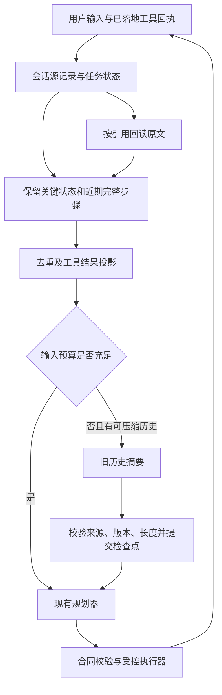

# AI 工作台上下文压缩：GitHub 调研与接入设计

日期：2026-09-19。状态：调研与待实施设计，不是已上线能力。

**后续实施更新（2026-09-19）：用户要求能复用上游时必须直接使用 SDK。本项目已采用 pi 官方 SDK 0.85.1 的公开切分、摘要和阈值 API；下文原选型中的“仅借鉴机制”已被此要求替代。具体已实现范围、存储收敛和验证结果见 [pi SDK 接入说明](../technical/assistant-context-compaction-pi-20260919.md)。下文其他未落地设想仍是设计建议，不代表已交付能力。**

## 1. 结论与范围

**值得做，而且能同时缓解历史膨胀和早期任务信息丢失；建议采用“确定性精简 + 结构化任务检查点 + 按需模型摘要 + 原文回读”的组合。** 不建议直接把整个 pi/DSH 框架引入当前扩展，也不建议只在报错时把聊天记录总结成一段话。

上下文压缩不扩大模型容量，也不能保证无限对话或完全无损。系统说明/工具合同本身过大、单次不可拆的输入过大、思考耗尽输出额度、12 轮/12 次工具/5 分钟执行上限，是不同问题，需要分别处理。

本次检查的是当前仓库 `assistant.html → assistant-engine → assistant-tools → assistant.plan → provider` 工作台路径；兼容旧音乐/闹钟独立会话，但不在第一期同时改造所有 AI 场景。没有修改执行代码、运行配置或用户历史，没有进行真实账号操作。

## 2. 当前链路：已有止血措施，但没有历史摘要系统

本地基线 HEAD 为 `4ae10be431fef5166a1664747632b36a1209ad30`，**以下判断包含当前未提交修改**，不能只凭该 SHA 重现。尤其 `assistant-context.mjs` 当前尚未跟踪。

| 当前事实 | 源码位置 | 意义 |
|---|---|---|
| 按加载模型容量计算预算，规划窗口最多 32768；冷加载 12288、已加载但未知容量 8192；减去输出及 512 安全空间 | `local-ai/assistant-context.mjs:3–13,27–30` | 已修复固定 6200 门槛；加载更大窗口不等于规划输入无限增长 |
| 中文等非 ASCII 每字符估 2 tokens，ASCII 每字符估 0.5 tokens | 同文件 `5–7` | 是保守启发式，不能当 tokenizer 实测 |
| 去当前输入重复项；超预算时缩短展示文字、删除附属字段，仍不够则报错 | 同文件 `33–50` | 是字段裁剪，没有摘要、持久化压缩点或自动续跑 |
| 引擎保留最近 16 条 turns，规划请求只带最近 12 条 | `js/assistant-engine.js:155,267,319`；`js/assistant-tools.js:118` | 旧约束可能在进入服务端前已退出输入，事后摘要救不回已丢信息 |
| observations 最多 6 条，总 JSON 超过 12000 字符时逐条移除旧项；若单条仍太大，会被服务端拒绝 | `js/assistant-engine.js:159–160`；`local-ai/assistant-service.mjs:18–19` | 不只是模型 token 窗口问题；需要先做结果投影，不能仅改最后一道预算判断 |
| completedSteps 取当前任务 log 的已完成项，最多 24 条，每条消息最多 500 字符 | `js/assistant-tools.js:117` | 已有防重复线索，但不等同带动作身份的长期回执账本 |
| continue 新建 task、继承 observations/memory/turns，但 `log: []` | `js/assistant-engine.js:254–279` | 跨用户续接后，completedSteps 不能保证包含上一 task 的完整已完成动作 |
| 原始历史默认 `captureContent: false`，即使开启也做清洗、截断、容量和时间淘汰 | `local-ai/history-store.mjs:6–36` | 不能假定现有 history.json 是完整、可精确回读的原文档案 |
| 模型 HTTP 失败统一成通用错误，未保留明确的上下文超限分类 | `local-ai/provider.mjs:19` | 尚不能可靠区分“应压缩”与权限、连接、参数错误 |
| Gateway 当前自动恢复针对思考耗尽、无正式输出、超时；仅重试生成 | `local-ai/gateway.mjs:128–180` | 可借鉴恢复边界，但不是上下文溢出恢复 |
| 每任务最多 12 轮规划、12 次工具、5 分钟 | `js/assistant-engine.js:167–169,203–205` | 压缩不应顺便重置这些保护计数 |

昨天的故障说明记录：某轮保守估算约 6259，旧门槛 6200；第一轮真实模型输入 2158。后来报告的 6 轮流程在新预算下通过。**这是仓库既有报告，本次未重跑真实模型**；不能据此宣称所有历史失败都是误报。后续应按错误码与预算分项统计真实发生频率。

本次补充验证：

- 执行 `node --test test/local-ai-assistant-context.test.mjs test/local-ai-planner-recovery.test.mjs`，23/23 通过。它们验证当前行为，不证明新设计已实现。
- 只调用现有校验函数，单条 12100 字符工具内容在 `validateInput` 报“执行观察超过上下文上限”，尚未进入 `prepareContext`。
- 构造没有历史、只有较大系统说明的输入，仍得到 `ASSISTANT_CONTEXT_BUDGET_EXCEEDED`。这说明不能把所有错误都导向历史摘要。

## 3. GitHub 一手调研

通过 GitHub API 固定当前提交，下载相关源码到临时目录后核查。以下源码链接固定 SHA，避免后续主分支漂移；未安装或运行这些上游框架。

### 3.1 pi：摘要旧历史、保留近期工作、记录压缩边界

本次从 `badlogic/pi-mono` 文档入口确认其现行源码指向 `earendil-works/pi`。锁定提交 [`36b60d2e8985899743c4cf5bd5f8929832a3f05d`](https://github.com/earendil-works/pi/commit/36b60d2e8985899743c4cf5bd5f8929832a3f05d)，提交时间 2026-09-18 UTC。

- 通过上下文使用量与预留预算判断是否压缩；既支持自动触发，也支持手动 compact。
- 用最近一次有效 usage 加新增消息估算；压缩后不能继续套用旧上下文的 usage。
- 从后向前选近期保留区；旧区交给模型生成目标、约束、进展、决策、下一步等摘要。
- `CompactionEntry` 记录 summary、`firstKeptEntryId`、tokensBefore、usage 等；后续输入由摘要和保留区重建，原会话记录仍可追溯。
- 切分需要保全工具调用/结果关系；长单轮也有前缀摘要处理。自动运行中工具结束后可检查容量，溢出恢复与普通网络重试分开。

源码：[compaction.ts](https://github.com/earendil-works/pi/blob/36b60d2e8985899743c4cf5bd5f8929832a3f05d/packages/coding-agent/src/core/compaction/compaction.ts)、[agent-session.ts](https://github.com/earendil-works/pi/blob/36b60d2e8985899743c4cf5bd5f8929832a3f05d/packages/coding-agent/src/core/agent-session.ts)、[session-manager.ts](https://github.com/earendil-works/pi/blob/36b60d2e8985899743c4cf5bd5f8929832a3f05d/packages/coding-agent/src/core/session-manager.ts)。

适合借鉴的是“可重建检查点”和“近期工作原样保留”。其默认 reserveTokens=16384、keepRecentTokens=20000 不适合直接照搬咱们 8K/12K/32K 工作窗口。

### 3.2 DSH：统一计量、先裁工具结果、再做可校验的历史替换

锁定 [`deepseek-ai/deepseek-harness@ddefc45fbc7f8e46dd73185e68295696d1297887`](https://github.com/deepseek-ai/deepseek-harness/commit/ddefc45fbc7f8e46dd73185e68295696d1297887)，提交时间 2026-09-17 UTC。

| 机制 | 源码核对结果 | 对我们的启发 |
|---|---|---|
| 分离职责 | token-meter、compaction seam、basic backend、tool-result-pruner、手动命令分开 | ContextManager 协调，不把全部逻辑堆进 prepareContext |
| 自动触发 | pre-step 按路由模型测量；默认 80% 触发、近期保留 16%，可按模型覆写 | 以实际请求和有效工作窗口计算，而不是固定消息条数 |
| 确定性裁剪 | 压力成立后先缩短巨大工具文本；够用便跳过模型摘要；完整原文保留在日志 | 把昂贵摘要放最后，先减少不需要的负载 |
| 范围替换 | 选择工具关系平衡的历史区间；记录 start/summary/end 和来源序号 | 有版本、来源和明确提交点，取消不能留下半成品 |
| 检查摘要 | 重新验证范围稳定及替换是否变小；截断的摘要不能当成功检查点 | “调用成功”不等于“可用压缩” |
| 溢出恢复 | 只响应明确 `CONTEXT_WINDOW_EXCEEDED`，实际替换推进后才允许有限重试 | 不能对所有 400/500 或同一失败输入无脑重试 |

源码：[入口及恢复](https://github.com/deepseek-ai/deepseek-harness/blob/ddefc45fbc7f8e46dd73185e68295696d1297887/packages/compaction/compaction-basic/src/index.ts)、[范围事务](https://github.com/deepseek-ai/deepseek-harness/blob/ddefc45fbc7f8e46dd73185e68295696d1297887/packages/compaction/compaction-basic/src/region.ts)、[摘要与结束原因校验](https://github.com/deepseek-ai/deepseek-harness/blob/ddefc45fbc7f8e46dd73185e68295696d1297887/packages/compaction/compaction-basic/src/summarizer.ts)、[裁剪器](https://github.com/deepseek-ai/deepseek-harness/blob/ddefc45fbc7f8e46dd73185e68295696d1297887/packages/compaction/compaction-tool-result-pruner/src/index.ts)、[计量说明](https://github.com/deepseek-ai/deepseek-harness/blob/ddefc45fbc7f8e46dd73185e68295696d1297887/packages/llm/token-meter/README.md)。

DSH 还尝试复用摘要请求的原始前缀以利用 provider 缓存。当前助手是每轮重新构造 JSON、`store:false` 的请求，这不证明底层没有缓存，但也不能直接套用 DSH 的缓存收益。第一期优先小而稳定的输入，缓存是否获益要实测。

DSH 的头尾文本裁剪也不能直接套在音乐候选 JSON 上：中间可能恰好包含用户选中的歌手、版本或分页标记。我们应按工具 schema 投影，并提供分页/回读。

### 3.3 补充：DSH 社区的非模型压缩

[`TsFreddie/dsh-compaction-instant`](https://github.com/TsFreddie/dsh-compaction-instant) 展示另一条路线：把调用编译成短记录，工具结果用日志序号引用，并通过 recall/search 恢复原文。这里仅核查 README，未做源码级和性能验收。

值得借鉴“省略内容仍可回读”。其 near-lossless 表述不等于模型当前能看到全部信息：如果模型没有回读，省略内容仍可能影响推理。因此本项目不采用“无损压缩”宣传，也不把社区的毫秒级数字作为本机性能承诺。

## 4. 选型：原生小模块，借鉴机制

| 方案 | 能力与代价 | 决策 |
|---|---|---|
| 放大窗口或改 token 常数 | 能修误拦截，不能恢复已裁掉的约束；输入增长仍增加计算成本 | 保留动态预算，非完整解决方案 |
| 只保留最后 N 条 | 实现简单，容易丢目标和已执行动作 | 不继续作为语义状态的唯一来源 |
| 只加 LLM 总结 | 有语言理解能力，但有延迟、摘要失真和重复压缩损失 | 作为最后一层，不单独使用 |
| 直接引入 pi/DSH runtime | 有完整会话体系，但需要适配执行器、事件、权限和存储 | 当前收益不足以覆盖迁移范围 |
| 自有 ContextManager，复用现有 Gateway/Engine | 可按我们的结构化工具、确认卡和引用机制精确处理 | **推荐** |

第一期不增加常驻模型、向量库、Python 服务或跨会话 RAG。个人长期偏好继续由现有 memory 模块管理；任务摘要不自动成为个人记忆。

## 5. 数据分层：摘要只承担可以有损的部分



### 5.1 必须由程序保存的关键状态

- 当前原始需求及后续修改原文，关联 sourceEventId、适用场景和被替代关系。禁止、否定、条件和待完成要求不能仅依赖模型摘要保留。无法可靠判断某条旧用户要求已失效时，保留该用户原文；达到不可容纳规模时明确暂停，不静默丢弃。
- 任务进展与副作用回执：actionId、目标引用、参数摘要/指纹、pending/succeeded/failed/unknown、来源事件、完成时间。确认前的 prepare 不能记为成功执行。
- 当前待选/待确认操作、有效引用、版本、分页标记及未完成步骤。模型不得生成它们的权威值。
- 最新可用状态观察；旧 revision 只能作历史证据，写入前仍走现有最新 revision 校验。

回执账本按 conversationId/目标阶段继承，不能在每次 continue 时清空。新的独立需求建立新 goalId；“再追加一次”是新动作，不因工具名相同而被错误去重。replace 使旧未完成目标和旧确认失效，但保留已经发生的事实。

### 5.2 可以压缩的内容

旧助手解释、重复展示、已经完成的检索过程、过期观察、可重新获取的大列表。模型摘要只保存背景、已做决策和推理所需线索，必须带来源引用；不保存模型内部思考，不复制全部工具 schema。

结构建议：

```ts
type ContextCheckpoint = {
  schemaVersion: 1;
  conversationId: string;
  goalId: string;
  sourceRevision: number;
  sourceRange: { fromSeq: number; throughSeq: number };
  firstRetainedSeq: number;
  previousCheckpointId?: string;
  summary: { background: string; decisions: string[]; unresolved: string[] };
  sourceRefs: string[];
  method: 'deterministic' | 'llm';
  model?: string;
  promptVersion?: string;
  beforeEstimatedTokens: number;
  afterEstimatedTokens: number;
  usage?: { inputTokens: number; outputTokens: number };
};
```

这是摘要元数据，不包含授权。constraints、actionLedger、pendingInteraction 和实体引用由 Engine 的事实状态另行组装，不能被摘要覆盖。

### 5.3 大结果外置与回读

音乐集合等已有真实 ref/执行器内存，继续利用；模型只看集合身份、数量、分页、有效选中项和操作所需字段。新增 `context.read(ref, cursor, limit)` 只读工具，返回有预算的小块及 nextRef。

外置前保留允许保存的业务原文，排除 cookie、凭证和请求头；“原文”指经过边界清洗、未做有损摘要的业务内容。所有 ref 带当前会话/目标范围及有效期；旧 ref 回读不延长有效期，也不能直接赋予写权限。用 event ID 去重回读结果，避免同一大段反复注入。

候选项不可盲目只保留前五个；分页后必须保留总数、过滤条件、已选择对象、下一页入口。用户选择的第 20 个对象在 UI 和执行器中仍存在，模型可直接拿到其真实 selectedRef。

## 6. 存储和一致性

建议新增浏览器侧 `AssistantContextStore`，使用独立 IndexedDB 数据库保存当前会话 events、artifacts、checkpoints。项目已有 IndexedDB 使用经验，但不复用书签数据库或 schema。本机 AI 服务只处理经过预算限制的投影/摘要块，不成为浏览器执行状态的第二个主库。

业务 task 仍由现有 Engine 管理；上下文存储持有 sourceRevision 和已提交 checkpoint。提交通过 Engine 的串行锁协调：先检查任务版本和取消状态，在短数据库事务中写 checkpoint 与指针，然后更新任务的 checkpoint 引用。不得跨模型等待时间保持 IndexedDB 事务。若崩溃发生在数据库提交后、任务指针更新前，重启仅恢复匹配 conversationId/goalId/sourceRevision 的有效检查点，不能自动重放业务动作。

存储失败不能宣布“压缩成功”：原投影能容纳则继续使用原投影；不能容纳则保留进度并暂停。迁移只导入当前尚在的 turns/observations/log，标记 `historyComplete:false`，不声称能找回过去已 slice 掉的对话。

必须区分活动任务恢复存储与用户可选的长期历史：

- 默认只为当前可续接任务保存上下文来源，不暗中开启 history.captureContent。
- 新建独立会话、用户清理任务时，删除该活动上下文；历史功能若开启，另按其明确配置归档。
- 设置活动存储上限及 UI 提示；建议首版会话上限 10 MiB、总上限 50 MiB，均为待验证的产品默认值。达到上限时先尝试移除可重新查询的过期 artifacts，仍不足则暂停接收额外大材料，不破坏活动来源。
- 删除递增 epoch，晚到的摘要/回读不得使内容复活；临时模式不持久化来源。

## 7. 预算、触发与执行顺序

### 7.1 使用有效输入预算

沿用并扩展当前公式：

```text
W = min(实际加载模型窗口, 规划工作窗口上限)
B = W - 输出额度（含思考额度）- 安全空间
I = 系统说明 + 当前工具合同 + 保留状态 + 摘要 + 近期步骤 + 本次输入
```

第一期沿用规划上限 32768，安全空间至少维持现有 512；只有确认接口封装/计量误差后才调整。不能只对聊天文字计量，工具目录、JSON 封装及摘要本身也在 I 中。

建议初始策略，**尚未性能调优**：

| 参数 | 首版建议 |
|---|---|
| 自动触发 | I ≥ 0.78 × B，或已知下一步结果上界将突破 B |
| 压缩目标 | 尽量使 I ≤ 0.55 × B；必须低于 B，否则不继续发模型 |
| 近期历史 | 按完整步骤保留，软目标约 0.20 × B；最新用户要求、待确认卡不受此裁剪 |
| 摘要输出 | 不超过 min(1536, floor(0.10 × B)) tokens，并受全局输出预算约束 |
| 摘要模型 | 默认当前所选模型，支持时关闭思考；不隐式切远端模型 |
| 自动恢复 | 同一 planning request 最多一次压缩恢复，不重放业务步骤 |

78% 与 55% 形成间隔，减少每轮都压缩。若关键状态本身已高于目标线但仍低于 B，不为追求比例反复压缩；记录无可压缩部分，等来源 revision 真正变化后再评估。固定状态超过 B 时，缩减无关工具或明确报告容量不足。

示例：W=32768、输出=4096、安全=512，则 B=28160，触发约 21965、目标约 15488。**这里以 B 为基准，不能用大模型宣称支持的总窗口百分比替代工作台预算。**

计量优先级：可验证的同模型 tokenizer/接口计数 > 同模型同模板、未压缩且前缀一致的实际 usage 加增量 > 保守估算。我们的每轮 JSON 和工具集合会变化，不能无条件照抄 pi 的尾部增量算法，更不能凭单个样本把所有中文估算乘 0.4。模型、提示词模板、工具目录或投影改变后使旧校准失效。UI 分别显示估算和实测。

### 7.2 接入位置：先保源，再投影，再校验

1. `Engine.accept` 在 slice/shift 前写入来源和精确回执；新用户输入也先记录。现有近期窗口可保留为缓存，不能再充当完整事实源。
2. 浏览器 ContextManager 对大结果按 schema 投影，保证送往服务端的每个 envelope 满足传输和校验上限。不能依赖一个永远到不了的服务端压缩分支。
3. 服务端共用提示词/工具目录构造器，计算本次准确的预算分项。可提供无模型的 `assistant.context.prepare`，返回 ready/needs_compaction/irreducible 及预算；已有轻量任务直走原路径，避免每轮额外 HTTP 往返。
4. 先去重、移除无关展示、外置可回读结果、重新测量。已经足够就直接规划，不调用摘要模型。
5. 不够且存在安全旧区间时，ContextManager 发起独立 `assistant.compact` 场景；输入为旧摘要和新的已结束区间，当前待确认交互与未完成调用留在外面。
6. 模型返回后校验结构、结束原因、来源范围和任务版本。回读 protected state 比对保持不变，候选有效期、参数和授权仍由执行器校验。
7. 新请求实测/估算必须更小，且能够放进 B；原子提交 checkpoint 后规划器才使用它。不够则进入有界分块整理或报告不可压缩，不能反复提交不缩小的摘要。

`assistant.compact` 必须是独立 Gateway 场景，拥有自己的 admission ticket、usage、取消、超时和 trace；summary 无执行工具。不要在当前 `controlledProvider.generateObject` 上直接连续调用两次：目前 record.attempts 每次重置、ticket 由外层收尾，多调用需要先改调用生命周期，否则用量和 admission 可能归属错误。

协议需要同步升级：`assistant.plan` 增加版本化的 `context` envelope，显式校验 checkpoint、约束来源、回执投影和近期步骤的字段、长度、数量及会话范围，不能透传任意客户端 prompt。`assistant.compact` 仅接收有界来源块和旧摘要，返回待校验摘要及 usage；它不写 Engine 的执行状态。prepare 结果携带模型、模板、工具目录和策略版本组成的 budgetKey，实际生成前重核；压缩需求通过结构化结果返回，不能靠解析中文报错触发。当前 `awaitAI` 只抛 message/code，还需保留安全的 contextBudget/recovery 元数据，才能让 Engine 精确进入恢复分支。业务副作用的最终校验始终留在执行器，摘要里即使出现“已经授权”也不能改变权限。

摘要和后续规划共享 Engine 剩余任务 deadline；摘要最多使用可分配时间的一部分，为规划留下余量。耗时不够则不开始摘要，不重置原有五分钟限制。只有真正发送规划模型请求才计入规划轮数；压缩请求单独计数、单独记账，但仍消耗模型全局额度。

### 7.3 摘要自身不能撑爆上下文

摘要输入使用更小的专用说明，不附完整执行工具目录。先裁结果，再测摘要请求；若“旧摘要 + 新来源块”仍超预算，按已完成步骤分块，一块一块合并。每个块都单独校验并计费，单次整理设最大块数和统一 deadline；不足时保留旧 checkpoint 和整理进度，不能循环调用直到超时。

重复摘要仅合并旧摘要与新来源增量，不把整段历史反复送模型。关键约束和回执每次从程序状态重新加入；摘要保留 sourceRefs，必要时可从原事件重建。这样降低摘要逐代失真的影响，但不宣称语义摘要完全无损。

## 8. 失败恢复：只重试规划，不重放副作用

Provider 需将已确认的上下文容量错误归一为 `MODEL_CONTEXT_WINDOW_EXCEEDED`；保留经过清洗的错误分类，不能把任意 HTTP 400 视为超限。输出额度不足沿用现有 reasoning/output 错误，不能混为输入溢出。

恢复规则：

```text
明确输入超限
→ 保存当前任务和已完成回执
→ 同一请求只进行一次恢复周期
→ 重新读取容量，先精简、必要时摘要
→ 只有投影确实变小且满足预算才重试本次规划
→ 仍失败则可恢复暂停
```

取消、切换模型、策略修改、删除会话、用户改需求都会使正在生成的旧摘要失效；提交时核对 task.version、contextRevision、policyRevision、model/template identity、epoch。压缩期间收到新输入可以排队，停止请求立即生效。

当前工具由浏览器执行，模型请求只产生计划，所以规划重试不会天然重发工具；仍要防止压缩后模型再次提出已执行动作。使用 actionLedger 和 goalId 做执行前检查。

**不承诺跨外部系统 exactly-once。** 如业务动作已发生、但回执落盘前进程崩溃，状态为 unknown；恢复先读当前队列/提醒状态核对，无法核对就等待用户处理，不能把未知当失败后重做。摘要文本永远不能把 unknown 改成 succeeded。

建议错误分类：`CONTEXT_SOURCE_LIMIT`、`CONTEXT_IRREDUCIBLE`、`COMPACTION_TIMEOUT`、`COMPACTION_INVALID`、`COMPACTION_STALE`、`COMPACTION_NO_GAIN`。UI 告诉用户保存了哪些进度及下一步，不笼统要求“新建会话重来”。

## 9. 工作台交互和可观测性

- 平时仅显示小状态，例如“上下文约 62%”；百分比注明相对输入预算，非账户额度。
- 压缩时显示“正在整理上下文，已完成操作已保留”，继续提供停止按钮，不额外要求授权。
- 完成后显示“已整理早期记录 · 估算 21K → 12K”；数字取实际本次测量，不能用固定宣传值。展开可查看保留范围、模型、耗时及来源。
- 提供“整理上下文”手动入口；执行器处于安全边界才运行。手动整理同样不能删掉确认卡，也不触发业务执行。
- 分开记录规则精简与模型摘要。trace 至少包含 trigger、method、before/after、model、usage、elapsed、sourceRevision、protectedStateVerified、重试结果及错误码；没有 usage 就标未知。
- UI 对应失败应区分：原始输入超长、工具结果超长、固定合同过大、摘要失败、模型输入超限、模型输出耗尽、执行轮次到顶。

## 10. 分阶段实施与文件影响

| 阶段 | 内容 | 核心文件 |
|---|---|---|
| P0：可靠来源与确定性投影 | 压缩前留源；跨 continue 的约束/回执账本；大结果按工具 schema 投影；计量分项；不依赖模型摘要 | 新 `js/assistant-context-store.js`、`js/assistant-context-manager.js`；修改 `assistant-engine.js`、`assistant-tools.js`、`assistant-contract.js`、`assistant-context.mjs` |
| P1：语义摘要和受控恢复 | 独立 assistant.compact；检查点事务、分块预算、取消；Provider 超限分类与一次恢复；回读工具 | 新 `local-ai/assistant-compaction.mjs`；修改 `assistant-service.mjs`、`gateway.mjs`、`provider.mjs`、Engine/Tools |
| P2：体验与调优 | 压缩状态、手动入口、trace、中文长任务评测；检查模型延迟后调阈值 | `assistant.js`、`assistant-timeline.js`、`local-ai-client.js`、相关 HTML/CSS 和测试 |

新增浏览器脚本还需核对 background 加载顺序和清理入口；新 scene 在服务端校验、控制面、历史元数据中登记。旧 `assistant-session.js` 的 40 条/500 字符独立会话限制应单独评估，不能改主工作台后就声称所有入口都支持长会话。

feature flag 建议 `contextCompactionMode = off | deterministic | hybrid`。先以 deterministic 跑同一回归，再用 hybrid 对照。off 恢复旧投影路径但保留可迁移检查点；关闭功能不删除已记录回执。**完整解决长对话语义问题需完成 P1，不能把 P0 交付包装成全部完成。**

## 11. 验收：任务正确性优先于压缩率

同一模型、相同 reasoning、相同加载窗口、工具目录及输入序列对比“当前 / 仅确定性 / 混合”三组。先业务替身，后真实模型加业务替身，最后真实扩展；各级证据分开。

| 场景 | 必须满足 |
|---|---|
| 101 首队列 → 确认清空 → 选择歌手 → 100 首热门歌 → 追加 → 随机起播 | 压缩前后同一目标，清空/追加/起播各执行一次 |
| 30 次用户续接，跨多次新 task | 早期“先别播放”“不要清空”仍有效；已有动作不因 log 重置而丢失 |
| 同工具不同目标与“再来一次” | 不重复旧动作，也不错误拦截新授权动作 |
| 连续 5 次摘要 | 关键用户原文、待完成目标、确认状态保留；摘要来源仍可回读 |
| 20KB/200KB 工具结果，关键命中在中间 | 原文先留源，传输投影不过限；通过 ref/分页可取回关键命中 |
| 切到 8192 窗口或降低输出策略 | 重算预算，不重用旧校准或过大的 checkpoint |
| summary 超时、非法 JSON、仅思考、输出截断、没有变小 | 不提交坏检查点；原进度可继续核对 |
| 压缩时取消/删会话/改变需求/重启 | 晚结果不回写、不复活会话、不触发任何业务动作 |
| 写入之后、回执之前崩溃 | 恢复为 unknown，经实际查询确认后才能继续 |
| 老 revision/ref 过期 | 不被摘要复活；重新查询并通过现有执行校验 |
| 固定 system/tools 已超过 B | 明确不可压缩原因，不持续调用摘要模型 |
| 短单轮任务 | 不新增摘要模型调用，规则直达能力继续可用 |

记录完整任务成功率、因输入超限中断次数、错误重复动作数、约束保留率、额外模型调用数、输入/输出 tokens、整理时延与总任务时延。已知必须容纳的固定测试用例要求超限中断为 0；禁止类约束丢失、错误重复副作用、取消后继续执行为 0 容忍。不要把小测试集 100% 表述成生产永不失败。

建议以较大历史输入至少减少 30% 作为实验目标，而不是硬性产品承诺；最终是否开启 hybrid 由端到端成功率和本机 Qwen 延迟决定。未测之前不承诺“压缩 80%”或“完全不卡”。

## 12. 最终建议

按上述原生小模块路线实施，先把关键状态从滚动窗口中独立出来，再加入可校验的语义摘要。pi 提供检查点和近期上下文保留的参考；DSH 提供计量、裁剪、事务和溢出恢复的参考；社区方案补充按需回读思路。

期望结果是：对话变长时，工作台自动整理已结束的过程，保留当前需求和真实进度，从未完成步骤接着执行。对于确实无法容纳或无法确认的状态，保留可恢复任务并准确说明原因。这比单纯增加模型窗口或删掉旧聊天更契合当前问题。
