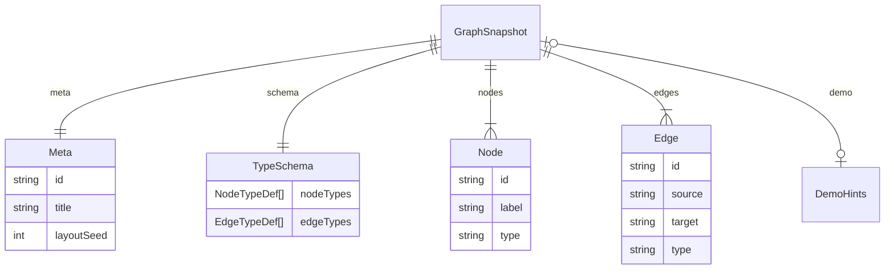

# GraphSnapshot Schema v1（冻结）

| 元数据 | 值 |
|--------|-----|
| **状态** | **Frozen**（D1 M0 门禁） |
| **契约版本** | `schemaVersion: "1.0.0"` |
| **机器可读** | [graphsnapshot-schema-v1.json](graphsnapshot-schema-v1.json) |
| **架构 ADR** | [ADR-002](../adr/adr-graphsphere-tech-stack-architecture-v2.md) |

---

## 1. 设计原则

| 原则 | 说明 |
|------|------|
| **SSOT** | 预置场景、P1 JSON 导入、QA fixture 均使用同一 JSON 契约 |
| **零后端** | 文件即数据源；无 API、无布局坐标持久化 |
| **可复现** | `meta.layoutSeed` + 确定性布局迭代 → 录屏可复现（R-KG-S06） |
| **分层校验** | L0 结构（JSON Schema）→ L1 引用完整性 → L2 R-KG 图统计（P0 门禁 subset） |
| **向前兼容** | v1 仅允许 **增字段**（optional）；删改 required 须 bump `schemaVersion` |

---

## 2. 顶层结构



### 2.1 字段总览

| 字段 | 类型 | 必填 | 说明 |
|------|------|------|------|
| `schemaVersion` | string | ✓ | 固定 `"1.0.0"` |
| `meta` | object | ✓ | 场景元数据 + `layoutSeed` |
| `schema` | object | ✓ | 节点/边类型图例（颜色、文案） |
| `nodes` | array | ✓ | 1–200 项（运行时硬限，见 ADR-002） |
| `edges` | array | — | 0–800 项 |
| `demo` | object | — | 演示巡航、默认场景、相机提示 |

### 2.2 明确禁止持久化的字段

以下字段 **不得** 出现在 GraphSnapshot v1 中（违反 R-KG-S07）：

- `x` / `y` / `z` / `position` / `layout` / `coordinates`
- `vx` / `vy` / `fz` 等仿真速度
- 内嵌 WebGL / Three.js 对象引用

布局输出由 `kg-graph-layout.js` 在内存中生成 `LayoutSnapshot`（见 ADR-002 §6.3），**不**回写 JSON。

---

## 3. 类型系统（与 BA R-KG 对齐）

### 3.1 默认 nodeTypes 白名单

预置场景 A/B **必须** 在 `schema.nodeTypes` 中声明子集；`nodes[].type` 仅能引用已声明的 `id`：

| id | 含义 |
|----|------|
| `product` | 产品 / 领域根 |
| `module` | 前端或客户端模块 |
| `service` | 后端 / 本地服务 |
| `infra` | 基础设施 |
| `data` | 数据实体 / 存储 |
| `integration` | 外部集成 |
| `capability` | 能力 / 特性 |

### 3.2 默认 edgeTypes 白名单

| id | directed | 含义 |
|----|----------|------|
| `contains` | true | 组成 / 包含 |
| `depends_on` | true | 依赖（L2 无环检查子集） |
| `communicates_with` | true | 通信 / 调用 |
| `stores_in` | true | 持久化 |
| `exposes` | true | 对外暴露 |
| `integrates_with` | true | 第三方集成 |
| `derived_from` | true | 概念衍生 |

场景可 **缩减** 使用子集，但不得引入未声明的 `type` 字符串。

---

## 4. 校验分级（kg-graph-core 契约）

| 级别 | 时机 | 规则 | 失败行为 |
|------|------|------|----------|
| **L0** | 解析后立刻 | JSON Schema + `schemaVersion` | 拒绝加载，错误码 `E_SCHEMA` |
| **L1** | L0 通过后 | 节点 id 唯一；边端点存在；无自环；无重复边 (source,target,type) | `E_GRAPH_REF` |
| **L2-P0** | Demo 交付 | 节点 ≤200；预置包 ≤150；孤立节点 ≤5%；主连通分量 ≥90%；`demo.tourNodeIds` 均存在 | `E_RKG_STATS` |
| **L2-P1** | P1 导入 | `depends_on` 子图无环；hub `summary`；敏感词扫描 (R-KG-N06) | 警告或拒绝（可配置） |

### 4.1 校验 API（实现须遵守）

```javascript
/**
 * @typedef {'ok'|'error'} ValidateStatus
 * @typedef {{ code: string, message: string, path?: string }} ValidateIssue
 * @typedef {{ status: ValidateStatus, issues: ValidateIssue[], graph?: NormalizedGraph }} ValidateResult
 */

/** @param {unknown} raw @returns {ValidateResult} */
function validateGraphSnapshot(raw) {}

/**
 * @typedef {Object} NormalizedGraph
 * @property {string} schemaVersion
 * @property {Readonly<Meta>} meta
 * @property {ReadonlyMap<string, Node>} nodeById
 * @property {ReadonlyArray<Edge>} edges
 * @property {Readonly<TypeSchema>} schema
 */

/** @param {string} nodeId @returns {{ nodeIds: string[], edgeIds: string[] }} */
function getNeighborhood1Hop(graph, nodeId) {}
```

---

## 5. 最小合法示例

```json
{
  "schemaVersion": "1.0.0",
  "meta": {
    "id": "scenario-b-ai-stack",
    "title": "AI 技术栈概念图谱",
    "layoutSeed": 42,
    "locale": "zh-CN",
    "updatedAt": "2026-05-25"
  },
  "schema": {
    "nodeTypes": [
      { "id": "product", "label": "产品", "color": "#4F46E5" },
      { "id": "module", "label": "模块", "color": "#0EA5E9" }
    ],
    "edgeTypes": [
      { "id": "contains", "label": "包含", "directed": true },
      { "id": "depends_on", "label": "依赖", "directed": true }
    ]
  },
  "nodes": [
    { "id": "ai-landscape", "label": "AI 产业全景", "type": "product", "summary": "对外路演根节点", "pinned": true },
    { "id": "rag-pipeline", "label": "RAG Pipeline", "type": "module", "summary": "检索增强生成链路" }
  ],
  "edges": [
    { "id": "e-ai-rag", "source": "ai-landscape", "target": "rag-pipeline", "type": "contains" }
  ],
  "demo": {
    "defaultScene": true,
    "tourNodeIds": ["ai-landscape", "rag-pipeline", "ai-landscape"],
    "hubNodeIds": ["ai-landscape"]
  }
}
```

---

## 6. 资产路径约定

| 用途 | 路径（MVP） |
|------|-------------|
| 场景 A 完整数据 | `test/fixtures/graphsphere/scenario-a-chrome-bridge.json` |
| 场景 B 完整数据 | `test/fixtures/graphsphere/scenario-b-ai-stack.json` |
| Draft 抽检 | `test/fixtures/graphsphere/scenario-*-draft.json`（≤50 节点） |
| Schema 单测 | `docs/technical/graphsnapshot-schema-v1.json` + 内联 minimal fixture |

---

## 7. 版本演进

| 版本 | 变更策略 |
|------|----------|
| **1.0.0** | 当前冻结版 |
| **1.1.0**（P1 候选） | 可选 `groups[]`、边 `curvature`；仍禁止坐标持久化 |
| **2.0.0** | 若引入 Geo/layout 持久化或后端 ID，另立 ADR |

## 8. 冻结记录（D1 M0）

| 项 | 值 |
|----|-----|
| 冻结版本 | `schemaVersion: "1.0.0"` |
| 冻结日期 | 2026-05-25 |
| 门禁 | D1 Go/No-Go；变更须 bump 版本并修订 ADR-002 |
| 实现 SSOT | `js/kg-graph-core.js` → `validateGraphSnapshot()` |
| 单测门禁 | `test/kg-graph-core.test.js`（23 cases，L0–L2-P0） |

**签字**：架构师冻结 v1.0.0 · 研发以 `validateGraphSnapshot` 为唯一解析入口 · QA 以 L2-P0 为 AC-04 依据 · Tech Lead Accept ADR-002 后 PR-1 不得偏离契约。
