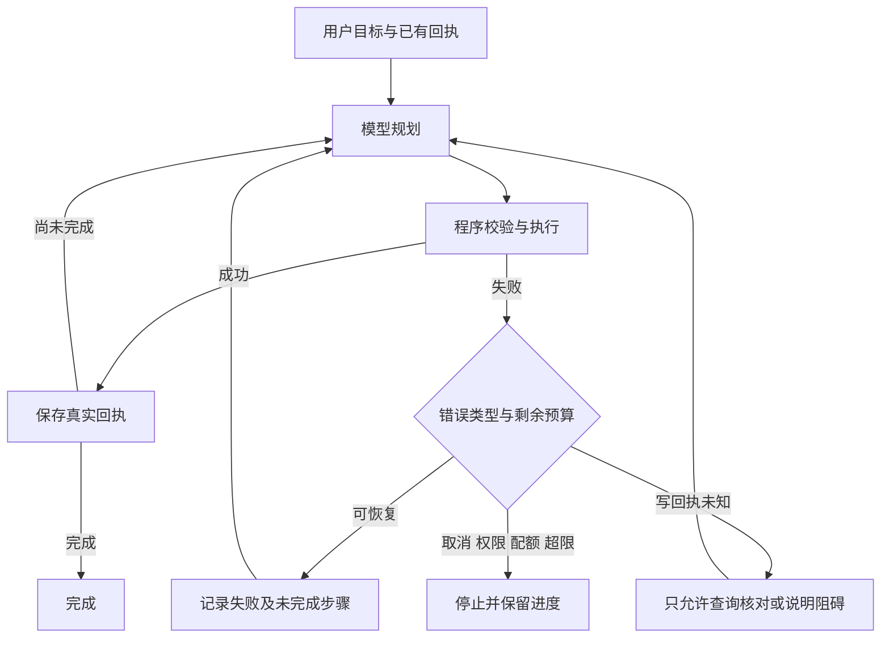

# 工具错误反馈与有限恢复循环

## 原有行为与修改目标

原有主工作台使用 `assistant.plan` 返回 JSON `steps/continue/done`，Engine 校验并串行执行，再把成功或等待回执放进 `observations`。模型超时/空输出有 Gateway 内的一次关闭思考恢复；上下文超限有 pi 压缩后的一次重新规划。但业务工具异常直接到达 `pump` 最外层 catch，任务变成 failed，模型通常看不到失败原因。

本次将可恢复错误变成模型可见的失败回执，继续同一个执行循环。目标是让模型根据错误调整计划，而不是无条件重放刚才的写操作。

## 复用决策

检查了当前安装的 `@earendil-works/pi-coding-agent@0.85.1`、其 `pi-agent-core@0.85.1` 依赖公开声明与实现、package exports、MIT 许可证和 Node >=22.19 要求。公开 `agentLoop/agentLoopContinue/runAgentLoop` 接收 AgentMessage、StreamFn、原生 toolCall/toolResult；`afterToolCall` 可标记 isError，但必须在其完整工具执行循环内运行，并非能单独插入当前 JSON steps 执行器的错误处理函数。

本项目仍是 Chrome 后台 importScripts/CommonJS 兼容模块、受控 HTTP 规划器及现有浏览器确认/资源引用/版本/持久化状态机。此次直接复用**已有 Engine、Tools、Context 与 Gateway**，仅增加错误回执和状态转移；没有创建第二个 agent loop、摘要引擎或事实库，也没有复制上游 SDK 源码。迁入 pi 的完整 AgentSession/工具消息协议会替换现有业务调度与权限适配，超出本次修复范围。pi 摘要仍使用已锁定的正式 SDK 公开 API，不增加依赖或引用私有导出。

## 实际行为

1. 工具执行失败后记录 operation、受控参数、错误码、脱敏错误消息、是否已开始写操作，以及本轮恢复次数。错误不是指令，不发送堆栈、凭证、原始 HTTP 返回体。
2. `observations.status` 增加 failed/unknown。失败不会进入成功 receipts，也不会进入 completedSteps。复用 `Context.observe` 保存来源，摘要和恢复继续使用同一活动任务快照。
3. 原始用户要求、已完成回执和失败步骤之后的 remainingSteps 一起交给模型。模型可先读取新状态/revision、改用已接入查询、修正参数或加载目录；输出仍经过全部工具/参数/应用范围校验。分页校验错误明确给出工具、字段及整数范围，例如 `music.queue.list.limit 必须是 1 至 20 的整数`，不再只返回“分页参数无效”。
4. 无效 JSON 和计划合同错误可作为 `assistant.plan` 失败回执重新规划；确认/选择动作失败使用不可调用的 `assistant.action` 观察标签。标签只用于描述错误，不是新工具。
5. 模型提示词只在出现失败/unknown 回执时增加恢复规则，避免给正常短请求增加无关输入。没有成功恢复回执时不能直接 done。
6. 轨迹保留原失败步骤，显示“正在根据错误重新规划（n/3）”，汇总显示错误恢复次数。没有把失败改写为成功。

## 副作用边界

`assistant-tools.js` 在实际写依赖（队列、播放、提醒、开页、记忆写入等）调用前，经 Engine `effectStarted` 保存标记。失败分类依据本次真实派发状态，而非只看工具名称。例如 music.search 在某些直接播放场景可能继续写队列，不能统称为只读。

- **写入前失败 / 只读失败**：允许模型重新规划。例如清空前读取到 revision 已变化，模型应重新读状态，再生成新的确认卡。
- **写入已开始、没有可信回执**：记录 unknown；模型仅能用合同标注的 readOnly 工具查询或说明阻碍。当前没有自动对账消除 unknown 的业务协议，所以只读查询成功也不能证明之前写操作失败或整个目标完成，不会自动重试写入。
- **重复已成功动作**：执行器仍阻止副作用，并反馈模型继续未完成部分；如果模型反复坚持同一动作，达到重复失败限制后停止。
- **用户另行明确选择其他候选**：沿用既有选择规则，可执行新选择，不等同于自动重试结果未知的旧候选。
- **提醒时间过期/时区变化**：需要用户重新给出或确认时间；不能由自动恢复把原时间悄悄改成新的相对时间。

只有模型 JSON 能纠错不代表权限也能由模型决定。权限拒绝、取消、策略阻断、配额/冷却、进度持久化失败直接停止。模型接口本身超时继续使用 Gateway 原有有界重试；底层已耗尽后不会套一层外循环反复调用不可用模型。

## 循环上限与持久化

- 每执行轮最多 **3 次错误恢复**。
- 同一工具、参数、错误码出现 **第二次失败**即停止，不依赖错误文案是否改变。
- 所有恢复继续计入原有 **12 轮规划、12 次工具调用、5 分钟执行预算**；不重置计数和开始时间，也不绕过每日模型额度或失败冷却。
- 恢复计数随原任务快照保存；失败后不会自动重启任务。显式新需求或用户确认/选择开始新的执行轮，沿用已有执行轮边界重置计数。
- 取消和版本 guard 在返回后、提交新计划前继续检查，晚到模型回复不能执行后续动作。

这不保证任意问题最终能自动解决：身份确认、权限、过期业务时间、外部服务持续故障和未知写回执都可能需要用户处理。停止时保留已经完成的进度和最后错误。

## 验证

- 新增 12 项专项测试：真实 Engine/Tools/Gateway 的失败回传、revision 修复后确认/清空一次、写入前后分类、unknown 查询与写阻断、重复错误、三次恢复上限、JSON/合同纠错、取消/配额/总时限、晚到结果、失败不算完成，以及依据明确分页范围修正参数。
- 相关完整回归 343/343 通过，包括实际安装的 pi SDK 摘要测试、原提醒确认和用户改选其他候选场景。9 个修改/新增脚本语法检查和 `git diff --check` 通过。
- 真实模型验证命令：`node local-ai/evaluate-assistant-recovery.mjs --live`。运行生产 Engine/Tools，通过生产鉴权 HTTP/Gateway 调用本机模型；第一次播放器状态查询注入模拟错误，第二次返回模拟 50 首队列。未接入真实账号或播放器写依赖。

首次实测报告 `local-ai/.local/evaluations/assistant-recovery-1789804010270.json`：读取失败后成功重新查询，但模型随后提出越界分页参数；原错误文案没有范围，重复同一合同错误达到上限后停止。该记录保留为失败证据，由此补充明确字段/范围的错误信息和“只读后续成功即已恢复、满足目标立即结束”的提示。

最终实测报告 `local-ai/.local/evaluations/assistant-recovery-1789804213662.json`，模型为 `qwen/qwen3.8-27b`，本次明确选择 off；没有修改默认 low 策略：

| 阶段 | 结果 | 真实模型耗时 / usage |
|---|---|---|
| 首次规划 | `music.state`，工具注入一次模拟读取失败 | 2.369 秒；输入 1813 / 输出 23 |
| 看到失败回执后重新规划 | 再次 `music.state`，返回 50 首未播放 | 15.306 秒；输入 2083 / 输出 40 |
| 读取成功后判断完成 | `done:true` | 15.555 秒；输入 2252 / 输出 10 |

全程 34.689 秒，错误恢复 1 次、查询 2 次、3 次模型请求，所有思考用量为 0，无写操作。该验证同时经过真实 Engine、Tools、生产 HTTP/Gateway 和真实本机模型，业务依赖为隔离替身。

本机服务已重载；需重新加载 Chrome 扩展并刷新工作台，才能加载浏览器侧的新 Engine/Tools。真实 Chrome 扩展重载后的界面和真实账号动作未验收，未提交 Git。
