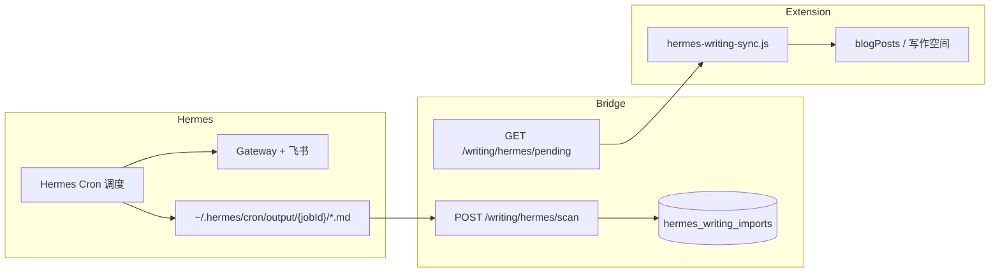

# Hermes Agent × 写作空间集成指南

## 架构概览



Hermes 每次 cron 运行会把完整输出写入 `~/.hermes/cron/output/{job_id}/{timestamp}.md`（含 Prompt 元数据与 `## Response` 正文）。cursor-bridge 负责解析、去重、排队；Chrome 扩展在打开页面或点击「Hermes」时拉取并写入 `chrome.storage.local` 的 `blogPosts`。

## 已映射的 3 个每日任务

| Job ID | 名称 | 分类 ID | 默认标签 |
|--------|------|---------|----------|
| `0c0d2c2e0918` | 中国历史每日故事 | `history` | hermes, 中国历史, 每日故事, cron |
| `dd51052451f6` | 中国学术思想史每日一讲 | `thought` | hermes, 学术思想史, 每日一讲, cron |
| `469d08ad3a2d` | 抗日战争前后故事 | `modern` | hermes, 抗战史, 每日故事, cron |

写作空间新增分类：**历史故事**、**思想史**、**近现代史**。

## 快速开始

### 1. 启动 cursor-bridge

```bash
cd cursor-bridge
npm run dev
# 监听 http://127.0.0.1:19840
```

### 2. 扫描历史 cron 输出（一次性回填）

```bash
node scripts/hermes-sync-writing.mjs
```

### 3. 在扩展中同步

- 重新加载扩展并打开新标签页；写作空间初始化时会自动 `scan + pull`。
- 或打开写作空间抽屉，点击顶栏 **Hermes** 按钮手动同步。

### 4. 每日自动扫描（推荐）

在 Hermes cron tick 之后执行扫描脚本，可用 macOS `launchd` 或 crontab：

```bash
# 示例：每天 10:15、12:15、18:15 扫描（对应三个任务跑完后）
15 10,12,18 * * * cd /path/to/chrome-time-background && node scripts/hermes-sync-writing.mjs >> /tmp/hermes-writing-sync.log 2>&1
```

或在 `~/.hermes/config.yaml` 增加 **shell hook**（`post_tool_call` 不适用 cron；cron 与 gateway 解耦，故推荐外部定时脚本）。

## API 参考

| 方法 | 路径 | 说明 |
|------|------|------|
| POST | `/writing/hermes/scan` | 增量扫描 `~/.hermes/cron/output/`（按文件 mtime；body `{ force: true }` 全量重扫） |
| GET | `/writing/hermes/pending` | 待扩展拉取的故事 |
| POST | `/writing/hermes/ack` | 扩展同步后确认 `{ ids: number[] }` |
| GET | `/writing/hermes/stats` | 队列统计 |
| GET | `/writing/hermes/jobs` | Job → 分类映射 |

## 与飞书的关系

- **飞书**：仍由 Hermes Gateway `deliver: origin,feishu:oc_xxx` 推送（你当前的 invalid receive_id 需单独修 open_chat_id）。
- **写作空间**：读本地 markdown 归档，不依赖飞书送达成功与否。

## 目录（TOC）说明

写作空间详情页的「目录」来自 Markdown **`##` ~ `####` 标题**，至少 2 条才显示侧栏。

Hermes 正文使用 `📖 **事件**`、`📅 **时间**` 等 emoji 小节，**不是** `#` 标题，因此默认识别不到目录。

**已做兼容**：打开 Hermes 来源文章时，扩展会自动把 emoji 小节转为 `## 小节名` 再渲染，无需重新同步。可选地在 Hermes Prompt 里为长段落增加 `### 子标题`（见 `hermes-prompts/output-title-standard.md`）。

## 标题输出规范（Hermes 侧）

Agent 最终回复首行须为 `📜 **{真实标题}**`，禁止 `📜 **标题**：…` 写法。详见 [guide-hermes-output-title-standard.md](guide-hermes-output-title-standard.md)。

批量更新三个现有任务的 Prompt：

```bash
node scripts/patch-hermes-cron-title-standard.mjs
```

## 扩展新 cron 任务

1. `hermes cron list` 拿到新 `job_id`
2. 在 `cursor-bridge/src/modules/writing/hermes-import.ts` 的 `HERMES_JOB_PROFILES` 增加映射
3. 在 `js/blog.js` 的 `CATEGORIES` 增加分类（如需要）
4. 将 job id 加入 `scripts/patch-hermes-cron-title-standard.mjs` 并执行 patch
5. 重新构建/重启 bridge，运行 `node scripts/hermes-sync-writing.mjs`

## 扫描策略（增量）

1. **Bridge** 在 SQLite `hermes_scan_state` 记录 `last_file_mtime_ms`（已见文件的最大修改时间）与 `last_scan_finished_at`。
2. **增量扫描**（默认）：对每个 `.md` 仅 `stat`；`mtime <= 水位` 的跳过且不读盘；`mtime` 更新但 `external_id` 已入库的跳过读盘；仅对新文件/变更文件 `readFile` + 解析。
3. **全量**：`POST /writing/hermes/scan` 传 `{ "force": true }`（CLI 脚本已默认带 force，用于一次性回填）。
4. **扩展拉取**：`GET /pending` 只拉 `status=pending` 队列；`hermesWritingSyncState.importedExternalIds` 防止重复写入 `blogPosts`。
5. **冷却**：55 分钟内非 force 的 scan 直接返回（多浏览器/多标签防刷）；与 mtime 增量正交。

`GET /writing/hermes/stats` 的 `scanState` 可查看上次扫描时间与 mtime 水位。

## 故障排查

| 现象 | 处理 |
|------|------|
| 同步失败 19840 | 启动 `cursor-bridge` |
| 扫描 0 条 | 确认 `~/.hermes/cron/output/{jobId}/` 有 `.md` 且含 `## Response` |
| 重复文章 | 以 `source.externalId` / `hermesKey` 去重，勿删 `hermes_writing_imports` 除非要重导 |
| 飞书 delivery failed | 与写作空间无关；检查 `feishu:oc_xxx` 是否为有效 chat_id |

## 相关文件

- `cursor-bridge/src/modules/writing/hermes-import.ts` — 解析与存储
- `js/hermes-writing-sync.js` — 扩展侧拉取
- `js/blog.js` — 分类与 UI
- `scripts/hermes-sync-writing.mjs` — CLI 扫描
