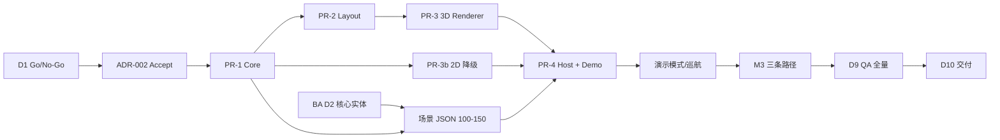

# GraphSphere v0.1 Demo Sprint · 执行计划 v0.2

| 元数据 | 值 |
|--------|-----|
| **Sprint 名称** | GraphSphere Demo Sprint |
| **版本** | v0.2（D1 范围冻结后） |
| **Sprint 周期** | 10 个工作日（D1–D10） |
| **日历窗口** | 2026-05-25（D1）→ 2026-06-05（D10） |
| **团队配置** | 1 资深开发 + 1 一线开发 + 0.5 QA + 0.5 DevOps + 兼职 PM/BA/产品/运营 |
| **交付形态** | Web 静态 Demo（`test/demos/knowledge-graph-3d-demo.html`） |
| **验收基准** | [Demo Scope 一页纸](../requirements/prd-graphsphere-demo-scope-v0.1.md) 三条路径 + AC-01~08 |

---

## 1. 执行摘要

Round 1 已裁定 **有条件 Go**：2 周 Demo Sprint，定位「可演示的 3D 知识图谱浏览器」，非知识管理平台。v0.2 执行计划在 v0.1 WBS 基础上，对齐 Tech Lead 全部裁定项，并固化 **D1 Go/No-Go 门禁**、**RACI** 与 **关键路径**。

**当前就绪度（D1 晨会 · 2026-05-25 同步）**

| 输入物 | 状态 | 阻塞 Sprint？ |
|--------|------|---------------|
| PRD Demo Scope 一页纸 v0.1 | ✅ 已完成 | 否 |
| GraphSnapshot Schema v1 | ✅ 已冻结 | 否 |
| ADR-002 技术选型草案 | 🟡 Proposed，待 Tech Lead Accept | **D1 黄项（24h 闭合）** |
| BA 场景 A/B 实体清单 v0.1 | 🟡 Draft 42/45 节点 + R-KG 自动化通过，D2 核心冻结 | 否（PR-1 已用 fixture） |
| `js/kg-graph-*` 模块 | 🟢 骨架已落地（core/layout/2d/3d/host） | 否（**超前于 WBS，不扩 P0 范围**） |
| 单测 | 🟢 47/47 通过（core/layout/renderer） | 否 |
| Demo 入口 + test/index 注册 | 🟢 已注册 | 否 |
| 场景 JSON fixture | 🟡 draft + minimal-valid，D5 扩展至 100–150 | 否（M3 前闭合） |
| QA 验收 Checklist | ❌ 未启动 | 否（D3 草案即可） |

**关键路径**：D1 门禁 → PR-1 Core → PR-2 Layout → PR-3 3D Renderer → PR-4 Host/Demo → 场景 JSON 全量 → 三条 Demo 路径联调 → D9 质量签字 → D10 交付。

---

## 2. 里程碑与时间线

### 2.1 里程碑定义

| 里程碑 | 目标日 | 名称 | 退出标准（摘要） | 签字人 |
|--------|--------|------|------------------|--------|
| **M0** | D1 | 范围冻结 | D1 Go/No-Go 门禁全部通过 | Tech Lead + PM |
| **M1** | D3 | 底座就绪 | Core 单测绿 + Layout seed 可复现 + fixture JSON 可加载 | 资深开发 + 架构师 |
| **M2** | D6 | 可视化就绪 | 200 节点 3D 渲染 ≥30fps + orbit + 点选 | 一线开发 + 资深开发 |
| **M3** | D8 | Demo 闭环 | 三条必演示路径各 1 次通过（内测） | 产品 + Tech Lead |
| **M4** | D9 | 质量门禁 | AC-01~08 全绿 + QA Checklist 定稿 | QA + PM |
| **M5** | D10 | Demo 交付 | 对外 Demo 包 + 录屏素材 brief + Retro | PM + Tech Lead |

### 2.2 10 日时间线（甘特概览）

```
角色/任务          D1   D2   D3   D4   D5   D6   D7   D8   D9   D10
                   5/25 5/26 5/27 5/28 5/29 6/01 6/02 6/03 6/04 6/05
─────────────────────────────────────────────────────────────────────
M0 范围冻结         ■
M1 底座             ·    ·    ■
M2 可视化           ·    ·    ·    ·    ·    ■
M3 Demo闭环         ·    ·    ·    ·    ·    ·    ·    ■
M4 质量             ·    ·    ·    ·    ·    ·    ·    ·    ■
M5 交付             ·    ·    ·    ·    ·    ·    ·    ·    ·    ■
─────────────────────────────────────────────────────────────────────
PR-1 Core+单测      ■■■
PR-2 Layout         ·  ■■■■
PR-3 3D Renderer    ·    ·  ■■■■■■
PR-4 Host+Demo页    ·    ·    ·  ■■■■■■■
BA 场景 JSON 扩展   ·  ■■■■■■■■■
QA Checklist        ·    ■■■■■■■■■
DevOps CI/部署草案  ·    ·    ·    ·    ·  ■■■■■
运营演示脚本        ·    ·    ·    ·    ·    ·    ·  ■■■
```

### 2.3 每日站会焦点

| 日 | 站会主题 | 须解除的阻塞 |
|----|----------|--------------|
| D1 | Go/No-Go 评审；PR-1 分支创建 | ADR-002 未 Accept |
| D2 | Core PR Review；BA 实体 D2 截止 | 场景 JSON 字段与 Schema 不一致 |
| D3 | M1 演示；Layout 收敛指标 | 单测覆盖率 <80% Domain 层 |
| D4 | 3D 渲染首屏；Probe 集成 | WebGL 上下文创建失败 |
| D5 | 点选/邻域/侧栏联调 | 邻域算法与 UI 不同步 |
| D6 | M2 性能摸底（200 节点 fps） | fps <30 无优化方案 |
| D7 | 演示模式 + 场景切换 | 巡航路径节点缺失 |
| D8 | M3 三条路径彩排 | 任一路径 P0 缺陷 |
| D9 | 全量回归 + 2D 降级 | AC 任一项 FAIL |
| D10 | 交付演示 + Sprint Retro | 无（缓冲 0.5 天在 D9） |

---

## 3. WBS（工作分解结构）

### 3.1 WBS 总览

```
1.0 GraphSphere Demo Sprint
├── 1.1 启动与治理（D1）
│   ├── 1.1.1 D1 Go/No-Go 门禁评审
│   ├── 1.1.2 Sprint 看板初始化 & 每日站会
│   └── 1.1.3 范围变更控制（CCB：Tech Lead + PM）
├── 1.2 需求与数据（D1–D5）
│   ├── 1.2.1 PRD v0.2 修订确认（P0/P1 边界）
│   ├── 1.2.2 BA 场景 A/B 核心实体清单（D2）
│   ├── 1.2.3 BA 场景 JSON 扩展至 100–150 节点（D5）
│   └── 1.2.4 R-KG 二次抽检（D5）
├── 1.3 架构与契约（D1–D3）
│   ├── 1.3.1 GraphSnapshot Schema v1（已冻结）
│   ├── 1.3.2 ADR-002 Accept（D1）
│   └── 1.3.3 模块接口契约评审（Core/Layout/Render/Host）
├── 1.4 工程实现（D1–D8）★ 关键路径
│   ├── 1.4.1 PR-1 kg-graph-core.js + 单测
│   ├── 1.4.2 PR-2 kg-graph-layout.js + 单测
│   ├── 1.4.3 PR-3 kg-graph-3d-renderer.js + Probe 集成
│   ├── 1.4.4 PR-3b kg-graph-2d-renderer.js（降级）
│   ├── 1.4.5 PR-4 kg-graph-host.js + demo.html + test/index 注册
│   └── 1.4.6 预置场景 demo-graph-a.json / demo-graph-b.json
├── 1.5 质量保障（D3–D9）
│   ├── 1.5.1 QA TC-001~005 + 边界用例 40+ 条
│   ├── 1.5.2 性能基线测试（冷启动/fps/内存）
│   ├── 1.5.3 三条 Demo 路径 ×3 连续验收
│   └── 1.5.4 失败态文案走查（§4 PRD）
├── 1.6 部署与运维（D6–D10，P1 主体）
│   ├── 1.6.1 deploy-kg3d-demo.md 草案（D6）
│   ├── 1.6.2 CI 门禁扩展草案
│   ├── 1.6.3 L0/L2 回滚脚本适配
│   └── 1.6.4 包体 gzip ≤800KB 审计
└── 1.7 交付与传播（D8–D10）
    ├── 1.7.1 5 分钟标准演示脚本
    ├── 1.7.2 录屏/GIF 传播素材 brief
    └── 1.7.3 Sprint Retro & Phase 1 触发条件文档
```

### 3.2 任务明细表

| WBS ID | 任务 | 交付物 | 预估工时 | 依赖 | 目标日 | 负责人 |
|--------|------|--------|----------|------|--------|--------|
| 1.1.1 | D1 Go/No-Go 门禁 | 门禁签字记录 | 2h | PRD、Schema | D1 AM | PM + Tech Lead |
| 1.1.2 | Sprint 看板 | 看板链接/Issue 列表 | 1h | — | D1 | PM |
| 1.2.1 | PRD v0.2 确认 | 修订 PRD（搜索/导入标 P1） | 2h | Round 1 裁定 | D1 | 产品经理 |
| 1.2.2 | BA 核心实体 D2 | 各 20–50 节点定稿 | 1d | Schema v1 | D2 | 业务分析 |
| 1.2.3 | 场景 JSON 全量 | A/B 各 100–150 节点 JSON | 2d | 1.2.2, PR-1 | D5 | BA + 资深开发 |
| 1.3.2 | ADR-002 Accept | ADR status → Accepted | 1h | Schema v1 | D1 AM | 架构师 + Tech Lead |
| 1.4.1 | PR-1 Core | `kg-graph-core.js` + 单测 | 1.5d | ADR-002 | D3 | 资深开发 |
| 1.4.2 | PR-2 Layout | `kg-graph-layout.js` + 单测 | 2d | PR-1 | D4 | 资深开发 |
| 1.4.3 | PR-3 3D | `kg-graph-3d-renderer.js` | 3d | PR-2, Probe | D6 | 一线开发 |
| 1.4.4 | PR-3b 2D | `kg-graph-2d-renderer.js` | 1d | PR-1, PR-3 | D7 | 一线开发 |
| 1.4.5 | PR-4 Host | host + demo.html + index 注册 | 2.5d | PR-3, 场景 JSON | D8 | 一线开发 |
| 1.4.6 | 演示模式/巡航 | 自动旋转 + ≥3 节点路径 | 1d | PR-4, BA 锚点 | D7 | 资深 + 一线 |
| 1.5.1 | QA Checklist | TC-001~005 + 40+ 用例 | 1.5d | PRD AC | D3 草案/D9 定稿 | QA |
| 1.5.3 | 路径 ×3 验收 | 验收报告 | 1d | M3 | D9 | QA + 产品 |
| 1.6.1 | 部署草案 | deploy-kg3d-demo.md | 0.5d | M2 | D6 | DevOps |
| 1.6.4 | 包体门禁 | scan 报告 | 0.5d | PR-4 | D9 | DevOps |
| 1.7.1 | 演示脚本 | 5min 脚本对齐三条路径 | 0.5d | M3 | D8 | 运营分析 |

**Sprint 总工时估算**：开发 ~14 人日（2 人 × 7 天）+ QA 4 人日 + DevOps 2 人日 + 支撑角色 6 人日 ≈ **26 人日**（在 30–60 万/6 个月预算 cap 内）。

> **进度说明（D1）**：工程骨架超前于原计划 D3/D6 节点，**不构成范围扩张**；剩余关键路径为 **场景 JSON 全量、三条 Demo 路径联调、性能基线、QA 签字**。

---

## 4. RACI 矩阵

> **R**=执行 · **A**=问责 · **C**=咨询 · **I**=知会

| 工作包 | Tech Lead | 资深开发 | 一线开发 | 架构师 | 产品经理 | 业务分析 | QA | DevOps | 运营 | PM |
|--------|-----------|----------|----------|--------|----------|----------|-----|--------|------|-----|
| D1 Go/No-Go 门禁 | **A** | C | I | C | C | I | I | I | I | **R** |
| 范围变更控制（CCB） | **A** | C | C | C | **R** | C | I | I | I | **R** |
| GraphSnapshot Schema | C | I | I | **A/R** | I | C | I | I | I | I |
| ADR-002 技术选型 | **A** | C | C | **R** | I | I | I | C | I | I |
| PR-1 Core + 单测 | **A** | **R** | I | C | I | I | C | I | I | I |
| PR-2 Layout + 单测 | **A** | **R** | C | C | I | I | C | I | I | I |
| PR-3 3D/2D Renderer | **A** | C | **R** | C | I | I | C | I | I | I |
| PR-4 Host + Demo 页 | **A** | C | **R** | C | C | I | C | I | I | I |
| 场景 A/B JSON 数据 | C | C | I | C | **A** | **R** | C | I | C | I |
| 三条 Demo 路径验收 | **A** | I | I | I | **R** | I | **R** | I | C | C |
| QA Checklist / 回归 | C | C | C | I | C | I | **A/R** | I | I | I |
| 性能基线（fps/冷启动） | **A** | **R** | **R** | C | I | I | **R** | C | I | I |
| CI / 部署 / 回滚 | C | I | I | I | I | I | C | **A/R** | I | C |
| 演示脚本 / 传播 brief | I | I | I | I | C | C | I | I | **A/R** | C |
| D10 交付签字 | **A** | I | I | I | C | I | C | C | C | **R** |
| Sprint Retro | **R** | R | R | R | R | R | R | R | R | **A** |

**并行规则**

- PR-1 与 BA D2 清单 **可并行**（Core 使用 fixture，不依赖全量场景）。
- PR-3 与 PR-2 **部分重叠**：D4 起 3D 骨架可用 mock 布局坐标。
- DevOps **不阻塞 D10**：D10 以 `test/demos` 本地入口为准；独立 CI/域名属 P1。

---

## 5. D1 Go/No-Go 门禁（M0）

### 5.1 门禁原则

- **Go**：全部 **P0 门禁项** 通过 → Sprint 正式开工，PR-1 合并权限放开。
- **Conditional Go**：仅 **黄色预警项** 未闭合 → 开工但须 **24h 内** 闭合，PM 每日追踪。
- **No-Go**：任一 **红色阻塞项** 未通过 → 暂停开发，4h 内召开 CCB，重新评估工期或范围。

### 5.2 门禁检查清单

| ID | 类别 | 检查项 | 标准 | 状态 | 证据 | 阻塞级别 |
|----|------|--------|------|------|------|----------|
| G-01 | 产品 | PRD Demo Scope 一页纸 Tech Lead 认可 | P0 功能 F-01~F-10 无增项 | 🟢 | prd-graphsphere-demo-scope-v0.1.md | — |
| G-02 | 产品 | 三条必演示路径已定义 | 路径 1/2/3 可测试 | 🟢 | PRD §二 | — |
| G-03 | 产品 | P0/P1/Out 边界书面确认 | 搜索/导入/500 节点标 P1 | 🟡 | 待产品 Round 2 签字 | 黄 |
| G-04 | 架构 | GraphSnapshot Schema v1 冻结 | status=Frozen | 🟢 | arch-graphsnapshot-schema-v1.md | — |
| G-05 | 架构 | ADR-002 Tech Lead Accept | status=Accepted | 🟡 | adr-graphsphere-tech-stack-architecture-v2.md | 黄 |
| G-06 | 架构 | 模块边界与 PR 映射确认 | PR-1~4 对应 Domain/Layout/Render/Host | 🟢 | ADR-002 §3 | — |
| G-07 | 数据 | BA 场景 A/B 草稿可用 | 各 ≥20 核心节点 | 🟢 | ba-graphsphere-scenario-entities-rkg-v0.1.md | — |
| G-08 | 资源 | 资深 + 一线开发 D1–D10 可用 | 无 >2 天冲突 | ⬜ | Tech Lead 确认 | **红** |
| G-09 | 资源 | QA 0.5 FTE D3–D9 可用 | D9 全量回归可执行 | ⬜ | QA Lead 确认 | **红** |
| G-10 | 工程 | Tetris3D 基建可复用确认 | Probe + Three vendor + 单测框架 | 🟢 | 仓库现状 | — |
| G-11 | 性能 | P0 性能红线书面承诺 | 200 节点/30fps/3s 冷启动 | 🟢 | Tech Lead 裁定 | — |
| G-12 | 运维 | Demo 阶段部署策略确认 | test/demos 先行，apps/ Phase 1 | 🟢 | Round 1 裁定 | — |
| G-13 | 风险 |  dissent 项均有 resolution | 4 条 dissent 已关闭 | 🟢 | Round 1 纪要 | — |
| G-14 | 治理 | CCB 与变更流程生效 | PM + Tech Lead 双签 | ⬜ | 本文档 §5.3 | 黄 |

### 5.3 D1 决策记录

| 字段 | 内容 |
|------|------|
| **决策** | ☑ **Conditional Go** ☐ Go ☐ No-Go |
| **日期** | 2026-05-25 |
| **决策者** | Tech Lead（A）+ PM（R） |
| **裁定理由** | P0 输入物（PRD/Schema/BA Draft/工程基建）已就绪；ADR-002 与资源锁定为唯一未闭合项，不阻塞 PR-1~4 继续，但须在 D1 EOD 前书面确认 |
| **条件（24h 内闭合）** | ① G-03 产品 Round 2 确认 PRD P0/P1 边界；② G-05 ADR-002 → Accepted；③ G-08 资深+一线 D1–D10 可用；④ G-09 QA 0.5 FTE D3–D9 可用；⑤ G-14 CCB 流程生效 |
| **开工授权** | PR-1~4 可合并至 `feature-intelligentize-multi-agent-v2`；**禁止** PR 引入搜索/导入/500 节点等 P1 范围 |
| **CCB 下次评审** | D3 M1 或任一 P0 变更请求时 |

### 5.4 No-Go 触发与升级

| 触发条件 | 升级动作 | 时限 |
|----------|----------|------|
| 资深开发 D1–D5 不可用 | 范围削减至单场景 + 延迟 D10 2 天 | 4h |
| ADR-002 与 Schema 冲突 | 架构师 4h 内出补丁 ADR | 4h |
| PR-1 单测 D3 未绿 | 冻结 PR-3，全力 Core/Layout | D3 EOD |
| M2 fps 连续 <25 | 预置场景降至 120 节点 + 强制 2D 演示备选 | D6 EOD |
| 三条路径 D8 任一条 FAIL | D9 为修复日，D10 仅交付「路径 1+2」降级 Demo | D8 EOD |

---

## 6. 依赖关系与关键路径



**外部依赖**

| 上游 | 下游 | 说明 |
|------|------|------|
| GraphSnapshot v1 | PR-1、场景 JSON | 已冻结 |
| webgl-capability-probe.js | PR-3 | 复用，不修改接口 |
| vendor/three | PR-3 | 复用 ADR-001 锁定版本 |
| BA 巡航锚点 | 演示模式 | D5 前提供 ≥3 节点 path 列表 |
| PRD 失败态文案 §4 | PR-4 Host UI | 文案 SSOT |

---

## 7. 风险矩阵

| ID | 风险描述 | 概率 | 影响 | 等级 | 触发信号 | 缓解措施 | 负责人 | 应急计划 |
|----|----------|------|------|------|----------|----------|--------|----------|
| R-01 | 范围蔓延（搜索/导入潜入 P0） | 中 | 高 | **高** | PR 含 P1 功能 | CCB 双签；PR 模板 P0 清单 | PM | 回滚 PR，记录 Change Request |
| R-02 | 200 节点 fps <30 | 中 | 高 | **高** | D6 性能测试 FAIL | 预置 ≤150；边简化；InstancedMesh | 资深开发 | 降至 120 节点 + 2D 备选路径 |
| R-03 | 力导向布局不收敛/不可复现 | 中 | 中 | 中 | 同 seed 两帧布局不同 | 纯函数 + 固定迭代次数 + 单测 | 资深开发 | 改用预计算坐标（仍不持久化 SSOT） |
| R-04 | BA 全量 JSON D5 延迟 | 中 | 中 | 中 | D4 节点 <80/场景 | D2 核心节点先入库 fixture | BA | 场景 B 先全量，A 用 80 节点 MVP |
| R-05 | 2D 降级 P0 交互缺失 | 低 | 高 | 中 | AC-05 FAIL | PR-3b 与 3D 共享 Host 事件层 | 一线开发 | D8 演示仅 3D，2D 标 Known Issue |
| R-06 | 演示巡航路径断链 | 中 | 中 | 中 | 巡航节点 id 不存在 | BA 锚点与 JSON 交叉校验脚本 | QA | 手动指定 3 节点 fallback 路径 |
| R-07 | 人员冲突（Bridge 并行需求） | 中 | 高 | **高** | G-08 未确认 | D1 资源锁定；非 P0 PR 拒收 | Tech Lead | 砍 P0 至单场景 + 延 D10 |
| R-08 | 包体超 800KB gzip | 低 | 中 | 低 | scan-package FAIL | 代码拆分；JSON 压缩 | DevOps | 审计报告排除 vendor 说明 |
| R-09 | Demo KPI 6 个月不达标 | 中 | 中 | 中 | 完播率 <40% @3mo | 运营脚本 + 录屏优化 | 运营 | 收缩为扩展内嵌组件（Round 1 裁定） |
| R-10 | Three.js 与 Probe 集成回归 | 低 | 中 | 低 | Tetris 3D CI 红 | kg-graph 独立单测，不修改 Probe | 资深开发 | 隔离 Probe 调用为只读 |

**风险评审节奏**：D1/D3/D6/D8 里程碑前 30min 风险扫雷；红色风险须当日升级 Tech Lead。

---

## 8. 沟通与治理

| 会议 | 频率 | 参与者 | 产出 |
|------|------|--------|------|
| Daily Standup | 每日 15min | 开发 + QA + PM | 阻塞清单 |
| M1/M2/M3 评审 | D3/D6/D8 | 全角色 | 里程碑签字 |
| CCB | 按需 | Tech Lead + PM + 请求方 | 变更记录 |
| D10 Demo & Retro | D10 2h | 全角色 | 交付确认 + Phase 1 建议 |

**变更控制**：任何增加 P0 功能、节点上限 >200、新依赖库的请求，须 CCB 书面批准并更新 PRD/本计划版本号。

---

## 9. D10 交付清单

| # | 交付物 | 路径/位置 | 验收人 |
|---|--------|-----------|--------|
| 1 | 3D Demo 入口 | `test/demos/knowledge-graph-3d-demo.html` | 产品 |
| 2 | 核心模块 | `js/kg-graph-*.js` | Tech Lead |
| 3 | 单测 | `test/kg-graph-*.test.js` | QA |
| 4 | 场景 A/B JSON | `test/fixtures/` 或约定目录 | BA + QA |
| 5 | test/index 注册 | `test/index.html` | 一线开发 |
| 6 | QA 验收报告 | docs 或 Issue | QA |
| 7 | 演示脚本 | 运营文档 | 运营 |
| 8 | deploy 草案 | `docs/deploy/deploy-kg3d-demo.md` | DevOps |
| 9 | Retro 纪要 | Sprint 记录 | PM |

---

## 10. Phase 1 触发条件（Sprint 外）

Demo KPI 通过 **且** 需深度渲染定制时，启动：

- 抽离 `apps/knowledge-graph-3d/`
- 评估 Vite+React+TS 与 `3d-force-graph`
- P1：JSON 导入、搜索、500 节点 LOD、独立 CI/域名

---

## 11. 与 Round 1 Action Items 对齐

| Action Item | 本计划 WBS | 目标日 | 状态 |
|-------------|------------|--------|------|
| Demo Scope 一页纸 | 1.2.1 | D1 | ✅ 完成 |
| BA 实体清单 + R-KG | 1.2.2–1.2.4 | D2/D5 | 🟡 进行中 |
| Schema + ADR-002 | 1.3.1–1.3.2 | D1 | 🟡 ADR 待 Accept |
| **执行计划 v0.2** | 本文档 | D1 | ✅ 本文 |
| PR-1 Core | 1.4.1 | D3 | 🟢 骨架+单测（待 M1 签字） |
| PR-2 Layout | 1.4.2 | D4 | 🟢 骨架+单测（待 seed 复现验收） |
| PR-3/4 Renderer + Demo | 1.4.3–1.4.5 | D6–D8 | 🟡 骨架+Demo 入口（待 M2/M3 性能与路径） |
| QA Checklist | 1.5.1 | D3/D9 | ⬜ |
| DevOps CI/回滚 | 1.6 | D6+ | ⬜ P1 主体 |
| 演示脚本 | 1.7.1 | D8 | ⬜ |
| Round 2 Tech Lead 主持 | 1.1.1 | D1 | ⬜ 待执行 |

---

## 变更日志

| 日期 | 版本 | 说明 |
|------|------|------|
| 2026-05-25 | 0.2.1 | 同步工程进度；D1 Conditional Go 裁定；Action Items 状态更新 |
| 2026-05-25 | 0.2 | 基于冻结范围：WBS、RACI、D1 Go/No-Go 门禁、风险矩阵、10 日时间线 |
