# v5 全业务多页面设计图库

设计规格见 [`docs/design/product-ui-multi-screen-v5.md`](../../../docs/design/product-ui-multi-screen-v5.md)。18 个业务共 112 个页面均已完成并验收；全部图片由内置 imagegen 生成，旧版 18 张业务母版保留在上一级目录，没有被覆盖。

## 生成进度

| 目录 | 业务 | 页面 | 状态 |
|---|---|---:|---|
| [`00-shell/`](00-shell/) | 产品外壳 | 5 | 已完成并验收 |
| [`01-music/`](01-music/) | 网易云音乐 | 10 | 已完成并验收 |
| [`02-knowledge/`](02-knowledge/) | 常用信息 | 6 | 已完成并验收 |
| [`03-bilibili/`](03-bilibili/) | B 站 | 7 | 已完成并验收 |
| [`04-schedule/`](04-schedule/) | 计划管理 | 6 | 已完成并验收 |
| [`05-worklog/`](05-worklog/) | 工作日志 | 6 | 已完成并验收 |
| [`06-writing/`](06-writing/) | 写作空间 | 7 | 已完成并验收 |
| [`07-tasks/`](07-tasks/) | 任务 | 8 | 已完成并验收 |
| [`08-quick-nav/`](08-quick-nav/) | 快捷导航 | 4 | 已完成并验收 |
| [`09-reading/`](09-reading/) | 今日阅读 | 5 | 已完成并验收 |
| [`10-poetry/`](10-poetry/) | 诗词电台 | 5 | 已完成并验收 |
| [`11-agent/`](11-agent/) | Agent 矩阵 | 7 | 已完成并验收 |
| [`12-ai-chat/`](12-ai-chat/) | AI 对话 | 6 | 已完成并验收 |
| [`13-prompt-manager/`](13-prompt-manager/) | Prompt 管理 | 6 | 已完成并验收 |
| [`14-games/`](14-games/) | 游戏 | 6 | 已完成并验收 |
| [`15-launchpad/`](15-launchpad/) | 应用启动台 | 5 | 已完成并验收 |
| [`16-ticker/`](16-ticker/) | 热榜资讯 | 6 | 已完成并验收 |
| [`17-settings/`](17-settings/) | 设置 | 7 | 已完成并验收 |
| **合计** | **18 个业务** | **112** | **全部完成并验收** |

## 产品外壳

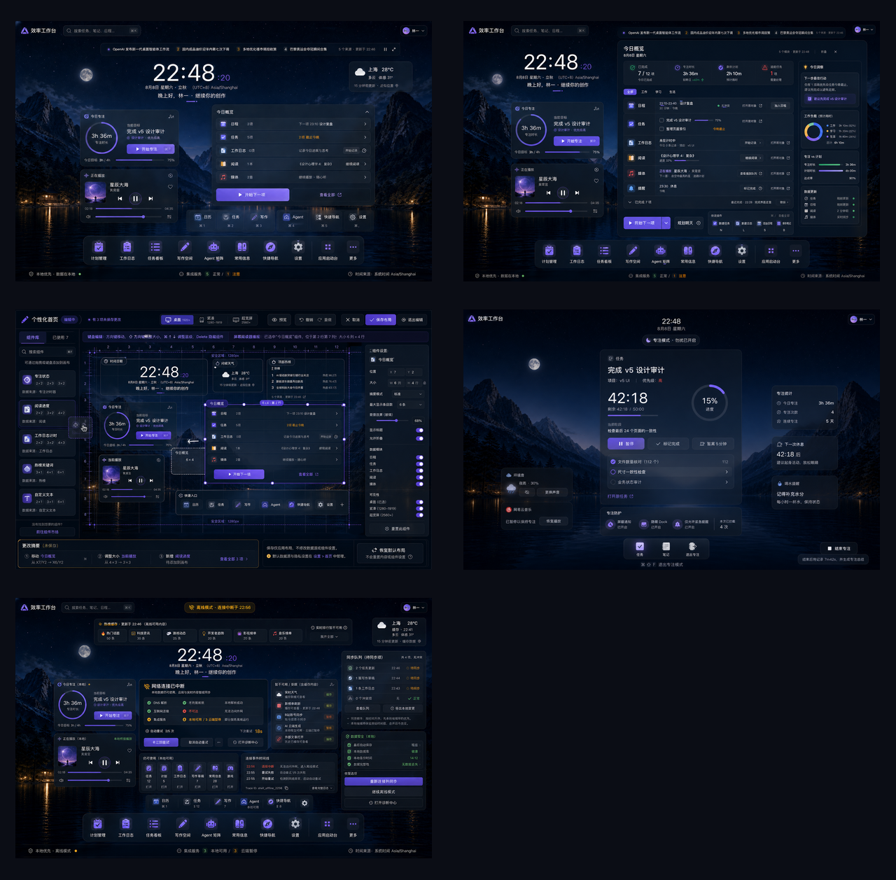

1. [`shell-01-home.png`](00-shell/shell-01-home.png)：默认首页、时间天气、今日焦点、应用 Dock 与迷你播放器。
2. [`shell-02-today-overview.png`](00-shell/shell-02-today-overview.png)：今日任务、计划、日志、提醒和跨业务概览。
3. [`shell-03-personalize.png`](00-shell/shell-03-personalize.png)：桌面组件编排、实时预览、对齐规则和保存边界。
4. [`shell-04-focus.png`](00-shell/shell-04-focus.png)：专注计时、环境控制、临时屏蔽和下一项建议。
5. [`shell-05-offline.png`](00-shell/shell-05-offline.png)：离线状态、本地可用能力、缓存标识与同步队列。

## 网易云音乐

1. [`music-01-now-playing.png`](01-music/music-01-now-playing.png)：正在播放。
2. [`music-02-queue.png`](01-music/music-02-queue.png)：队列与历史。
3. [`music-03-playlist-library.png`](01-music/music-03-playlist-library.png)：歌单库。
4. [`music-04-playlist-detail.png`](01-music/music-04-playlist-detail.png)：歌单详情。
5. [`music-05-lyrics-immersive.png`](01-music/music-05-lyrics-immersive.png)：沉浸歌词。
6. [`music-06-search.png`](01-music/music-06-search.png)：全局搜索。
7. [`music-07-discover-fm.png`](01-music/music-07-discover-fm.png)：发现与私人 FM。
8. [`music-08-artist-album.png`](01-music/music-08-artist-album.png)：歌手与专辑。
9. [`music-09-connection-error.png`](01-music/music-09-connection-error.png)：连接异常恢复。
10. [`music-10-more-sleep-timer.png`](01-music/music-10-more-sleep-timer.png)：睡眠定时与播放设置。

## 常用信息 / 知识库

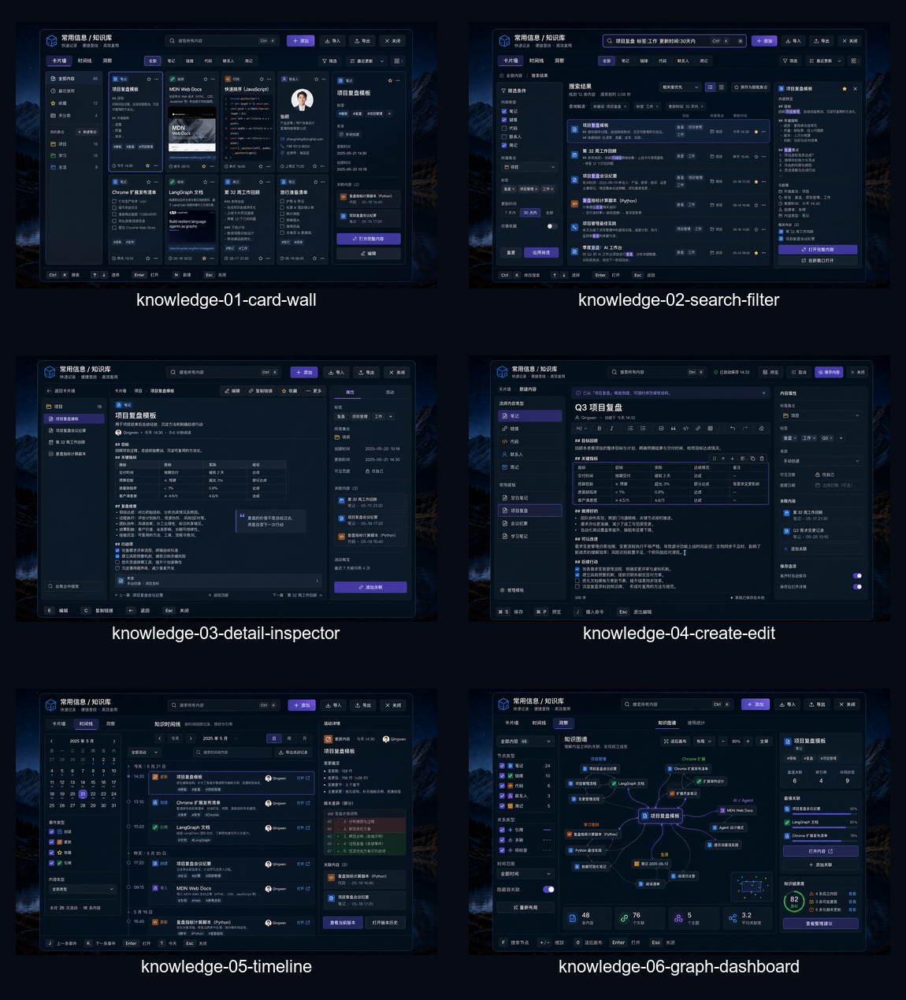

1. [`knowledge-01-card-wall.png`](02-knowledge/knowledge-01-card-wall.png)：多类型卡片墙。
2. [`knowledge-02-search-filter.png`](02-knowledge/knowledge-02-search-filter.png)：搜索与高级筛选。
3. [`knowledge-03-detail-inspector.png`](02-knowledge/knowledge-03-detail-inspector.png)：内容详情与属性检查器。
4. [`knowledge-04-create-edit.png`](02-knowledge/knowledge-04-create-edit.png)：模板化新建与编辑。
5. [`knowledge-05-timeline.png`](02-knowledge/knowledge-05-timeline.png)：知识活动时间线。
6. [`knowledge-06-graph-dashboard.png`](02-knowledge/knowledge-06-graph-dashboard.png)：知识图谱与健康度洞察。

## B 站

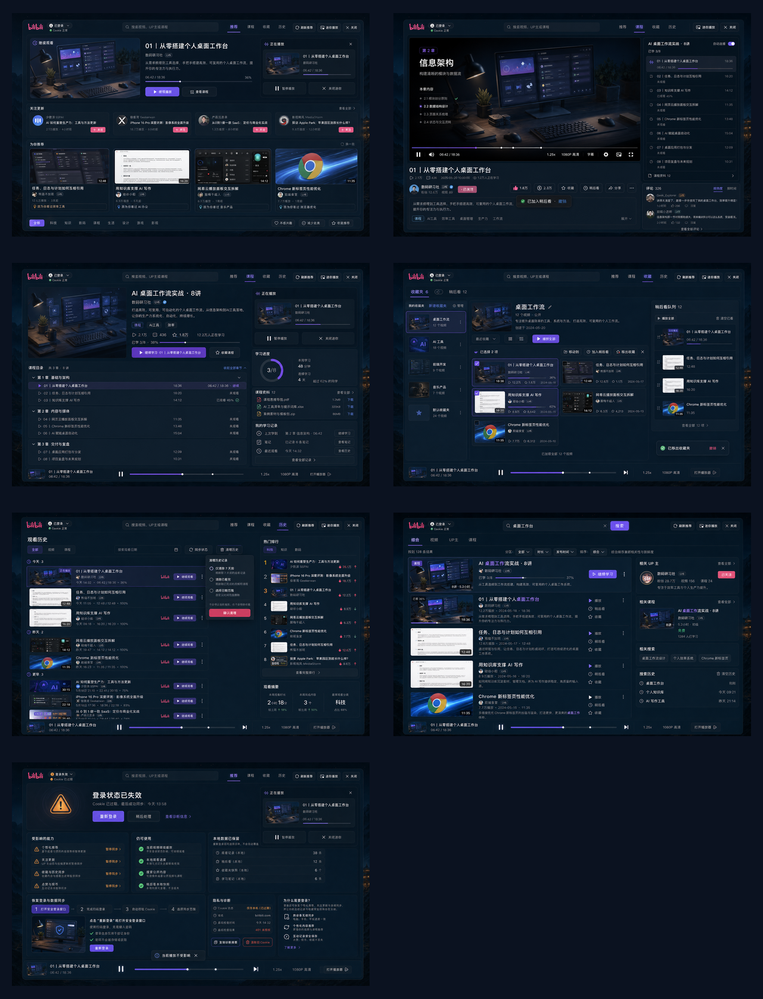

1. [`bilibili-01-recommend.png`](03-bilibili/bilibili-01-recommend.png)：继续观看、关注更新和推荐理由。
2. [`bilibili-02-player.png`](03-bilibili/bilibili-02-player.png)：视频播放、课程选集、互动与评论预览。
3. [`bilibili-03-course.png`](03-bilibili/bilibili-03-course.png)：课程目录、学习进度、资料和学习记录。
4. [`bilibili-04-library.png`](03-bilibili/bilibili-04-library.png)：收藏夹、稍后看队列与批量管理。
5. [`bilibili-05-history-ranking.png`](03-bilibili/bilibili-05-history-ranking.png)：观看历史、进度恢复、热门排行与范围清理。
6. [`bilibili-06-search.png`](03-bilibili/bilibili-06-search.png)：多类型搜索、筛选排序与相关结果。
7. [`bilibili-07-login-error.png`](03-bilibili/bilibili-07-login-error.png)：Cookie 失效诊断、本地数据保护与重新登录。

## 计划管理

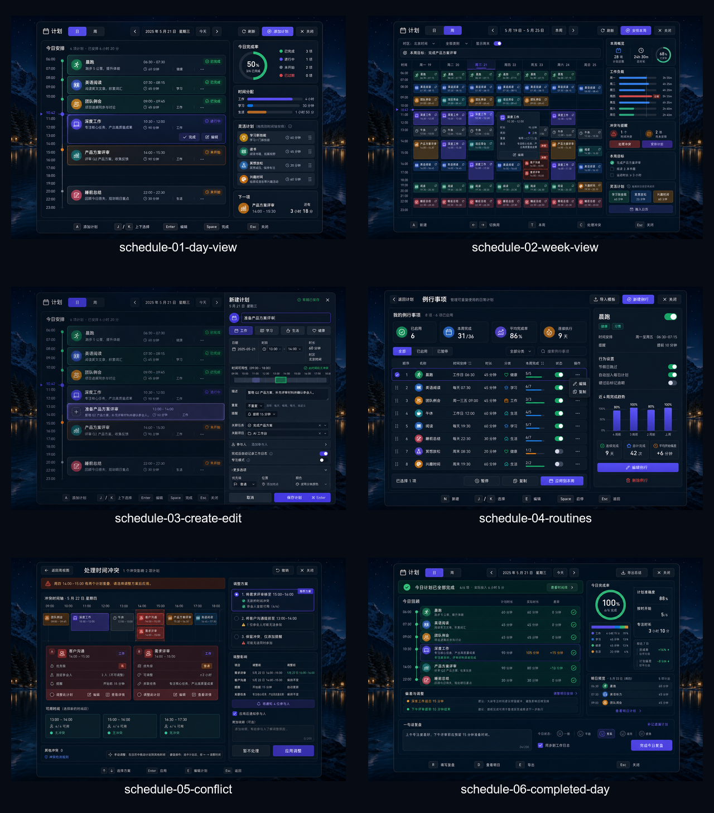

1. [`schedule-01-day-view.png`](04-schedule/schedule-01-day-view.png)：日计划时间轴。
2. [`schedule-02-week-view.png`](04-schedule/schedule-02-week-view.png)：周视图与工作负载。
3. [`schedule-03-create-edit.png`](04-schedule/schedule-03-create-edit.png)：新建计划与时间预览。
4. [`schedule-04-routines.png`](04-schedule/schedule-04-routines.png)：例行事项管理。
5. [`schedule-05-conflict.png`](04-schedule/schedule-05-conflict.png)：冲突诊断与调整方案。
6. [`schedule-06-completed-day.png`](04-schedule/schedule-06-completed-day.png)：完成日复盘。

## 工作日志

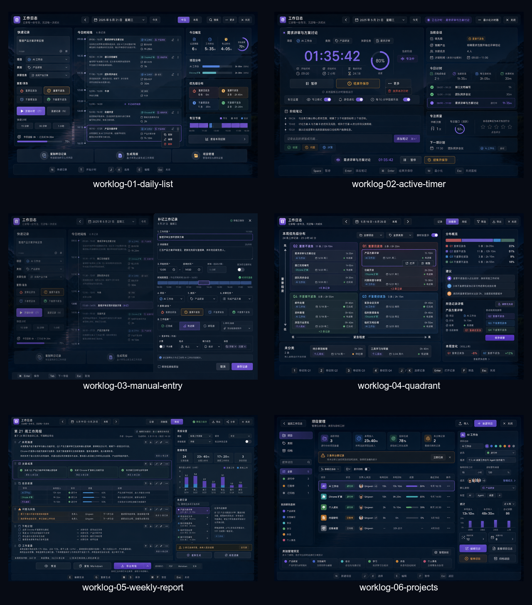

1. [`worklog-01-daily-list.png`](05-worklog/worklog-01-daily-list.png)：今日日志与事实时间线。
2. [`worklog-02-active-timer.png`](05-worklog/worklog-02-active-timer.png)：实时计时与阶段笔记。
3. [`worklog-03-manual-entry.png`](05-worklog/worklog-03-manual-entry.png)：手动补记工作记录。
4. [`worklog-04-quadrant.png`](05-worklog/worklog-04-quadrant.png)：四象限优先级分析。
5. [`worklog-05-weekly-report.png`](05-worklog/worklog-05-weekly-report.png)：可编辑周报与来源检查。
6. [`worklog-06-projects.png`](05-worklog/worklog-06-projects.png)：项目、类别与目标工时管理。

## 写作空间

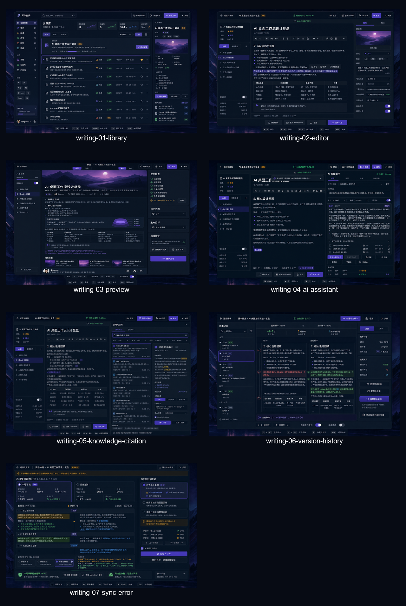

1. [`writing-01-library.png`](06-writing/writing-01-library.png)：文章库与最近编辑。
2. [`writing-02-editor.png`](06-writing/writing-02-editor.png)：正文编辑与文章属性。
3. [`writing-03-preview.png`](06-writing/writing-03-preview.png)：阅读预览与发布检查。
4. [`writing-04-ai-assistant.png`](06-writing/writing-04-ai-assistant.png)：AI 候选建议与插入路径。
5. [`writing-05-knowledge-citation.png`](06-writing/writing-05-knowledge-citation.png)：知识库检索与可追溯引用。
6. [`writing-06-version-history.png`](06-writing/writing-06-version-history.png)：版本历史与可视化差异。
7. [`writing-07-sync-error.png`](06-writing/writing-07-sync-error.png)：同步冲突与安全合并。

## 任务

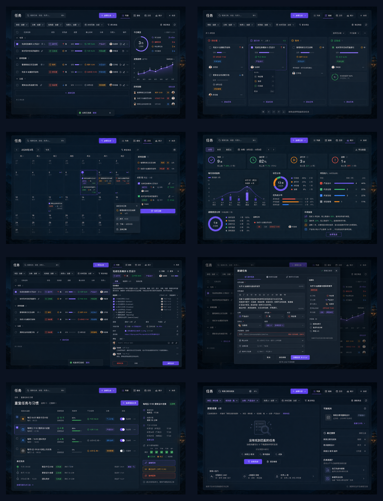

1. [`task-01-list.png`](07-tasks/task-01-list.png)：分组任务列表、筛选和今日概览。
2. [`task-02-kanban.png`](07-tasks/task-02-kanban.png)：状态看板、在制上限与键盘移动。
3. [`task-03-calendar.png`](07-tasks/task-03-calendar.png)：月历排期、日期负载与快速改期。
4. [`task-04-analytics.png`](07-tasks/task-04-analytics.png)：完成趋势、准时率、项目投入与逾期复盘。
5. [`task-05-detail.png`](07-tasks/task-05-detail.png)：任务详情、检查项、关联对象和活动记录。
6. [`task-06-create.png`](07-tasks/task-06-create.png)：分段创建、即时预览、草稿与输入校验。
7. [`task-07-recurring-habits.png`](07-tasks/task-07-recurring-habits.png)：重复规则、连续完成、跳过和暂停。
8. [`task-08-search-empty.png`](07-tasks/task-08-search-empty.png)：搜索空结果、条件诊断与安全恢复路径。

## 快捷导航

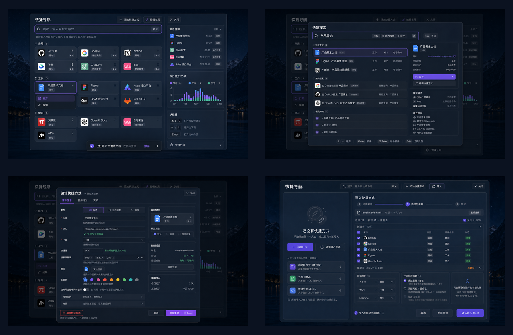

1. [`quick-nav-01-default.png`](08-quick-nav/quick-nav-01-default.png)：常用入口、分组、类型标签和最近使用。
2. [`quick-nav-02-command-search.png`](08-quick-nav/quick-nav-02-command-search.png)：网址、站内搜索与命令的统一检索。
3. [`quick-nav-03-create-edit.png`](08-quick-nav/quick-nav-03-create-edit.png)：创建编辑、实时预览、快捷键校验与安全删除。
4. [`quick-nav-04-import-empty.png`](08-quick-nav/quick-nav-04-import-empty.png)：文件导入预览、重复项处理、分组映射与空态恢复。

## 今日阅读

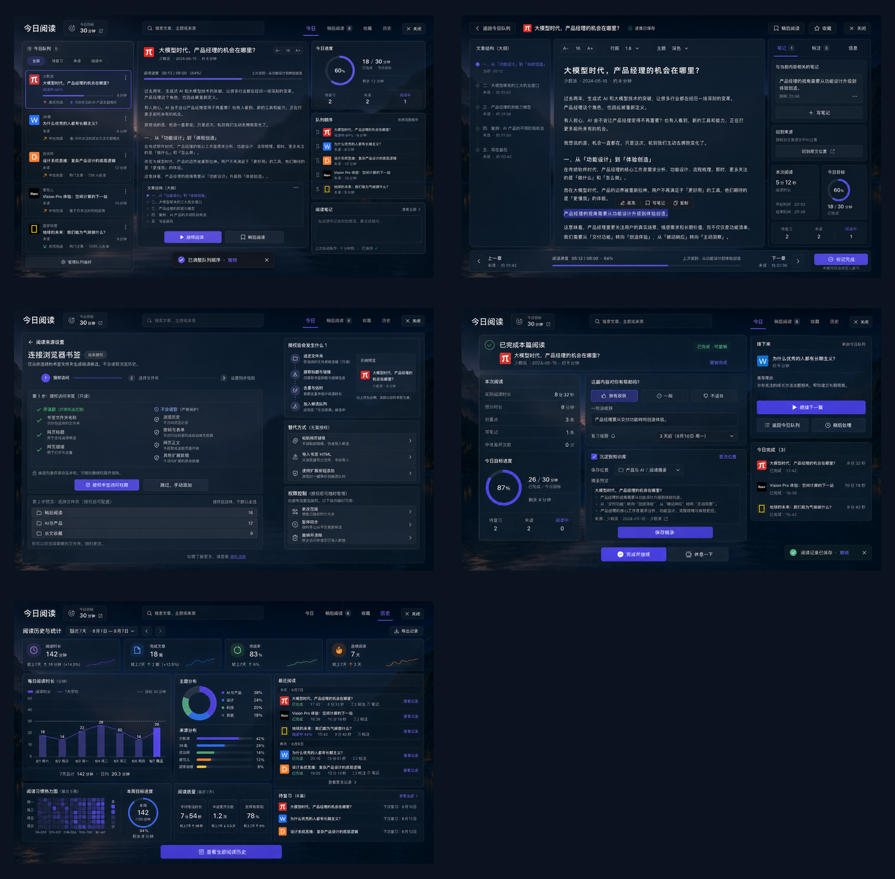

1. [`reading-01-review-queue.png`](09-reading/reading-01-review-queue.png)：今日队列、推荐理由、目标和队列排序。
2. [`reading-02-detail.png`](09-reading/reading-02-detail.png)：沉浸正文、文章目录、标注和关联笔记。
3. [`reading-03-permission.png`](09-reading/reading-03-permission.png)：书签最小权限、范围选择和无授权替代路径。
4. [`reading-04-complete-feedback.png`](09-reading/reading-04-complete-feedback.png)：阅读反馈、知识沉淀、复习提醒和下一篇。
5. [`reading-05-history-stats.png`](09-reading/reading-05-history-stats.png)：阅读趋势、主题来源、质量指标和历史明细。

## 诗词电台

1. [`poetry-01-mini-player.png`](10-poetry/poetry-01-mini-player.png)：桌面迷你播放与展开入口。
2. [`poetry-02-full-text.png`](10-poetry/poetry-02-full-text.png)：完整原文、当前朗读句和播放队列。
3. [`poetry-03-annotation.png`](10-poetry/poetry-03-annotation.png)：逐句译注、意象关系、赏析和作者背景。
4. [`poetry-04-favorites.png`](10-poetry/poetry-04-favorites.png)：收藏分组、整诗与单句边界和批量管理。
5. [`poetry-05-voice-settings.png`](10-poetry/poetry-05-voice-settings.png)：音色、语速、停顿、背景声和独立试听。

## Agent 矩阵

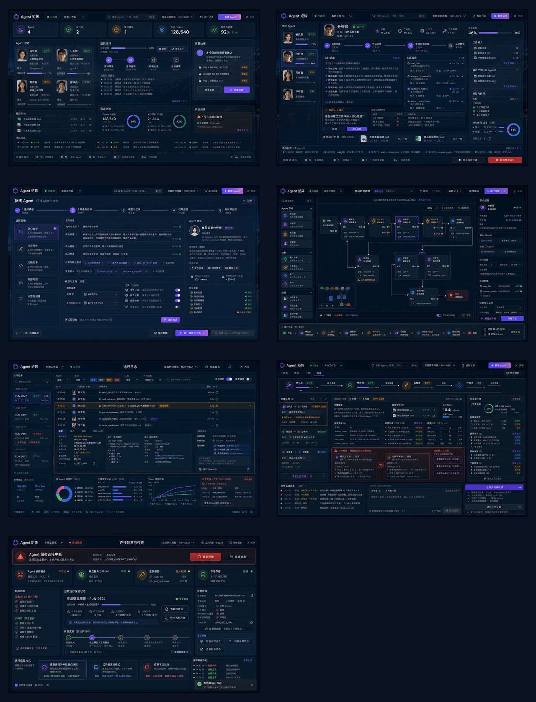

1. [`agent-01-overview.png`](11-agent/agent-01-overview.png)：Agent 状态、活跃运行、资源消耗、产物和健康提醒。
2. [`agent-02-active.png`](11-agent/agent-02-active.png)：实时步骤、流式输出、工具调用、人工确认和权限。
3. [`agent-03-create.png`](11-agent/agent-03-create.png)：模板化创建、角色目标、模型工具、最小权限和测试门槛。
4. [`agent-04-flow-canvas.png`](11-agent/agent-04-flow-canvas.png)：节点流程、条件回路、并行校验、版本和运行预览。
5. [`agent-05-run-logs.png`](11-agent/agent-05-run-logs.png)：运行筛选、事件追踪、Trace 诊断、指标和限定重试。
6. [`agent-06-collaboration.png`](11-agent/agent-06-collaboration.png)：Agent 交接、共享上下文、证据冲突和人工决策。
7. [`agent-07-connection-error.png`](11-agent/agent-07-connection-error.png)：服务诊断、检查点保留、离线能力和安全恢复。

## AI 对话

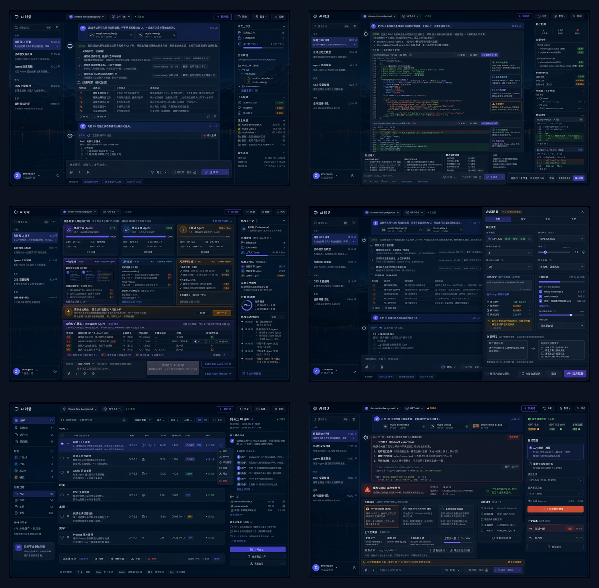

1. [`ai-chat-01-default.png`](12-ai-chat/ai-chat-01-default.png)：证据引用、完成/生成中状态、附件与工具权限。
2. [`ai-chat-02-code-answer.png`](12-ai-chat/ai-chat-02-code-answer.png)：代码补丁、影响范围、确认应用和未运行测试边界。
3. [`ai-chat-03-multi-agent.png`](12-ai-chat/ai-chat-03-multi-agent.png)：多 Agent 并行、独立证据、人工许可和冲突合并。
4. [`ai-chat-04-config-drawer.png`](12-ai-chat/ai-chat-04-config-drawer.png)：模型、指令、工具、上下文与未应用配置。
5. [`ai-chat-05-history.png`](12-ai-chat/ai-chat-05-history.png)：会话检索、标签、归档、预览和批量操作。
6. [`ai-chat-06-error-recovery.png`](12-ai-chat/ai-chat-06-error-recovery.png)：中断内容保留、检查点、重试范围和模型切换。

## Prompt 管理

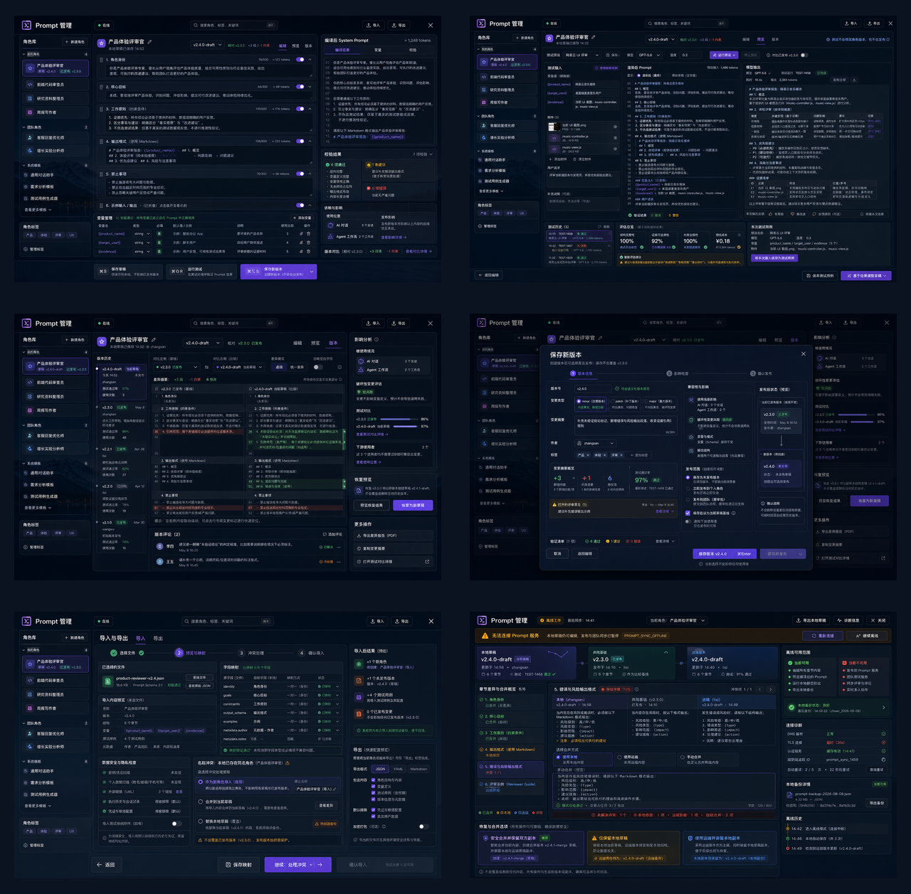

1. [`prompt-01-role-editor.png`](13-prompt-manager/prompt-01-role-editor.png)：结构化角色编辑、变量、编译结果和草稿保存。
2. [`prompt-02-live-preview.png`](13-prompt-manager/prompt-02-live-preview.png)：测试输入、渲染 Prompt、模型输出和质量评估。
3. [`prompt-03-version-diff.png`](13-prompt-manager/prompt-03-version-diff.png)：版本时间线、逐段差异、影响分析和恢复预览。
4. [`prompt-04-save-version.png`](13-prompt-manager/prompt-04-save-version.png)：版本信息、兼容性、发布范围和保存确认。
5. [`prompt-05-import-export.png`](13-prompt-manager/prompt-05-import-export.png)：文件预览、字段映射、名称冲突、脱敏和导出策略。
6. [`prompt-06-offline-error.png`](13-prompt-manager/prompt-06-offline-error.png)：本地/远端/基线合并、离线范围、备份和可逆恢复。

## 游戏

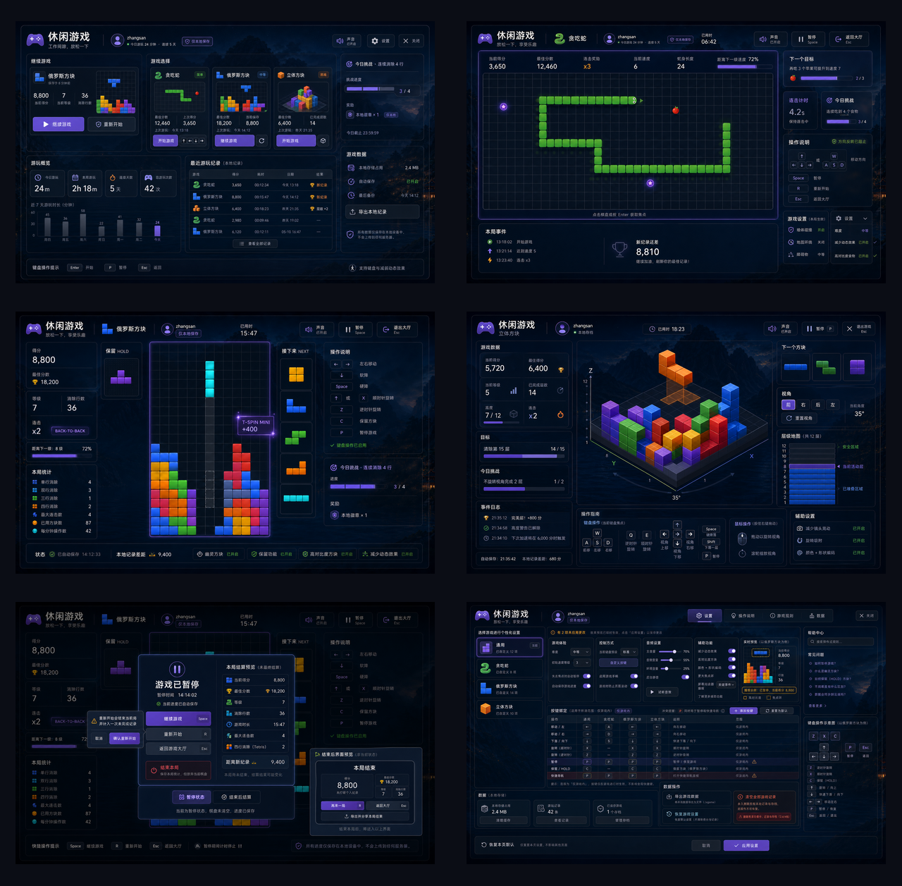

1. [`game-01-launcher.png`](14-games/game-01-launcher.png)：三款游戏入口、继续进度、今日挑战、本地纪录与运行设置。
2. [`game-02-snake.png`](14-games/game-02-snake.png)：贪吃蛇棋盘、目标、实时分数、操作说明与本局事件。
3. [`game-03-tetris.png`](14-games/game-03-tetris.png)：标准俄罗斯方块棋盘、暂存、预览队列、等级与消行统计。
4. [`game-04-voxel.png`](14-games/game-04-voxel.png)：立体方块棋盘、层级目标、视角操作、事件日志与辅助设置。
5. [`game-05-pause-gameover.png`](14-games/game-05-pause-gameover.png)：暂停和结束状态、继续/重开边界、本局结算与本地排行。
6. [`game-06-settings-help.png`](14-games/game-06-settings-help.png)：分游戏操作、音画与辅助设置、实时预览、恢复默认和清除纪录。

## 应用启动台

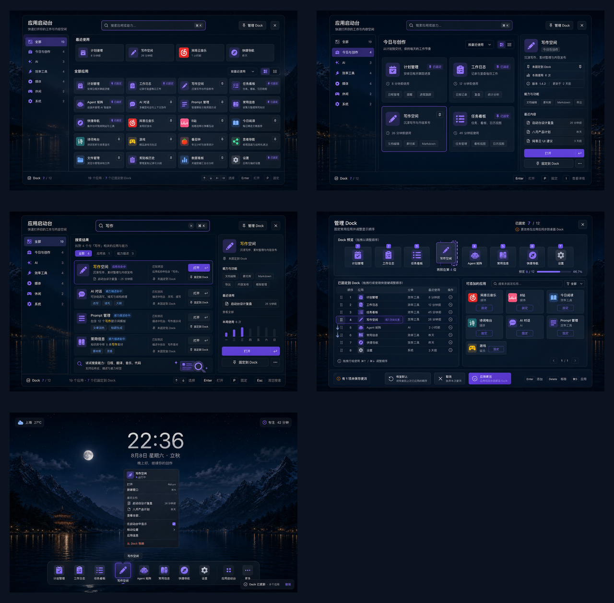

1. [`launchpad-01-all-apps.png`](15-launchpad/launchpad-01-all-apps.png)：全部应用、最近使用、分类与固定状态。
2. [`launchpad-02-category.png`](15-launchpad/launchpad-02-category.png)：分类浏览、应用详情、最近内容与固定入口。
3. [`launchpad-03-search.png`](15-launchpad/launchpad-03-search.png)：应用名与能力描述检索、命中原因和结果操作。
4. [`launchpad-04-pin-order.png`](15-launchpad/launchpad-04-pin-order.png)：Dock 固定、拖拽/键盘排序、容量预览与未保存状态。
5. [`launchpad-05-dock-menu.png`](15-launchpad/launchpad-05-dock-menu.png)：真实桌面 Dock、锚定菜单、最近文档与可撤销移除。

## 热榜资讯

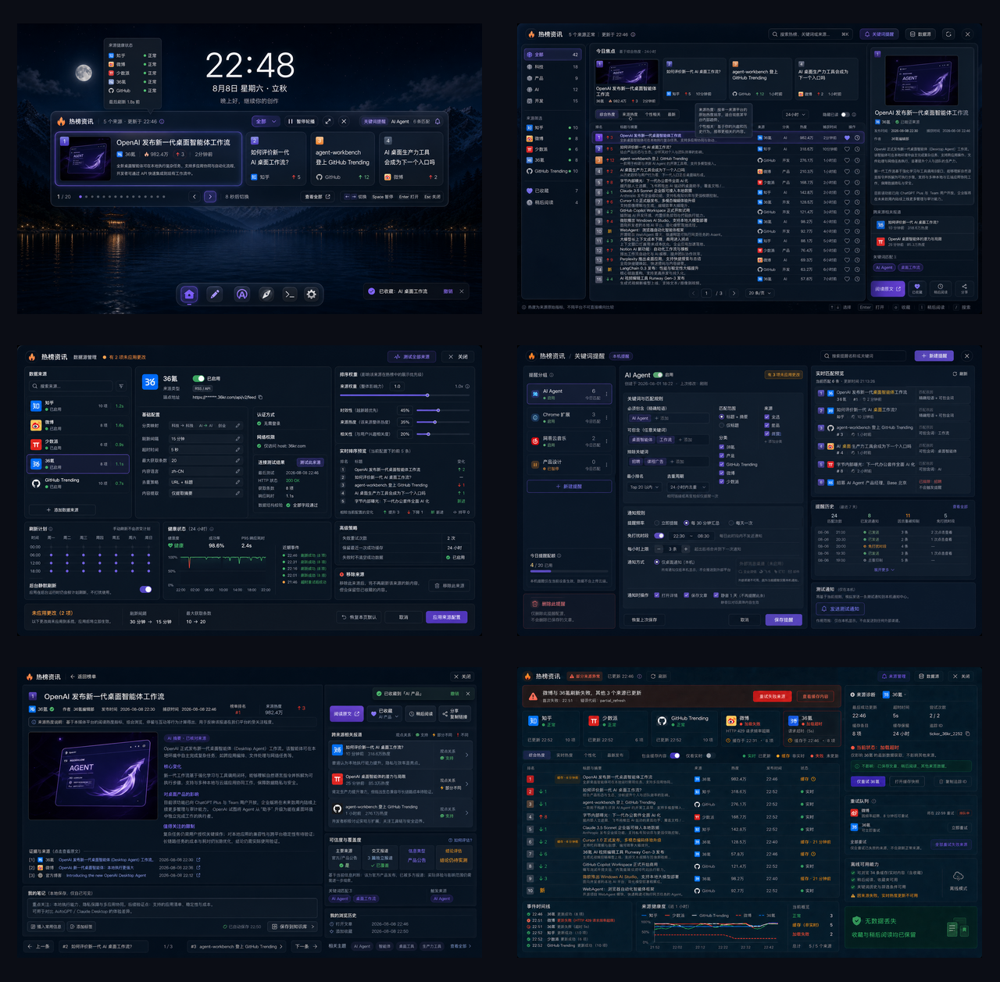

1. [`ticker-01-compact.png`](16-ticker/ticker-01-compact.png)：桌面紧凑轮播、榜位、来源、热度、翻页和展开入口。
2. [`ticker-02-expanded.png`](16-ticker/ticker-02-expanded.png)：多来源完整榜单、筛选排序、详情预览和收藏状态。
3. [`ticker-03-sources.png`](16-ticker/ticker-03-sources.png)：来源启停、抓取频率、健康度、规则预览和应用边界。
4. [`ticker-04-keywords.png`](16-ticker/ticker-04-keywords.png)：关键词提醒、范围、阈值、免打扰、命中历史和测试通知。
5. [`ticker-05-detail-favorite.png`](16-ticker/ticker-05-detail-favorite.png)：资讯正文、来源交叉验证、收藏分类和相关条目。
6. [`ticker-06-loading-error.png`](16-ticker/ticker-06-loading-error.png)：部分来源失败、缓存数据、事件日志、单源重试与离线保护。

## 设置

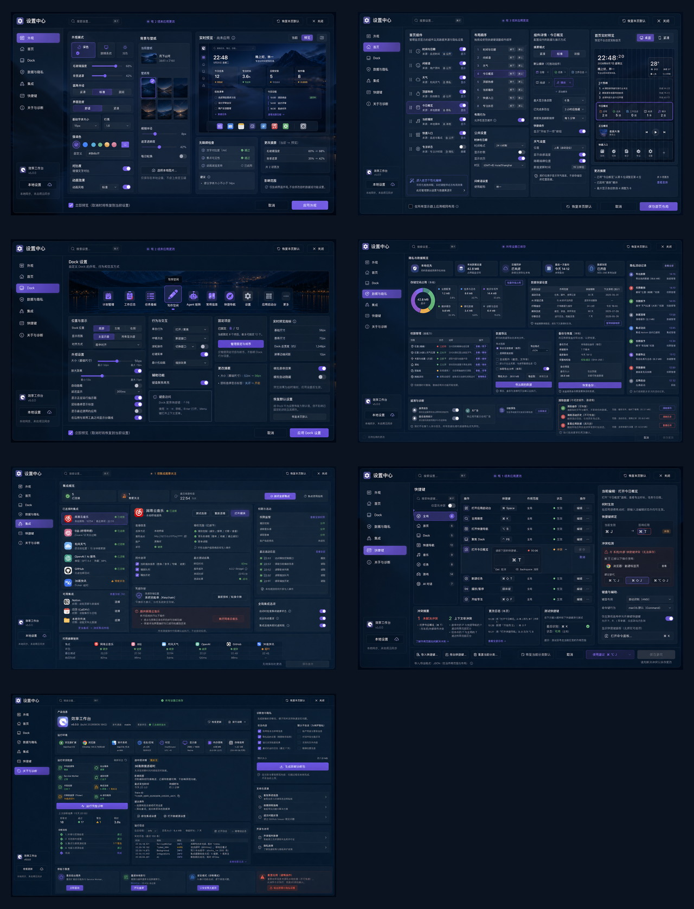

1. [`settings-01-appearance.png`](17-settings/settings-01-appearance.png)：主题、背景、透明度、字体与实时外观预览。
2. [`settings-02-homepage.png`](17-settings/settings-02-homepage.png)：首页布局、组件显隐、信息密度和局部恢复默认。
3. [`settings-03-dock.png`](17-settings/settings-03-dock.png)：Dock 位置、尺寸、隐藏、放大、固定项入口与预览。
4. [`settings-04-data-privacy.png`](17-settings/settings-04-data-privacy.png)：存储占用、分项导出、备份、同步范围与危险数据操作。
5. [`settings-05-integrations.png`](17-settings/settings-05-integrations.png)：网易云、B 站、浏览器、AI 等集成状态与最小权限。
6. [`settings-06-shortcuts.png`](17-settings/settings-06-shortcuts.png)：全局快捷键、搜索、录入、冲突诊断与禁用状态。
7. [`settings-07-about-diagnostics.png`](17-settings/settings-07-about-diagnostics.png)：版本更新、运行环境、依赖状态和默认脱敏诊断包。
